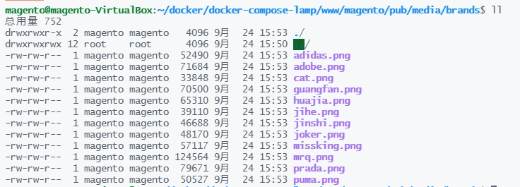
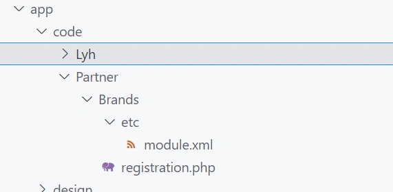
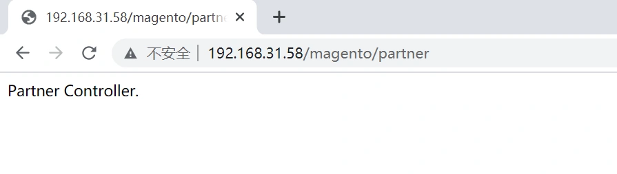
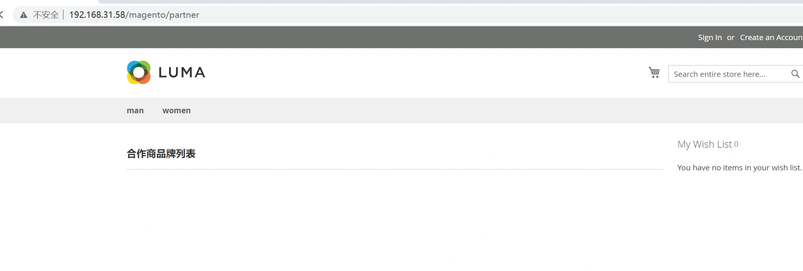
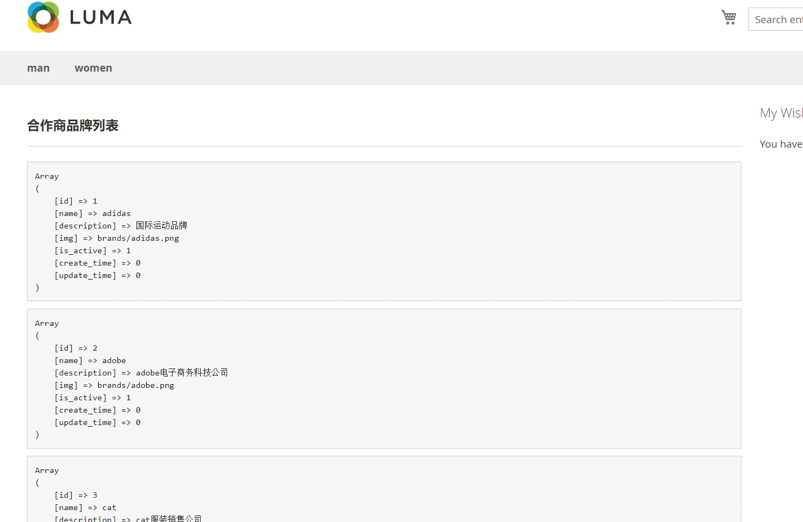
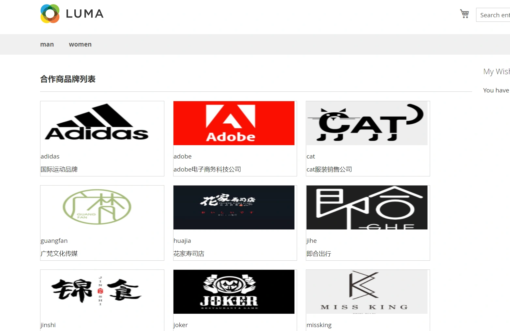
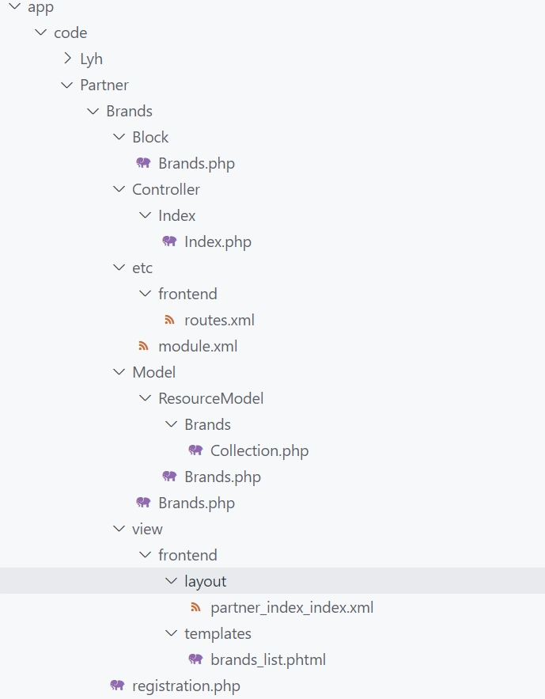

### 1.需求分析

本章为大家讲解从零开始开发一个模块。
我们以一个入驻品牌展示的功能为开发需求。
该模块将包括layout，路由，控制器，model，template等各个部分。
本模块功能相对简单，但涉及到的技术点比较全面。
希望大家在学习完本章后对模块有更多的了解。

---

### 2.数据表与数据填充

##### 数据表

为了方便快速开发，我们在数据表的部分将不采用magento中编写脚本建表方式，而是直接编写sql。

##### 数据表说明

数据表主要包含以下几个字段：
id:自增主键
name:品牌名
img:品牌logo图片
description:品牌描述

##### 建表sql

```sql
CREATE TABLE `brands` (
  `id` int(11) NOT NULL AUTO_INCREMENT,
  `name` varchar(30) CHARACTER SET latin1 NOT NULL DEFAULT '' COMMENT '品牌名称',
  `description` varchar(1000) CHARACTER SET latin1 NOT NULL DEFAULT '' COMMENT '品牌描述',
  `img` varchar(255) CHARACTER SET latin1 NOT NULL DEFAULT '' COMMENT '品牌图片',
  `is_active` tinyint(3) NOT NULL DEFAULT '1' COMMENT '是否启用1:启用0禁用',
  `create_time` int(11) NOT NULL DEFAULT '0' COMMENT '创建时间',
  `update_time` int(11) NOT NULL DEFAULT '0' COMMENT '更新时间',
  PRIMARY KEY (`id`)
) ENGINE=InnoDB DEFAULT CHARSET=utf8mb4 COMMENT='品牌入驻表'
```

##### 填充数据

```sql
INSERT INTO `brands` VALUES (1, 'adidas', '国际运动品牌', 'brands/adidas.png', 1, 0, 0);
INSERT INTO `brands` VALUES (2, 'adobe', 'adobe电子商务科技公司', 'brands/adobe.png', 1, 0, 0);
INSERT INTO `brands` VALUES (3, 'cat', 'cat服装销售公司', 'brands/cat.png', 1, 0, 0);
INSERT INTO `brands` VALUES (4, 'guangfan', '广梵文化传媒', 'brands/guangfan.png', 1, 0, 0);
INSERT INTO `brands` VALUES (5, 'huajia', '花家寿司店', 'brands/huajia.png', 1, 0, 0);
INSERT INTO `brands` VALUES (6, 'jihe', '即合出行', 'brands/jihe.png', 1, 0, 0);
INSERT INTO `brands` VALUES (7, 'jinshi', '即食餐饮连锁', 'brands/jishi.png', 1, 0, 0);
INSERT INTO `brands` VALUES (8, 'joker', '极客聚集地', 'brands/joker.png', 1, 0, 0);
INSERT INTO `brands` VALUES (9, 'missking', '我是女王', 'brands/missking.png', 1, 0, 0);
INSERT INTO `brands` VALUES (10, 'mrq', '金先生', 'brands/mrq.png', 1, 0, 0);
INSERT INTO `brands` VALUES (11, 'prada', 'prada普拉达', 'brands/prada.png', 1, 0, 0);
INSERT INTO `brands` VALUES (12, 'puma', '彪马-年轻人的运动选择', 'brands/puma.png', 1, 0, 0);
```

##### 把对应的图片上传到pub/media/brands目录下

上传本地文件到虚拟机，我们可以用scp命令，或者使用winScap软件上传。
上传文件路径为：
/home/magento/docker/docker-compose-lamp/www/magento/pub/media/brands



至此，我们数据表和数据准备完毕。
下面将开始代码编写。 

---

### 3.建立module

#### 添加module

添加module: Partner_Brands



#####  registrations.php: 

```php
<?php

\Magento\Framework\Component\ComponentRegistrar::register(
    \Magento\Framework\Component\ComponentRegistrar::MODULE,
    'Partner_Brands',
    __DIR__
);
```

#####  etc/module.xml: 

```xml
<?xml version="1.0"?>
<config xmlns:xsi="http://www.w3.org/2001/XMLSchema-instance" xsi:noNamespaceSchemaLocation="urn:magento:framework:Module/etc/module.xsd">
    <module name="Partner_Brands" setup_version="2.0.0">
    </module>
</config>
```

---

### 4.路由

##### 路由声明

建立etc/frontend/routes.xml文件，声明前端控制器的名称。
File：app/code/Partner/Brands/etc/frontend/routes.xml
在routes.xml：

```
<?xml version="1.0"?>
<config xmlns:xsi="http://www.w3.org/2001/XMLSchema-instance" xsi:noNamespaceSchemaLocation="urn:magento:framework:App/etc/routes.xsd">
    <router id="standard">
        <route id="partner" frontName="partner">
            <module name="Partner_Brands" before="Magento_Core"/>
        </route>
    </router>
</config>
```

---

### 5.控制器

##### 建立控制器

File:app/code/Partner/Brands/Controller/Index/Index.php：

控制器中代码如下：

```php
<?php
namespace Partner\Brands\Controller\Index;

use Magento\Framework\App\Action\Action;

class Index extends Action {

    protected $resultPageFactory;
    
    public function __construct(
        \Magento\Framework\App\Action\Context $context,
        \Magento\Framework\View\Result\PageFactory $resultPageFactory
    ){
        $this->resultPageFactory = $resultPageFactory;
        parent::__construct($context);
    }

    /**
     * @return \Magento\Framework\View\Result\PageFactory
     */
    public function execute()
    {
        echo "Partner Controller.";
    }
}
```

更新module: php bin/magneto s:up
现在访问url，可以看到控制器执行成功： http://192.168.31.58/magento/partner



 修改一下控制器的execute方法,让其显示模板： 

```php
/**
 * @return \Magento\Framework\View\Result\PageFactory
 */
public function execute()
{
    return $this->resultPageFactory->create();
}
```

 接下来，我们继续编写block和模板。 

---

### 6.创建Block

##### 创建Bock文件

File:app/code/Partner/Brands/Block/Brands.php:

```
<?php
namespace Partner\Brands\Block;

class Brands extends \Magento\Framework\View\Element\Template
{
    public function _prepareLayout()
    {

    }
    
}
```

---

### 7.创建布局文件

##### 创建布局文件

布局文件的命名规则为：
Router Name_Controller Name_Action Name.xml
这里我们的布局文件名称为：partner_index_index.xml
File:app/code/Partner/Brands/view/frontend/layout/partner_index_index.xml:

```xml
<?xml version="1.0"?>
<page xmlns:xsi="http://www.w3.org/2001/XMLSchema-instance"  xsi:noNamespaceSchemaLocation="urn:magento:framework:View/Layout/etc/page_configuration.xsd" layout="2columns-right">
    <body>
        <referenceContainer name="content">
            <block class="Partner\Brands\Block\Brands" name="brands_list" template="brands_list.phtml">
            </block>
        </referenceContainer>
    </body>
</page>
```

------

说明：

```
referenceContainer name="content"
```

1. 我们在这里引用了content容器，这个容器是我们继承的主题luma，luma继承了blank，在blank主题中定义的用于显示页面主体部分的容器，即，除去header和footer外，页面body中显示的内容。
2. 布局中指定了我们上一步建立的block文件和模板文件。

---

### 8.建立模板

##### 建立模板文件

File:app/code/Partner/Brands/view/frontend/templates/brands_list.phtml:

```
<div id="brands_list_box">
    <h3>合作商品牌列表</h3>
    <hr>
</div>
```

更新module: php bin/magento s:up
访问：http://192.168.31.58/magento/partner



至此，我们MVC三个部分中，Controller和View就已经完成了，接下来，我们进行数据展示的部分，即Model层。

> 说明：什么时候执行s:up，什么时候执行c:c ？

1. php bin/magento s:up 该命令为更新module，当我们修改了di.xml,routes.xml,layout的xml文件时，需要更新module,通常理解为更改xml配置文件时，需要更新module。
2. php bin/magento c:c 该命令为更新缓存，通常当我们修改模板后，执行该命令更新缓存。

---

### 9.建立Model层

##### Model层说明

1. Model层(ORM)用来定义数据表与数据访问对象的映射，相当于把一张表映射为一个类。
2. 我们通常把查询数据的方法都写在Model层。
3. 通常一个Model对应为一张数据表。
4. 把查询数据的逻辑写在Model层的好处是便于代码重用，即不同的控制器或者api，需要查询某个数据表的数据，可以共用Model层的方法。
5. 复杂一点的架构还可以再分出一个service层或者叫logic，这样查询数据的逻辑从Model层迁移到service层，Model只负责数据表与对象的映射关系。

------

##### Magento的数据查询方式

1.Magento可以使用Model层方式查询数据，即ORM方式。
2.也可以直接获取数据库查询对象，使用sqlBulider封装sql查询。
直接获取数据库查询对象的方式示例：

```php
获取对象管理器：
$objectManager = \Magento\Framework\App\ObjectManager::getInstance();
获取数据库连接：
$db = $objectManager->get( 'Magento\Framework\App\ResourceConnection' )->getConnection();
接下来就可以使用SqlBuilder构建sql查询：
$db->select()->where()->xxx
```

------

##### 建立Model

我们本模块使用Model的方式进行数据查询。
app/code/Partner/Brands/Model/Brands.php：

```php
<?php
namespace Partner\Brands\Model;

use \Magento\Framework\Model\AbstractModel;

class Brands extends AbstractModel
{
    //指定数据表主键字段名称
    protected $_idFieldName = 'id';

    /**
     * 初始化 resource model
     */
    protected function _construct()
    {
        $this->_init('Partner\Brands\Model\ResourceModel\Brands');
    }
}
```

------

##### 建立ResourceModel

```php
<?php
namespace Partner\Brands\Model\ResourceModel;

use \Magento\Framework\Model\ResourceModel\Db\AbstractDb;

class Brands extends AbstractDb
{
    /**
     * 初始化 resource model
     */
    protected function _construct()
    {
        // 指定表名和主键
        $this->_init('brands', 'id');
    }

}
```

##### 建立Collection文件

app/code/Partner/Brands/Model/ResourceModel/Brands/Collection.php：

```php
<?php
namespace Partner\Brands\Model\ResourceModel\Brands;

use \Magento\Framework\Model\ResourceModel\Db\Collection\AbstractCollection;

class Collection extends AbstractCollection
{

    protected $_idFieldName = 'id';

    /**
     * 定义Resource Model
     */
    protected function _construct()
    {
        //参数为 model,resource model
        $this->_init('Partner\Brands\Model\Brands', 'Partner\Brands\Model\ResourceModel\Brands');
    }
}
```

------

至此我们的Model层建立完成。
下面介绍如何使用Model。

> Magento中获取对象的两种方式:

1. 在控制器或者block中通过__construct方法获取(生成对象工厂)

```php
 public function __construct(

        Partner\Brands\Model\Brands $brands

    ) {
        $this->_brands= $brands;


    }
```

2. 使用对象管理器获取:

```php
//获取对象管理器
$objectManager = \Magento\Framework\App\ObjectManager::getInstance();
//通过对象管理器获取指定的对象
$collection = $objectManager->get( 'Partner\Brands\Model\Brands');
```

---

### 10.查询数据

##### Block中查询数据

修改一下Block文件，添加一个getBrandsList方法，查询品牌列表:
app/code/Partner/Brands/Block/Brands.php:

```
<?php
namespace Partner\Brands\Block;

class Brands extends \Magento\Framework\View\Element\Template
{
    /**
     * 查询品牌数据
     */
    public function getBrandsList(){
        $objectManager = \Magento\Framework\App\ObjectManager::getInstance();
        //获取collection对象
        $collection = $objectManager->get( 'Partner\Brands\Model\ResourceModel\Brands\Collection');

		foreach($collection as $item){
			echo "<pre>";
			print_r($item->getData());
			echo "</pre>";
		}
    }

}
```

##### 模板中调用block中的方法：

app/code/Partner/Brands/view/frontend/templates/brands_list.phtml：

```
<div id="brands_list_box">
    <h3>合作商品牌列表</h3>
    <hr>
</div>

<?php
    $block->getBrandsList();
?>
```

##### 测试：

访问：http://192.168.31.58/magento/partner



 数据全部被打印出来，代表我们的model调用正确。 

---

### 11.完善模板

##### 修改Block文件,返回collect对象

app/code/Partner/Brands/Block/Brands.php：

```
<?php
namespace Partner\Brands\Block;

class Brands extends \Magento\Framework\View\Element\Template
{
    /**
     * 查询品牌数据
     */
    public function getBrandsList(){
        $objectManager = \Magento\Framework\App\ObjectManager::getInstance();
        //获取collection对象
        $collection = $objectManager->get( 'Partner\Brands\Model\ResourceModel\Brands\Collection');
        
        return $collection;
    }
}
```

##### 修改模板，循环展示数据：

app/code/Partner/Brands/view/frontend/templates/brands_list.phtml：

```
<?php
    $brandsList = $block->getBrandsList();
    //获取pub/media目录的url
    $objectManager = \Magento\Framework\App\ObjectManager::getInstance();
    $storeManager = $objectManager->get('\Magento\Store\Model\StoreManagerInterface');
    $mediaUrl = $storeManager->getStore()->getBaseUrl(\Magento\Framework\UrlInterface::URL_TYPE_MEDIA);
?>

<style>
    .brands-item{
        width:280px;
        height:170px;
        float:left;
        margin-right:20px;
        margin-bottom:20px;
        border:1px solid #ccc;
    }
    .brands-item img{
        width:275px;
        height:100px;
    }
</style>

<div id="brands_list_box">
    <h3>合作商品牌列表</h3>
    <hr>

    <!-- 循环展示品牌列表 start-->
    <?php foreach($brandsList as $item):?>
    <div class='brands-item'>
        <p>getData('img') ?>"</p>
        <p><?= $item->getData('name') ?></p>
        <p><?= $item->getData('description') ?></p>
    </div>
    <?php endforeach;?>
    <!-- 循环展示品牌列表 end-->

</div>
```

访问 http://192.168.31.58/magento/partner 查看结果：



---

### 12.小结

品牌模块开发到这里就暂告一个段落了，最终所有文件的目录结构为：



剩下的部分大家感兴趣的话可以继续扩展：

1. 添加分页展示逻辑。
2. 增加后台管理，支持品牌数据的增删改。
3. 增加api，开放我们的品牌数据，供第三方调用。


本小节结束.