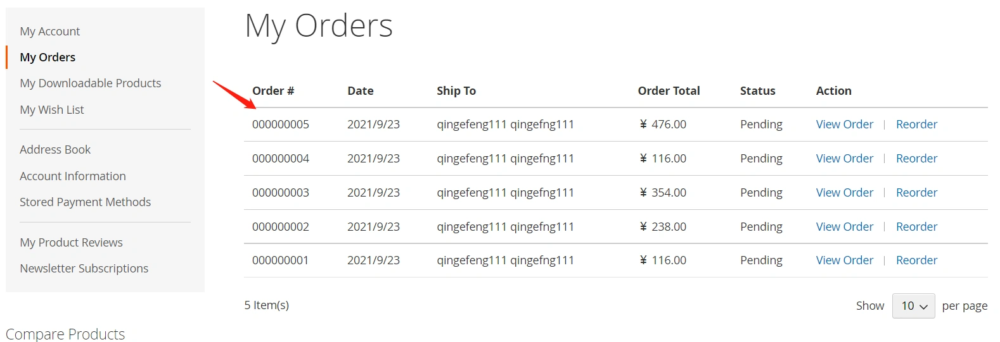
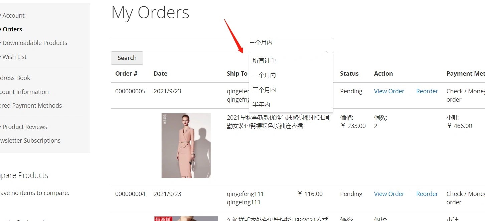
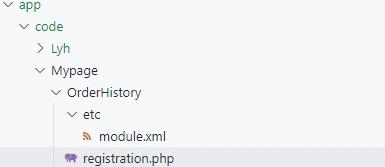
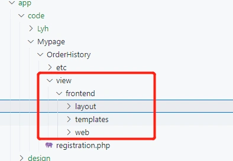
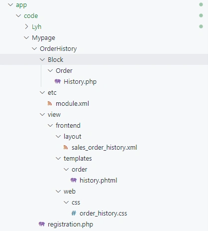

### 1.需求分析

##### 需求分析

订单历史记录列表,修改前只展示订单相关字段，如订单号，下单日期等：



用户在查看订单记录的时候可能需要知道每个订单中买了哪些商品。
因此，我们需要重写订单历史记录模块。
除了展示订单信息外，在每个订单下面展示该订单的商品信息。
另外，我们要在订单列表上面添加一个搜索框可供查询订单。

------

##### 逻辑分析

从订单列表中，我们可以获取到每一条订单记录，对应该条订单id。
我们有了订单id，就可以通过这个订单查询到该订单关联的商品。
因此，我们也可以把商品信息展示在订单列表页面。

------

最终要实现的效果：



---

### 2.新建模块

- 建立一个新的module: Mypage_OrderHistory



##### 注册模块

- app/code/Mypage/OrderHistory/etc/module.xml

```xml
<?xml version="1.0"?>
<config xmlns:xsi="http://www.w3.org/2001/XMLSchema-instance" xsi:noNamespaceSchemaLocation="urn:magento:framework:Module/etc/module.xsd">
    <module name="Mypage_OrderHistory" setup_version="1.0.0.0" active="true" ></module>
</config>
```

------

- app/code/Mypage/OrderHistory/registration.php

```php
<?php
\Magento\Framework\Component\ComponentRegistrar::register(
    \Magento\Framework\Component\ComponentRegistrar::MODULE,
    'Mypage_OrderHistory',
    __DIR__
);
```

---

### 3.重写：布局文件

- 建立前端系列目录：



建立layout文件：
app/code/Mypage/OrderHistory/view/frontend/layout/sales_order_history.xml

```xml
<?xml version="1.0"?>
<page xmlns:xsi="http://www.w3.org/2001/XMLSchema-instance" xsi:noNamespaceSchemaLocation="urn:magento:framework:View/Layout/etc/page_configuration.xsd">
    <update handle="customer_account"/>
    <head>
        <css src="Mypage_OrderHistory::css/order_history.css"/>
    </head>
    <body>
        <referenceBlock name="sales.order.history" remove="true">
            <referenceContainer name="content">
            <block class="Mypage\OrderHistory\Block\Order\History" name="override.sales.order.history" cacheable="false">
                <container name="sales.order.history.info" as="info" label="Order History Info"/>
                <container name="sales.order.history.extra.column.header" as="extra.column.header" label="Order History Extra Column Header"/>
                <block class="Magento\Sales\Block\Order\History\Container"
                       name="sales.order.history.extra.container" as="extra.container">
                    <block class="Magento\Framework\View\Element\Template"
                        name="sales.order.history.extra.container.data" as="extra.container.data"/>
                </block>
            </block>
            </referenceContainer>
        </referenceBlock>
    </body>
</page>
```

说明：

1. 我们在这里指定了自己的自己的Block文件。
2. 这里没有设置template,template的指定也可以在block文件中指定。
3. 我们在head部分引入了一段css文件，这个文件内容较少，这里主要目的是为大家演示模块如何引入自己的css文件。

---

### 4.Block文件

新建Block文件：
app/code/Mypage/OrderHistory/Block/Order/History.php

> Block文件继承自原有的History类，并添加我们自己的方法：

```php
<?php

namespace Mypage\OrderHistory\Block\Order;

/**
 * Sales order history block
 *
 * @api
 * @since 100.0.2
 */
class History extends \Magento\Sales\Block\Order\History
{
    //指定模板文件路径
    protected $_template = 'Mypage_OrderHistory::order/history.phtml';

    protected $retCollection = null;

    /**
     * Get orders by increment id or order during
     *
     * @return bool|\Magento\Sales\Model\ResourceModel\Order\Collection
     */
    public function getOrdersByIncrementId($orderCollection)
    {
        if ($orderCollection) {
            // get param
            $request = $this->getRequest();
            $params = $request->getParams();

            $incrementId = $this->getIncrementId($params);
            $orderDuring = $this->getOrderDuring($params);

            // select by orderNo
            if ($incrementId) {
                $this->retCollection = $orderCollection->addFieldToFilter('increment_id',array('like'=>'%'. $incrementId .'%'));
                $this->setData('increment', $incrementId);
            } else if ($orderDuring) {
                // select by order during
                $from = null;
                $now = new \DateTime();
                if ($orderDuring == 1) {
                    // 一个月内
                    $from = date("Y-m-d",strtotime("last month"));
                    
                } else if ($orderDuring == 3) {
                    // 三个月内
                    $from = date("Y-m-d",strtotime("-3 month"));
                } else if ($orderDuring == 6 
                            or $orderDuring == 7) {
                    // 半年内/ 半年前
                    $from = date("Y-m-d",strtotime("-6 month"));
                } else if ($orderDuring == 9) {
                    // すべて
                    $this->setData('orderDuring', $orderDuring);
                    $this->retCollection = $orderCollection;
                    return $this->retCollection;
                }

                if ($orderDuring == 6) {
                    $dateArr = array('lteq'=>$from);
                } else {
                    $dateArr = array('from'=>$from, 'to'=>$now);
                }

                $this->retCollection = $orderCollection->addFieldToFilter('created_at', $dateArr);

                $this->setData('orderDuring', $orderDuring);
            } else {
                $this->retCollection = $orderCollection;
            }
        }
        
        return $this->retCollection;
    }

    /**
     * @inheritDoc
     */
    protected function _prepareLayout()
    {
        $orderCollection = $this->getOrders();
        if ($this->getOrdersByIncrementId($orderCollection)) {
            $pager = $this->getLayout()->createBlock(
                \Magento\Theme\Block\Html\Pager::class,
                'sales.order.history.pager'
            )->setCollection(
                $this->retCollection
            );
            $this->setChild('pager', $pager);
            $this->retCollection->load();
        }
        return $this;
    }

    /**
     * get Order id
     * @param params
     * @return string
     */
    public function getIncrementId($params) {
        return isset($params['increment']) ? $params['increment'] : '';
    }

     /**
     * get Order During
     * @param params
     * @return string
     */
    public function getOrderDuring($params) {
        return isset($params['order_during']) ? $params['order_during'] : '';
    }

    /**
     * Retrieve Currency Switch URL
     *
     * @return string
     */
    public function getHistoryUrl()
    {
        $searchKey = $this->getUrlParam();
        $incrementId = $searchKey['incrementId'];
        return $this->getUrl('sales/order/history', ['incrementId' => $incrementId, 'order_during' => '1']);
    }

}
```

---

### 5.模板文件

新建模板文件：
app/code/Mypage/OrderHistory/view/frontend/templates/order/history.phtml

> 模板文件我们找到vendor目录下对应的模板粘贴过来，添加自己的逻辑:

```php+HTML
<?php $_ordersCollection = $block->getOrders();?>
<?php $_orders = $block->getOrdersByIncrementId($_ordersCollection);?>
<?php $incrementId = $block->getData('increment');?>
<?php $orderDuring = $block->getData('orderDuring');?>
<?=$block->getChildHtml('info')?>
<div class="form_left">
    <form class="form my_form" id="search_order_form" action="<?=$block->getUrl('sales/order/history');?>" method="get">
        <div class="order_no_txt">
            <input type="text" id="increment" name="increment" class="input-text" value=<?=$incrementId?>>
            <button type="submit" title="<?=$block->escapeHtmlAttr(__('Search'))?>" class="action search" aria-label="Search">
                <span><?=$block->escapeHtml(__('Search'))?></span>
            </button>
        </div>
    </form>
</div>
<div class="customer-welcome">
    <div
        data-mage-init='{"dropdown":{}}'
        data-toggle="dropdown"
        class="dropdown_list"
        data-action="customer-menu-toggle">
        <span> 
            <?php if ($orderDuring == 9): ?>
                所有订单
            <?php elseif ($orderDuring == 1): ?>
                一个月内
            <?php elseif ($orderDuring == 3): ?>
                三个月内
            <?php elseif ($orderDuring == 6): ?>
               半年内
            <?php else: ?>
                按订单时间搜索
            <?php endif;?>
        </span>
    </div>
    <ul data-target="dropdown" class="dropdown-options">
        <li class="item">
            <a href="<?= $this->getUrl('sales/order/history', ['order_during' => 9]) ?>"><span>所有订单</span></a>
        </li>
        <li class="item">
            <a href="<?= $this->getUrl('sales/order/history', ['order_during' => 1]) ?>"><span>一个月内</span></a>
        </li>
        <li class="item">
            <a href="<?= $this->getUrl('sales/order/history', ['order_during' => 3]) ?>"><span> 三个月内</span></a>
        </li>
        <li class="item">
            <a href="<?= $this->getUrl('sales/order/history', ['order_during' => 6]) ?>"><span> 半年内</span></a>
        </li>
    </ul>
</div>
<?php if ($_orders && count($_orders)): ?>
    <div class="clear" style="clear:both"></div>
    <div class="table-wrapper orders-history">
        <table class="data table table-order-items history" id="my-orders-table">
            <caption class="table-caption"><?=$block->escapeHtml(__('Orders'))?></caption>
            <thead>
                <tr>
                    <th scope="col" class="col id"><?=$block->escapeHtml(__('Order #'))?></th>
                    <th scope="col" class="col date"><?=$block->escapeHtml(__('Date'))?></th>
                    <?=$block->getChildHtml('extra.column.header')?>
                    <th scope="col" class="col shipping"><?=$block->escapeHtml(__('Ship To'))?></th>
                    <th scope="col" class="col total"><?=$block->escapeHtml(__('Order Total'))?></th>
                    <th scope="col" class="col status"><?=$block->escapeHtml(__('Status'))?></th>
                    <th scope="col" class="col actions"><?=$block->escapeHtml(__('Action'))?></th>
                    <th scope="col" class="col actions"><?=$block->escapeHtml(__('Payment Method'))?></th>
                </tr>
            </thead>
            <tbody>
                <?php foreach ($_orders as $_order): ?>
                    <?php $_items = $_order->getAllItems(); ?>
                    <tr class="product-order-main">
                        <td data-th="<?=$block->escapeHtmlAttr(__('Order #'))?>" class="col id"><?=$block->escapeHtml($_order->getRealOrderId())?></td>
                        <td data-th="<?=$block->escapeHtmlAttr(__('Date'))?>" class="col date"><?=/* @noEscape */$block->formatDate($_order->getCreatedAt())?></td>
                        <?php $extra = $block->getChildBlock('extra.container');?>
                        <?php if ($extra): ?>
                            <?php $extra->setOrder($_order);?>
                            <?=$extra->getChildHtml()?>
                        <?php endif;?>
                        <td data-th="<?=$block->escapeHtmlAttr(__('Ship To'))?>" class="col shipping"><?=$_order->getShippingAddress() ? $block->escapeHtml($_order->getShippingAddress()->getName()) : '&nbsp;'?></td>
                        <td data-th="<?=$block->escapeHtmlAttr(__('Order Total'))?>" class="col total"><?=/* @noEscape */$_order->formatPrice($_order->getGrandTotal())?></td>
                        <td data-th="<?=$block->escapeHtmlAttr(__('Status'))?>" class="col status"><?=$block->escapeHtml($_order->getStatusLabel())?></td>
                        <td data-th="<?=$block->escapeHtmlAttr(__('Actions'))?>" class="col actions">
                            <a href="<?=$block->escapeUrl($block->getViewUrl($_order))?>" class="action view">
                                <span><?=$block->escapeHtml(__('View Order'))?></span>
                            </a>
                            <?php if ($this->helper(\Magento\Sales\Helper\Reorder::class)->canReorder($_order->getEntityId())): ?>
                                <a href="#" data-post='<?=/* @noEscape */
                                $this->helper(\Magento\Framework\Data\Helper\PostHelper::class)
                                ->getPostData($block->getReorderUrl($_order))
                                ?>' class="action order">
                                    <span><?=$block->escapeHtml(__('Reorder'))?></span>
                                </a>
                            <?php endif?>
                        </td>
                        <td data-th="<?=$block->escapeHtmlAttr(__('Payment Method'))?>" class="col status"><?=$block->escapeHtml($_order->getPayment()->getMethodInstance()->getTitle())?></td>
                    </tr>

                    <?php foreach ($_items as $_item): ?>
                        <?php
                            $objectManager = \Magento\Framework\App\ObjectManager::getInstance();
                            $_imagehelper  = $objectManager->get('Magento\Catalog\Helper\Image');
                            $product = $_item->getProduct();
                            if ($product) {
                                $productImage = $_imagehelper->init($product, 'category_page_list', array('height' => 350 , 'width'=> 350))->getUrl();
                            }
                        ?>
                        <tr>
                            <td></td>
                            <td class="col image">
                                <?php if ($product) :?>
                                    "/>
                                <?php endif; ?>
                            </td>
                            <td class="col name" colspan="2"><?=$_item->getData("name")?></td>
                            <td class="col price center-align">価格:<br/><?=$_order->formatPrice($_item->getData("price"))?></td>
                            <td class="col qty center-align">個数:<br/><?=(float)$_item->getData("qty_ordered")?></td>
                            <td class="col total center-align">小計:<br/><?=$_order->formatPrice($_item->getData("row_total"))?></td>
                        </tr>
                    <?php endforeach;?>

                <?php endforeach;?>
            </tbody>
        </table>
    </div>
    <?php if ($block->getPagerHtml()): ?>
        <div class="order-products-toolbar toolbar bottom"><?=$block->getPagerHtml()?></div>
    <?php endif?>
<?php else: ?>
    <div class="message info empty"><span><?=$block->escapeHtml(__('You have placed no orders.'))?></span></div>
<?php endif?>
```

------

##### 代码解析：

我们在原来的基础上添加了一个搜索表单，并添加了select筛选框。
在循环订单列表的地方，我们添加了根据订单查询商品：

```
<?php $_items = $_order->getAllItems(); ?>
```

同时在每一个订单下，循环显示该订单对应的商品：

```php+HTML
<?php foreach ($_items as $_item): ?>
    <?php
        $objectManager = \Magento\Framework\App\ObjectManager::getInstance();
        $_imagehelper  = $objectManager->get('Magento\Catalog\Helper\Image');
        $product = $_item->getProduct();
        if ($product) {
            $productImage = $_imagehelper->init($product, 'category_page_list', array('height' => 350 , 'width'=> 350))->getUrl();
        }
    ?>
    <tr>
        <td></td>
        <td class="col image">
            <?php if ($product) :?>
                "/>
            <?php endif; ?>
        </td>
        <td class="col name" colspan="2"><?=$_item->getData("name")?></td>
        <td class="col price center-align">価格:<br/><?=$_order->formatPrice($_item->getData("price"))?></td>
        <td class="col qty center-align">個数:<br/><?=(float)$_item->getData("qty_ordered")?></td>
        <td class="col total center-align">小計:<br/><?=$_order->formatPrice($_item->getData("row_total"))?></td>
    </tr>
```

---

### 6.添加css文件

app/code/Mypage/OrderHistory/view/frontend/web/css/order_history.css：

```
.dropdown_list {
    border: 1px solid black;
    width: 200px;
    height: 30px;
}

.form_left {
    width: 300px;
    float: left;
    margin-right: 30px;
}
```

---

### 7.测试修改结果

开启我们重写的module:
执行命令: php bin/magento s:up

测试重写结果：


 本实例全部目录及文件如下： 



优化建议：
本实例主要为大家展示了如何重写一个module。

1. 关于商品查询的部分，我们直接写在了模板里，这部分代码可以写到block文件的一个方法中，在模板中调用方法实现。
2. 模板部分我们直接写到了app/code目录下，可以将模板移到主题目录中统一管理。


本小节结束.