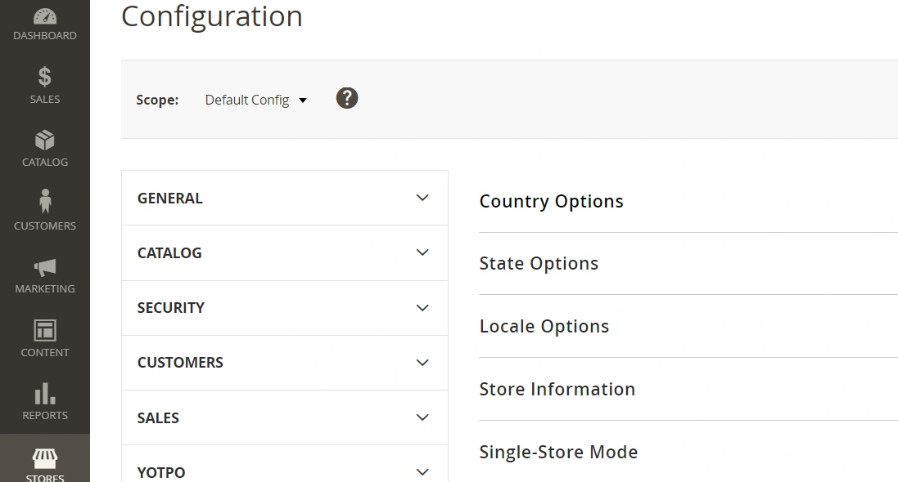
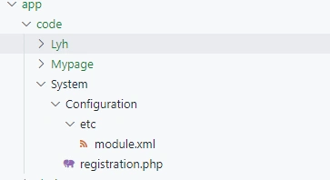
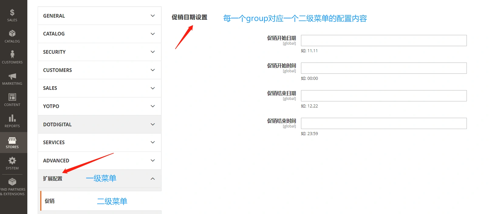
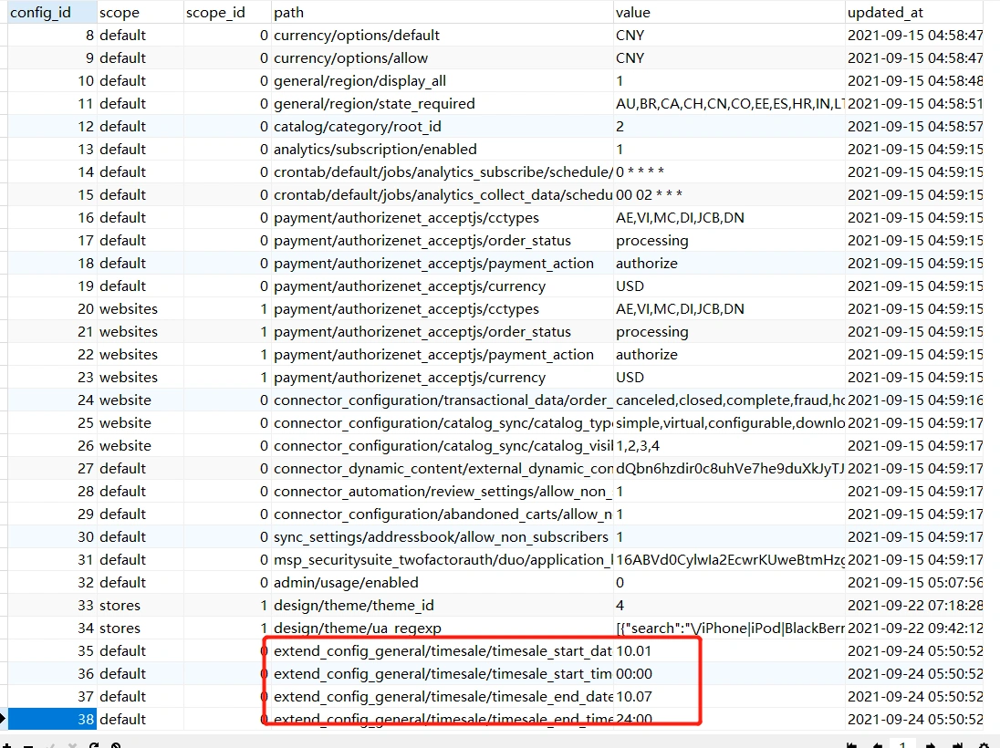
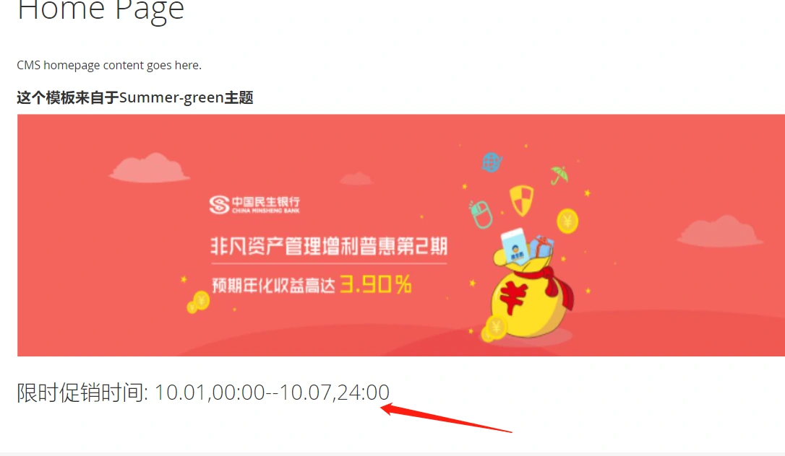

### 1.需求分析

##### 添加自己的配置页面

我们知道在magento后台有一个系统配置页面：



 本示例将展示如何添加一个新的配置项，并在前台页面读取该配置。 

---

### 2.后台实现

添加新的module:System_Configuration:



module.xml:

```xml
<?xml version="1.0"?>
<config xmlns:xsi="http://www.w3.org/2001/XMLSchema-instance" xsi:noNamespaceSchemaLocation="urn:magento:framework:Module/etc/module.xsd">
    <module name="System_Configuration" setup_version="2.0.0">
    </module>
</config>
```

registration.php:

```
<?php

\Magento\Framework\Component\ComponentRegistrar::register(
    \Magento\Framework\Component\ComponentRegistrar::MODULE,
    'System_Configuration',
    __DIR__
);
```

##### 建立后台菜单配置system.xml

app/code/System/Configuration/etc/adminhtml/system.xml

```xml
<?xml version="1.0"?>
<config xmlns:xsi="http://www.w3.org/2001/XMLSchema-instance" xsi:noNamespaceSchemaLocation="urn:magento:module:Magento_Config:etc/system_file.xsd">
    <system>

        <tab id="extend_config" translate="label" sortOrder="999999">
            <label>扩展配置</label>
        </tab>

        <section id="extend_config_general" translate="label" sortOrder="130" showInDefault="1" showInWebsite="1" showInStore="1">

            <class>separator-top</class>
            <label>促销</label>
            <tab>extend_config</tab>
            <resource>System_Configuration::system_configuration</resource>

            <group id="timesale" translate="label" type="text" sortOrder="1" showInDefault="1" showInWebsite="0" showInStore="0">
                <attribute type="expanded">1</attribute>
                <label>促销日期设置</label>
                <field id="timesale_start_date" translate="label" type="text" sortOrder="1" showInDefault="1" showInWebsite="0" showInStore="0">
                    <label>促销开始日期</label>
                    <comment>如: 11.11</comment>
                </field>
                <field id="timesale_start_time" translate="label" type="text" sortOrder="1" showInDefault="1" showInWebsite="0" showInStore="0">
                    <label>促销开始时间</label>
                    <comment>如: 00:00</comment>
                </field>
                <field id="timesale_end_date" translate="label" type="text" sortOrder="1" showInDefault="1" showInWebsite="0" showInStore="0">
                    <label>促销结束日期</label>
                    <comment>如: 12.22</comment>
                </field>
                <field id="timesale_end_time" translate="label" type="text" sortOrder="1" showInDefault="1" showInWebsite="0" showInStore="0">
                    <label>促销结束时间</label>
                    <comment>如: 23:59</comment>
                </field>
            </group>
            
        </section>
    </system>
</config>
```

##### system.xml文件解析：

tab id="extend_config": 此处配置为左侧一级菜单的tab,id应与其它菜单不重复。
section id="extend_config_general"：此配置为二级菜单配置，每一个section单元为一个二级菜单。
extend_config:这里tab标签填写的内容要与上面设置的tabid相同。
group：为二级菜单对应的每一个可展开的配置组。

更新模块 php bin/magento s:up
访问后台配置菜单：



##### 测试

填写一下表单，保存。查看core_config_data表：



可以看到，我们添加的配置，和系统其它配置一样被写到core_config_data表中。
path字段对应的是我们xml文件中section_id/group_id/fieldname组合而成。
value则为input填写的值 。
至此，后台添加配置完成。 

---

### 3.前台实现

##### 前台读取配置项我们使用helper文件来实现

在banner图片区下面我们来读取这个配置项。
首先，在banner模块中添加一个helper文件，在这个文件中我们封装读取配置的方法：
app/code/Lyh/Banner/

```php
<?php

namespace Lyh\Banner\Helper;

class Data extends \Magento\Framework\App\Helper\AbstractHelper
{

    const TIMESALE_TEXT_START_DATE = 'extend_config_general/timesale/timesale_start_date';
    const TIMESALE_TEXT_END_DATE = 'extend_config_general/timesale/timesale_end_date';
    const TIMESALE_TEXT_START_TIME = 'extend_config_general/timesale/timesale_start_time';
    const TIMESALE_TEXT_END_TIME = 'extend_config_general/timesale/timesale_end_time';

    public function __construct(
        \Magento\Framework\App\Helper\Context $context
    ) {
        parent::__construct($context);
    }

    public function getConfig($config_path)
    {
        return $this->scopeConfig->getValue(
            $config_path,
            \Magento\Store\Model\ScopeInterface::SCOPE_STORE
        );
    }

    /**
     * get homepage timesale date and time config
     * 
    */
    public function getTimeSaleConfig()
    {

        $startDateText = $this->getConfig(self::TIMESALE_TEXT_START_DATE);
        $endDateText = $this->getConfig(self::TIMESALE_TEXT_END_DATE);
        $startTime = $this->getConfig(self::TIMESALE_TEXT_START_TIME);
        $endTime = $this->getConfig(self::TIMESALE_TEXT_END_TIME);
        return [
            's_day' => $startDateText,
            's_time' => $startTime,
            'e_day' => $endDateText,
            'e_time' => $endTime
        ];

    }

}
```

------

##### 模板文件调用block的方法

app/design/frontend/Summer/green/Lyh_Banner/templates/widget/banner.phtml：

```php+HTML
<?php
$bannerImg = $this->getViewFileUrl('Lyh_Banner::images/banners/banner.png');
//读取helper中的配置项
$timeConfig = $this->helper('Lyh\Banner\Helper\Data')->getTimeSaleConfig();
?>
<style>
#banner-img{
    width:100%;
    height:300px;
}
</style>
<div class="banner-container">
    <h3>这个模板来自于Summer-green主题</h3>
    ">

    <!-- 显示读取的配置项 -->
    <div id='hot-sale-title'>
        <h2 class="time-sale-heading">
            <span>限时促销时间:</span>
            <span><?=$timeConfig['s_day']?><time>,<?=$timeConfig['s_time']?>--<?=$timeConfig['e_day']?>,<?=$timeConfig['e_time']?></span>
        </h2>
    </div>
</div>
```

##### 查看结果：

更新缓存 php bin/magento c:c
刷新首页：




本小节结束.