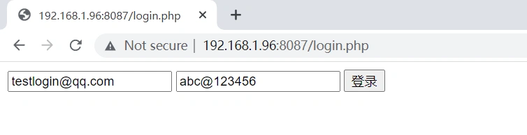
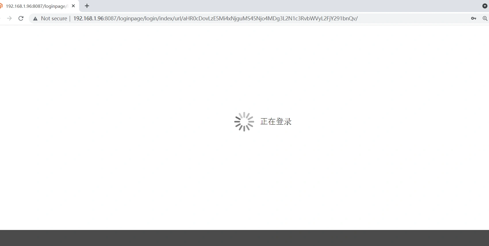
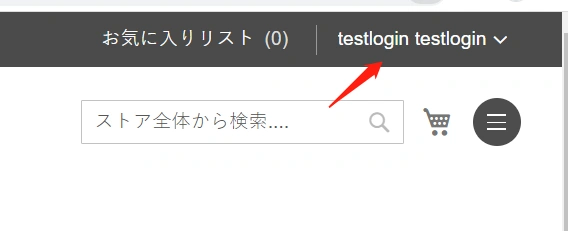
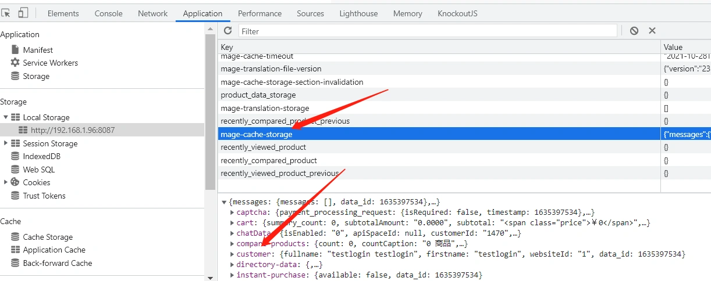
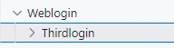
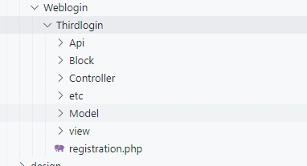
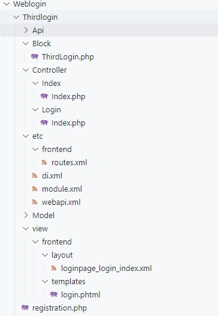
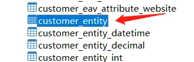

### 1.需求分析

实际项目中经常会遇到第三方系统登录到Magento的需求。
本章为大家讲解第三方系统登录Magento系统的实现方法。

模拟第三方系统登录页面，建立一个表单，在Magento的根目录下，建立login.php文件.我们先来看一下整个流程效果：

第一步，第三方页面输入Magento用户名密码：



第二步，点击登录，跳转到Magento系统，跳转到我们定制的登录中间页： 



第三步，跳转后查看是否登录成功：



 确认用户登录成功后，所有用户信息在前端存储成功： 



---

### 2.登录页表单

在Magento根目录下建立login.php文件(与index.php)同级：
login.php文件代码：

```php+HTML
<?php
$email = 'testlogin@qq.com';
$password = 'abc@123456';
?>

<!-- <script src="http://libs.baidu.com/jquery/2.0.0/jquery.min.js"></script> -->

<form action="http://192.168.1.96:8087/thirdlogin" method='post'>
    <input type="text" name="email" value="<?=$email?>">
    <input type="text" name="password" value="<?=$password?>">
    <input id='login' type="submit" value="登录">
</form>
```

现在访问你的域名/login.php，可以看到登录表单。


下面开始第三方登录逻辑开发。 

---

### 3.建立module

在app/code目录下建立目录：Weblogin/Thirdlogin



建立文件：registration.php：



registration.php:

```php
<?php \Magento\Framework\Component\ComponentRegistrar::register(
\Magento\Framework\Component\ComponentRegistrar::MODULE, 'Weblogin_Thirdlogin',
__DIR__
);
```

------

建立module.xml文件
app\code\Weblogin\Thirdlogin\etc\module.xml：

```xml
<?xml version="1.0"?>
<config xmlns:xsi="http://www.w3.org/2001/XMLSchema-instance" xsi:noNamespaceSchemaLocation="urn:magento:framework:Module/etc/module.xsd">
<module name="Weblogin_Thirdlogin" setup_version="0.1.2"/>
</config>
```

------

建立路由文件
app\code\Weblogin\Thirdlogin\etc\frontend\routes.xml：

```xml
<?xml version="1.0" ?>
<config xmlns:xsi="http://www.w3.org/2001/XMLSchema-instance" xsi:noNamespaceSchemaLocation="urn:magento:framework:App/etc/routes.xsd">
    <router id="standard">
        <route frontName="thirdlogin" id="thirdlogin">
            <module name="Weblogin_Thirdlogin"/>
        </route>

        <route frontName="loginpage" id="loginpage">
            <module name="Weblogin_Thirdlogin"/>
        </route>
    </router>
</config>
```

> 路由文件说明：

在路由文件里定义了两条路由：
1.thirdlogin ，即访问http://xxx/thirdlogin ，此路由为上一节中表单提交的控制器路由。
2.loginpage，即访问http://xxx/loginpage，此路由为登录后跳转到登录中间页的路由。

---

### 4.建立控制器-后端登录逻辑

建立登录后端逻辑处理控制器：
app\code\Weblogin\Thirdlogin\Controller\Index\Index.php:

```php
<?php
namespace Weblogin\Thirdlogin\Controller\Index;

use \Magento\Customer\Controller\AbstractAccount;
use \Magento\Framework\App\Action\Context;
use \Magento\Framework\View\Result\PageFactory;
use \Magento\Framework\App\Request\InvalidRequestException;
use \Magento\Framework\App\RequestInterface;
use \Magento\Framework\Phrase;
use \Magento\Framework\Controller\Result\Redirect;
use \Magento\Framework\App\CsrfAwareActionInterface;

/**
 * Edit registered card action
 */
class Index extends \Magento\Framework\App\Action\Action implements CsrfAwareActionInterface
{

    /**
     * @param Context $context
     * @param PageFactory $resultPageFactory
     */
    public function __construct(
        \Magento\Framework\Controller\ResultFactory $resultFactory,
        Context $context
    ) {
        $this->resultFactory = $resultFactory;
        parent::__construct($context);
    }

    /**
     * Default customer account page
     *
     * @return \Magento\Framework\View\Result\Page
     */
    public function execute()
    {
        $post = $this->getRequest()->getPostValue();
        $email = isset($post['email'])  ? $post['email'] : '';
        $password = isset($post['password'])  ? $post['password'] : '';
        $redirectTo = isset($post['redirect'])  ? $post['redirect'] : 1;
        $redirectToUrl = '';
        switch ($redirectTo) {
            case 1:
                $redirectToUrl = $this->_url->getUrl('customer/account');
                break;
            case 2:
                $redirectToUrl = $this->_url->getUrl('checkout');
                break;
            case 0:
                return $this->resultFactory
                        ->create(\Magento\Framework\Controller\ResultFactory::TYPE_REDIRECT)
                        ->setUrl($this->_url->getUrl('customer/account/login'));
                break;
        }

     

        if (!empty($email) && !empty($password)) {
            
            $objectManager = \Magento\Framework\App\ObjectManager::getInstance();
		    $session = $objectManager->get(\Magento\Customer\Model\Session::class);
		    $customerAccountManagement = $objectManager->get(\Magento\Customer\Model\AccountManagement::class);
		    $cookieManager = $objectManager->get(\Magento\Framework\Stdlib\Cookie\PhpCookieManager::class);
            $cookieMetadataFactory = $objectManager->get(\Magento\Framework\Stdlib\Cookie\CookieMetadataFactory::class);
            $redirect = $this->resultFactory->create(\Magento\Framework\Controller\ResultFactory::TYPE_REDIRECT);
            
            try {
				//login
				$customer = $customerAccountManagement->authenticate($email, $password);
				$session->setCustomerDataAsLoggedIn($customer);

                if ($cookieManager->getCookie('mage-cache-sessid')) {
                    $metadata = $cookieMetadataFactory->createCookieMetadata();
                    $metadata->setPath('/');
                    $cookieManager->deleteCookie('mage-cache-sessid', $metadata);
                }

                //redirect page
                $middlePage = 'loginpage/login/index/url/'.base64_encode($redirectToUrl);
                return $redirect->setUrl($this->_url->getUrl($middlePage));

            } catch (\Exception $e) {
                //redirect to login
                return $redirect->setUrl($this->_url->getUrl('customer/account/login'));
            } finally {
                $session->setUsername($email);
            }
        } else {
            exit('param error.');
		}

    }

    public function createCsrfValidationException(RequestInterface $request): ?InvalidRequestException
    {
        return null;
    }
 
    public function validateForCsrf(RequestInterface $request): ?bool
    {
        return true;
    }

}
```

> 代码逻辑说明：

1.登录逻辑全部放在execute方法中。
2.请求参数说明：
2-1：email:用户邮箱
2-2：password:用户密码
2-3：redirect：登录成功后重定向url
这里接收了两个值(1,2)，1：跳转到用户中心页，2跳转到购物车结算页。
3.登录逻辑：
登录逻辑主要是下面两行代码，可以参照magento系统现有的登录后端控制器。

```php
$customer = $customerAccountManagement->authenticate($email, $password);
$session->setCustomerDataAsLoggedIn($customer);
```

4.登录成功后跳转逻辑：

```php
$middlePage = 'loginpage/login/index/url/'.base64_encode($redirectToUrl);
return $redirect->setUrl($this->_url->getUrl($middlePage));
```

5.后端登录成功后跳转到我们自定义的登录中间页

> 登录中间页的作用：

由于magento把登录用户信息存储到了本地的localStorage中，如果我们只做了后端登录，而没有把登录后的用户信息写到本地的localStorage,会导致在前台页面看到用户的信息不完整，如header中不能显示用户名，不显示购物车数量，购物车数据等。因此我们需要做一个中间页，手动加载登录用户信息，存储到浏览器的localStorage中。

---

### 5.建立控制器-登录中间页

在一节中，用户登录成功后，会跳转到登录页，代码为：

```php
  $middlePage = 'loginpage/login/index/url/'.base64_encode($redirectToUrl);
```

------

loginpage在routes定义的路由

> 在此回顾一下路由的规则：

以这个url为例：http://xxx.com/loginpage/login/index/

1.第一段：loginpage 为我们在routes.xml中定义的frontName的值：

```
 <route frontName="thirdlogin" id="thirdlogin">
```

2.第二段：login: 为module/Controller下建立的目录名称
3.第三段：index:为module/Controller/Login下建立的控制器Index.php文件名
4.以上一小节的路由举例，如果url为http://xxx.com/thirdlogin
我们只写了一段，thirdlogin代表路由文件中定义的路由名，不写第二段和第三段则代表，控制器为Controller下面的Index目录和Index.php文件

------

5.后面的url为自定义的请求传递的参数，用于在中间页拿到这个参数来做跳转用到。

------

下面建立登录中间页的控制器：
app\code\Weblogin\Thirdlogin\Controller\Login\Index.php:

```php
<?php
namespace Weblogin\Thirdlogin\Controller\Login;

use \Magento\Customer\Controller\AbstractAccount;
use \Magento\Framework\App\Action\Context;
use \Magento\Framework\View\Result\PageFactory;
use \Magento\Framework\App\Request\InvalidRequestException;
use \Magento\Framework\App\RequestInterface;
use \Magento\Framework\Phrase;
use \Magento\Framework\Controller\Result\Redirect;
use \Magento\Framework\App\CsrfAwareActionInterface;

/**
 * Edit registered card action
 */
class Index extends \Magento\Framework\App\Action\Action
{

    /**
     * @param Context $context
     * @param PageFactory $resultPageFactory
     */
    public function __construct(
        \Magento\Framework\View\Result\PageFactory $resultPageFactory,
        Context $context
    ) {
        $this->resultPageFactory = $resultPageFactory;
        parent::__construct($context);
    }

    /**
     * Default customer account page
     *
     * @return \Magento\Framework\View\Result\Page
     */
    public function execute()
    {
        return $this->resultPageFactory->create();
    }

}
```

这个控制器没有什么特别需要讲解的地方，只用于显示模板。

---

### 6.建立中间页的layout文件

登录中间页的控制器建立好了，这个控制器具体显示哪个一模板，则是由layout布局文件决定。
下面开始建立layout文件。
app\code\Weblogin\Thirdlogin\view\frontend\layout\loginpage_login_index.xml

```xml
<?xml version="1.0"?>
<page xmlns:xsi="http://www.w3.org/2001/XMLSchema-instance"  xsi:noNamespaceSchemaLocation="urn:magento:framework:View/Layout/etc/page_configuration.xsd" layout="1column">
    <body>
        <referenceContainer name="content">
            <block class="Weblogin\Thirdlogin\Block\ThirdLogin" name="custom_thirdlogin_page" template="login.phtml">
            </block>
        </referenceContainer>
    </body>
</page>
```

> 布局文件说明：

1.布局文件中设置了block和template。
2.布局文件的命名规则：
我们在第九章-创建block小节中曾讲解过布局文件的命名规则：
布局文件的命名规则为：

```
<Router Name><Controller Name><Action Name>
```

在这里对应的就是loginpage_login_index(全部小写+.xml)
3.这样当我们在浏览器中访问链接http://xxx/loginpage/login/index时，
访问的是app/code/Controller/Login/Index控制器。
而这个控制器中要显示哪个模板则在上面的布局文件中指定，同时在布局文件中指定了模板获取数据对应的Block文件。

<font color='orange'>布局文件在magento中的理解尤为重要，当需要重写系统功能时，我们遵循上面的规则，可以从url中找到对应的控制器，布局文件，模板等。</font>

---

### 7.建立block文件

本模块暂时没有用到block查询数据，因此只建立一个空的类文件,并未实际用到：
app\code\Weblogin\Thirdlogin\Block\ThirdLogin.php：

```php
<?php

namespace Weblogin\Thirdlogin\Block;

class ThirdLogin extends \Magento\Framework\View\Element\Template
{

}
```

---

### 8.建立登录中间页模板

我们在布局文件中指定了中间页的模板，下面建立该模板：
app\code\Weblogin\Thirdlogin\view\frontend\templates\login.phtml：

```php+HTML
<?php
$objectManager = \Magento\Framework\App\ObjectManager::getInstance();  
$request = $objectManager->get('Magento\Framework\App\Request\Http');  
$redirect = $request->getParam('url') ?? '';
if(!$redirect){
    exit();
}
$redirect = base64_decode($redirect);
?>
<style>
    .page-bottom{
        display:none;
    }
    header{ 
        display: none !important;
    }
    header .header-actions .minicart-wrapper{
        display: none;
    }
    .loading-wrap{
        margin-top: 100px;
        width: 100%;
        display: flex;
        justify-content: center;
        align-items: center;
    }
    .loading-wrap img{
        width: 50px;
    }
    .loading-txt{
        margin-left: 15px;
        font-size: 20px;
        line-height: 1.2;
    }
    .loading-txt02{
        font-size: 14px;
        color: #666;
    }
</style>


<div class="loading-wrap">
    getUrl() ?>pub/errors/default/images/loader-1.gif">
    <div class="loading-txt">正在登录</span></div>
</div>

<script>
require([
        "jquery",
        "underscore",
        "Magento_Customer/js/customer-data"
    ], function($, _, customer){

        var customStorage = $.localStorage.get('mage-cache-storage');

        if( _.isEmpty(customStorage) || _.isEmpty(customStorage.customer)  || _.isEmpty(customStorage.customer.fullname) ){

            customer.reload();
            $("body").ajaxComplete(function(event,request, settings){
                 location.href="<?=$redirect?>";
            });
        }else{
             location.href="<?=$redirect?>";
        }
    });
</script>
```

> 代码说明：

1.该模板接收了在后端登录时传递过来的redirect参数。
2.js部分,加载了jquery，_(下划线函数库)，customer.js
3,登录中间页做的最主要的事情就是加载登录用户信息：

```js
customer.reload();
$("body").ajaxComplete(function(event,request, settings){
     location.href="<?=$redirect?>";
});
```

customer.load()方法会发送一个ajax请求，load()方法中不填参数就会加载所有用户登录后相关的信息，即我们用浏览器看到的localStorage中存储的信息：

```
captcha: {payment_processing_request: {isRequired: false, timestamp: 1635397534},…}
cart: {summary_count: 0, subtotalAmount: "0.0000", subtotal: "<span class="price">￥0</span>",…}
chatData: {isEnabled: "0", apiSpaceId: null, customerId: "1470",…}
compare-products: {count: 0, countCaption: "0 商品",…}
customer: {fullname: "testlogin testlogin", firstname: "testlogin", websiteId: "1", data_id: 1635397534}
directory-data: {,…}
instant-purchase: {available: false, data_id: 1635397534}
......
```

可以看到，里面包含了customer对象，cart对象，地区对象，心愿单等等。
当该请求返回成功后，跳转到前面传过来的redirect地址。
即使用jquery的ajaxComplete方法实现。

------

至此，模板编写完毕。
更新module,给文件权限，执行

```
php bin/mageto s:up
chmod -R 777 /var/www/html/
```

------

最终实现的即为第1小节中需求分析中展示的效果。
最后，所有代码的文件结构 。
以前面建立的文件为准，下面截图中多余的如Api目录，di.xml,webapi.xml为webapi相关内容，会在webapi章节中讲解。



---

### 9.第三方登录扩展

本节内容为大家提供一个思路，旨在抛砖引玉。
我们实现了表单登录到Magento系统。
可以借助这个逻辑，扩展为......
微信登录，qq登录，Line登录，github登录。

------

OAuth  user 唯一id

通常第三方登录调用其api后，会返回一个用户wx_openid。我们以微信登录举例：
首先新建一个字段如wx_openid存到用户表中。



当用户点击用微信登录后，去用户表里查看该用户wx_openid是否有值 。

1. 如果没有值 ，首先需要先绑定用户的wx_openid,
   即用户在magento系统登录成功后，调用微信登录api，获得token。
   将微信返回的token写入该用户wx_openid字段。
2. 如果有值

```php
$customer = $customerAccountManagement->authenticate($email, $password);
$session->setCustomerDataAsLoggedIn($customer);
```

我们把这段代码修改一下
$customer = $this->getUserFromWxOpenid($wx_openid);
我们自己写一个方法getUserFromWxOpenid，去数据库查询，是否有该wx_openid，如果查询到，则通过该wx_openid查询该用户信息。
再继续调用
$session->setCustomerDataAsLoggedIn($customer);

------

> 如果大家需要做其它系统的第三方登录，可以按照此思路开发。


本小节结束.