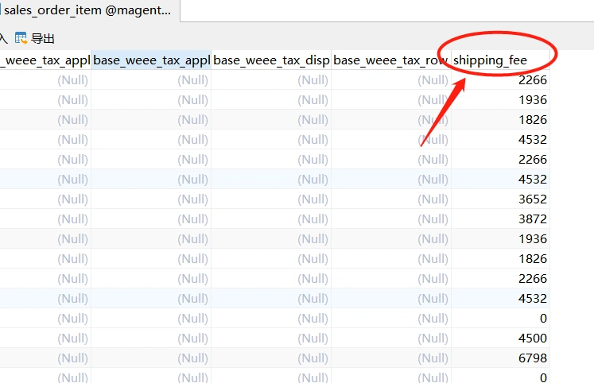

### 1.需求分析

本章为大家讲解magento创建订单的流程，以及向订单的商品表中添加一个字段，并写入数据。

本例以shipping_fee字段为例讲解，假设我们有一个需求，我们为每一个商品都指定了固定的运费规则，假设我们创建一个订单，订单中有一个商品数量是3，运费规则是单个商品的运费乘以数量，如单个商品运费是10，我们将在这条记录的shipping_fee字段记录为30.

针对以上需求，我们需要了解订单相关的两张表：
sales_order 订单主表
sales_order_item 订单item表
二者的关系是一对多，即sales_order表生成一条记录，代表一个订单，sales_order_item 中生成该订单中的商品，可以是一条，也可以是多条，两个表以order_id进行关联。

最终要实现的效果如下图：



如上图，我们记录了订单对应的每一个item商品对应的运费。
本例主要目的在于讲解如何向sales_order_item表中添加一个字段并存入指定数据，在此不对运费的计算逻辑做代码说明，只做举例用。 

---

### 2.创建订单流程追踪

##### **本节内容全解订单创建流程，及创建订单后，在什么位置向sales_order_item表写入数据。**

### 

##### 创建订单流程分析：

##### **1、需求**

需求是找到下订单的代码逻辑，找到下单过程中，向sales_order_item(订单中的商品)表中添加数据的代码位置，
并向该表中添加一个新的字段shipping_fee,并将计算出的运费写入该字段。

##### **2、定位创建订单请求URL：**

在前台点击创建订单按钮时，定位到下单请求URL：POST `/rest/default/V1/carts/mine/payment-information`

api路由文件
`vendor/magento/module-checkout/etc/webapi.xml：`

```
<!-- My place order with payment information saving -->
<route url="/V1/carts/mine/payment-information" method="POST">
    <service class="Magento\Checkout\Api\PaymentInformationManagementInterface" method="savePaymentInformationAndPlaceOrder"></service>
    <resources>
        <resource ref="self" ></resource>
    </resources>
    <data>
        <parameter name="cartId" force="true">%cart_id%</parameter>
    </data>
</route>
```

PaymentInformationManagementInterface接口由PaymentInformationManagement类实现.

追踪代码到:
`vendor/magento/module-checkout/Model/PaymentInformationManagement.php` 的 `savePaymentInformationAndPlaceOrder()`方法.
代码片段为：$orderId = $this->cartManagement->placeOrder($cartId);

**3、由购物车管理类创建订单。**
追踪代码到：`vendor/magento/module-quote/Model/QuoteManagement.php` 的 placeOrder()方法。
分析这个方法可以大概得知，mgt创建订单的过程是从购物车读取数据，最终生成订单。
追踪代码到：QuoteManagement.php 的 submitQuote()方法。

3-1.生成订单自增id的逻辑分析:
`$quote->reserveOrderId();`
由框架底层类Sequence负责生成，生成方式：直接向sequence_order_1表中插入一条数据，并返回lastInsertId
`vendor/magento/framework/EntityManager/Sequence/Sequence.php`
代码示例：

```
public function getNextValue()
{
	$this->resource->getConnection($this->connectionName)
	->insert($this->resource->getTableName($this->sequenceTable), []);
	return $this->resource->getConnection($this->connectionName)
	->lastInsertId($this->resource->getTableName($this->sequenceTable));
}
```

sequence_order_0,sequence_order_1负责生成order_id

3-2.准备order数据：

```
$order->setBillingAddress($billingAddress);
$order->setAddresses($addresses);
$order->setItems($this->resolveItems($quote));
......
```

3-3.调用创建订单before事件：

```
$this->eventManager->dispatch(
'sales_model_service_quote_submit_before',
[
'order' => $order,
'quote' => $quote
]
);
```

3-4.创建订单：

```
$order = $this->orderManagement->place($order);
$quote->setIsActive(false);
```

3-5.调用订单成功事件:

```
$this->eventManager->dispatch(
'sales_model_service_quote_submit_success',
[
'order' => $order,
'quote' => $quote
]
);
```

3-6.更新购物车：
`$this->quoteRepository->save($quote);`

**4.分析3-4流程**：
`$order = $this->orderManagement->place($order);`
`//$this->orderManagement: Magento\Sales\Model\Service\OrderService`

调用了OrderService的place方法进行下单
`$order->place();`

```
$this->_eventManager->dispatch('sales_order_place_before', ['order' => $this]);
   $this->_placePayment();
   $this->_eventManager->dispatch('sales_order_place_after', ['order' => $this]);
```

分析 $this->_placePayment();
`vendor/magento/module-sales/Model/Order/Payment.php`
place()方法：这里的place方法主要是处理支付状态相关的

**5.生成订单**
`$this->orderRepository->save($order);` 这一步把数据保存到sales_order表中

```
$order = $this->orderRepository->save($order);
//$this->orderRepository:  Magento\Sales\Model\OrderRepository
```

5-1: orderRepository中创建订单的方法：

```
$this->metadata->getMapper()->save($entity);
//$this->metadata:  Magento\Sales\Model\ResourceModel\Metadata
//$this->metadata->getMapper():  Magento\Sales\Model\ResourceModel\Order
```

5-2: `Magento\Sales\Model\ResourceModel:`
调用父类方法save():
`return parent::save($object);`
父类：
`Model\ResourceModel\EntityAbstract`

##### **以上的流程是创建订单的，并没有显示地调用指定写入sales_order_item表中的逻辑.创建订单流程结束，即生成sales_order表数据。**

##### 6.sales_order_item表写数据流程

sales_order_item表中的数据是通过`Magento\Sales\Model\Order\ItemRepository`的save()写入的
这个方法没有找到显式被调用的地方。。

在这个文件中有显式调用save()方法的代码.
vendor/magento/module-sales/Model/ResourceModel/Order/Relation.php

基本可以确定，sales_order_item表的数据是调用该文件的processRelation()方法写入的。

代码片段：

```
if (null !== $object->getItems()) {
	/** @var \Magento\Sales\Model\Order\Item $item */
	foreach ($object->getItems() as $item) {
	$item->setOrderId($object->getId());
	$item->setOrder($object);
	$this->orderItemRepository->save($item);
	}
}
```

##### **processRelation()这个方法是怎么被调用的？**

Relation调用机制底层代码流程：

`vendor/magento/module-sales/etc/di.xml`文件中定义：

在这个文件里定义了ResourceModel->Order的依赖关系,指定了 OrderRelationsComposite:

```
<type name="Magento\Sales\Model\ResourceModel\Order">
	<arguments>
	<argument name="entityRelationComposite" xsi:type="object">OrderRelationsComposite</argument>
	</arguments>
</type>
```

OrderRelationsComposite由virtualType来指定：

```
<virtualType name="OrderRelationsComposite" type="Magento\Framework\Model\ResourceModel\Db\VersionControl\RelationComposite">
	<arguments>
		<argument name="relationProcessors" xsi:type="array">
			<item name="default" xsi:type="object">Magento\Sales\Model\ResourceModel\Order\Relation</item>
		</argument>
	</arguments>
</virtualType>
```

6-1.当Model文件调用save()方法的时候，可以追踪代码到：
`vendor/magento/framework/Model/ResourceModel/Db/AbstractDb.php` save()方法
该方法中会调用：$this->processAfterSaves($object);

6-2.processAfterSaves方法分析：
`vendor/magento/framework/Model/ResourceModel/Db/VersionControl/AbstractDb.php`中定义了
`processAfterSaves()`方法，该方法中代码：
`$this->entityRelationComposite->processRelations($object)`;

6-3.processRelations方法分析：
`vendor/magento/framework/Model/ResourceModel/Db/VersionControl/RelationComposite.php`

```
foreach ($this->relationProcessors as $processor) {
	/**@var $processor RelationInterface*/
	$processor->processRelation($object);
}
```

也就是相当于循环调用绑定到 RelationComposite 类中的processor对象的**processRelation**方法。

再回到virtualType定义：

```
<virtualType name="OrderRelationsComposite" type="Magento\Framework\Model\ResourceModel\Db\VersionControl\RelationComposite">
	<arguments>
		<argument name="relationProcessors" xsi:type="array">
			<item name="default" xsi:type="object">Magento\Sales\Model\ResourceModel\Order\Relation</item>
		</argument>
	</arguments>
</virtualType>
```

所以上面的逻辑 相当于调用 Relation 的 processRelation方法

总结： 当调用model的save()方法时，会检查，该model是否有绑定的RelationComposite类，如果有，通过afterSave机制，会调用该Relation类的processRelation方法。

##### 8.修改记录：

一.DB修改:
修改sales_order_item表 添加字段：shipping_fee
注意，修数据表字段后，需要cc清除缓存，否则会导致新加的字段无法保存到DB。

二.文件修改:
1.vendor/magento/module-sales/Model/ResourceModel/Order/Relation.php
processRelation()

2.vendor/magento/module-sales/Model/Order/Item.php
添加method:setShippingFee()

3.app/code/CyberCheckout/Sales/etc/di.xml
因此，我们只需要完成重写1、2、3三步即可。

---

### 3.重写

前面，我们讲解了定位创建订单的流程，及向sales_order_item表写数据的逻辑，下面开始重写步骤。

**第一步：在自定义的module中添加di.xml配置：**

```xml
<?xml version="1.0"?>
<config xmlns:xsi="http://www.w3.org/2001/XMLSchema-instance" xsi:noNamespaceSchemaLocation="urn:magento:framework:ObjectManager/etc/config.xsd">
    <preference for="Magento\Sales\Model\ResourceModel\Order\Relation" type="CustomCheckout\Sales\Model\ResourceModel\Order\Relation" />
    <preference for="Magento\Sales\Model\Order\Item" type="CustomCheckout\Sales\Model\Order\Item" />
</config>
```

**第二步：重写上面定义的两个文件**

1. Relation.php
   `app/code/CustomCheckout/Sales/Model/ResourceModel/Order/Relation.php`

```php
<?php
/**
 * Copyright © Magento, Inc. All rights reserved.
 * See COPYING.txt for license details.
 */

namespace CustomCheckout\Sales\Model\ResourceModel\Order;

use Magento\Framework\Model\ResourceModel\Db\VersionControl\RelationInterface;
use Magento\Sales\Api\OrderItemRepositoryInterface;
use Magento\Sales\Model\ResourceModel\Order\Handler\Address as AddressHandler;
use Magento\Sales\Model\ResourceModel\Order\Payment as OrderPaymentResource;
use Magento\Sales\Model\ResourceModel\Order\Status\History as OrderStatusHistoryResource;

/**
 * Class Relation
 */
class Relation implements RelationInterface
{
    /**
     * @var AddressHandler
     */
    protected $addressHandler;

    /**
     * @var OrderItemRepositoryInterface
     */
    protected $orderItemRepository;

    /**
     * @var OrderPaymentResource
     */
    protected $orderPaymentResource;

    /**
     * @var OrderStatusHistoryResource
     */
    protected $orderStatusHistoryResource;

    /**
     * @param AddressHandler $addressHandler
     * @param OrderItemRepositoryInterface $orderItemRepository
     * @param OrderPaymentResource $orderPaymentResource
     * @param OrderStatusHistoryResource $orderStatusHistoryResource
     */
    public function __construct(
        AddressHandler $addressHandler,
        OrderItemRepositoryInterface $orderItemRepository,
        OrderPaymentResource $orderPaymentResource,
        OrderStatusHistoryResource $orderStatusHistoryResource
    )
    {
        $this->addressHandler = $addressHandler;
        $this->orderItemRepository = $orderItemRepository;
        $this->orderPaymentResource = $orderPaymentResource;
        $this->orderStatusHistoryResource = $orderStatusHistoryResource;
    }

    /**
     * Save relations for Order
     *
     * @param \Magento\Framework\Model\AbstractModel $object
     * @return void
     * @throws \Exception
     */
    public function processRelation(\Magento\Framework\Model\AbstractModel $object)
    {
        /** @var \Magento\Sales\Model\Order $object */
      
        if (null !== $object->getItems()) {
            /** @var \Magento\Sales\Model\Order\Item $item */
            foreach ($object->getItems() as $item) {
                $item->setOrderId($object->getId());
                $item->setOrder($object);
                //我们在这里模拟一个计算运费的值
                $shippingFee = 19.90;
                //注意在这一步调用了itemModel 的setter方法
                $item->setShippingFee($shippingFee);
            }
            //这里保存了item数据
            $this->orderItemRepository->save($item);
            }
        }
        if (null !== $object->getPayment()) {
            $payment = $object->getPayment();
            $payment->setParentId($object->getId());
            $payment->setOrder($object);
            $this->orderPaymentResource->save($payment);
        }
        if (null !== $object->getStatusHistories()) {
            /** @var \Magento\Sales\Model\Order\Status\History $statusHistory */
            foreach ($object->getStatusHistories() as $statusHistory) {
                $statusHistory->setParentId($object->getId());
                $statusHistory->setOrder($object);
                $this->orderStatusHistoryResource->save($statusHistory);
            }
        }
        if (null !== $object->getRelatedObjects()) {
            foreach ($object->getRelatedObjects() as $relatedObject) {
                $relatedObject->setOrder($object);
                $relatedObject->save();
            }
        }
        $this->addressHandler->removeEmptyAddresses($object);
        $this->addressHandler->process($object);
    }
}
```

2.Item.php
`app/code/CustomCheckout/Sales/Model/Order/Item.php`

```php
<?php
/**
 * Copyright © Magento, Inc. All rights reserved.
 * See COPYING.txt for license details.
 */
namespace CyberCheckout\Sales\Model\Order;

use Magento\Framework\Api\AttributeValueFactory;
use Magento\Sales\Api\Data\OrderItemInterface;
use Magento\Sales\Model\AbstractModel;

/**
 * Order Item Model
 *
 * @api
 * @method int getGiftMessageId()
 * @method \Magento\Sales\Model\Order\Item setGiftMessageId(int $value)
 * @method int getGiftMessageAvailable()
 * @method \Magento\Sales\Model\Order\Item setGiftMessageAvailable(int $value)
 * @SuppressWarnings(PHPMD.ExcessivePublicCount)
 * @SuppressWarnings(PHPMD.ExcessiveClassComplexity)
 * @SuppressWarnings(PHPMD.CouplingBetweenObjects)
 * @since 100.0.2
 */
class Item extends \Magento\Sales\Model\Order\Item
{
    /**
     * 我们在这个文件里只是添加了这一个方法，
     * 将shipping_fee字段表示为model的属性值，
     * 这样通过model保存数据时，会自动将对象的属性值存入db
     */
    public function setShippingFee($shippingFee = 0){
        return $this->setData('shipping_fee', $shippingFee);
    }
}
```

最后，执行命令 php bin/magento s:up 更新模块，去前台页面下单，将会看到sales_order_item表中每条记录的shipping_fee被写入为19.90


本小节结束.

