### 如何访问一个api

**magento访问api有几种方式：**

- Token-based authentication
- OAuth-based authentication
- OAuth error codes
- Session-based authentication

我们主要介绍第一种：基于token验证，访问api。

------

##### 使用token方式访问webapi有几种方式：

| Token 类型  | 描述                                              | 有效时间                        |
| :---------- | :------------------------------------------------ | :------------------------------ |
| Integration | 商家确定集成可以访问哪些 Magento 资源。           | 不定。 它一直持续到被手动撤销。 |
| Admin       | 商家确定管理员用户可以访问哪些 Magento 资源。     | 4 hours                         |
| Customer    | 将访问授权给如下资源 `anonymous` 或者`self` 权限. | 1 hour                          |

------

**integrations(集成)token**
说明：使用integrations创建的token没有时间限制，除非手动删除。
**创建步骤说明**
第一步，登录后台，导航到 System -- Extensions -- Integrations

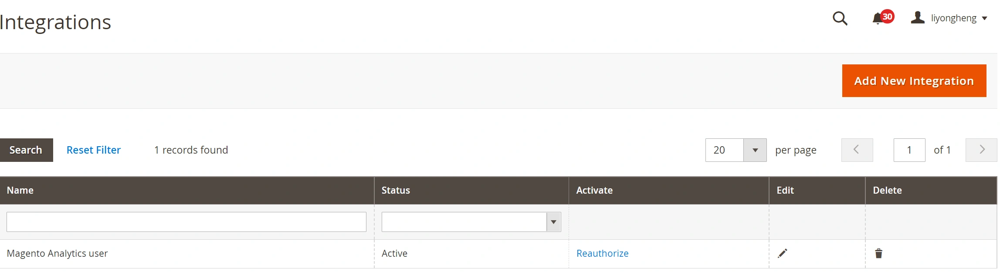

第二步，点击 Add New Integration
第三步，在名称字段中输入integrations的唯一名称。 然后在您的密码字段中输入您的管理员密码。 将所有其他字段留空。 

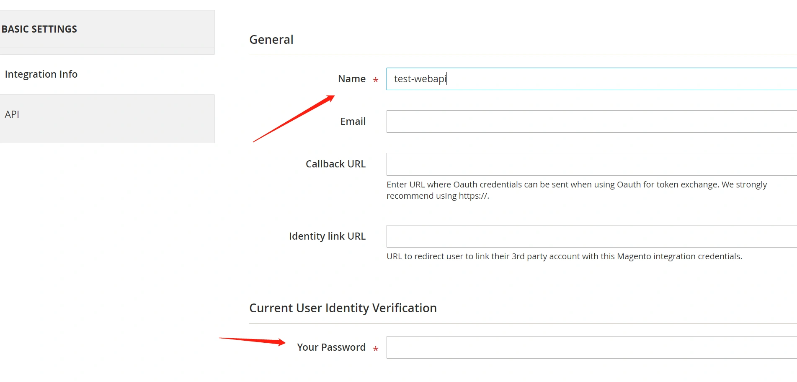

第四步，点击 API 选项卡。 选择integrations可以访问的 Magento 资源。 您可以选择所有资源，也可以选择自定义列表。（我们这里作为测试演试，选择全部，即将所有magento的api资源全部开放） 

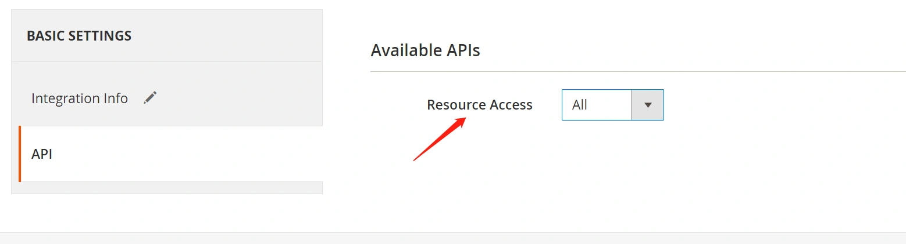

 第五步，点击保存以保存更改并返回到集成页面。 

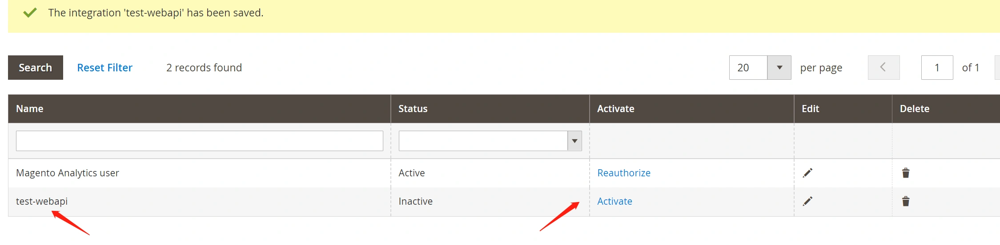

第六步，点击新创建的集成对应的网格中的Activate链接。
第七步，点击Allow，会弹出一个层，显示api的token信息。 

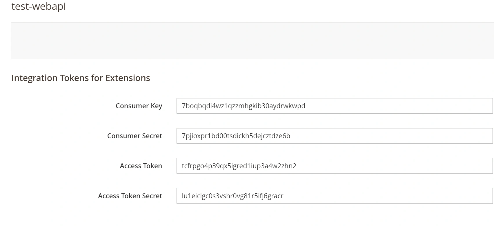

第八步，查看token信息，我们可以在上一步弹出的信息中复制token信息保存，如果没有复制，可以点击列表的编辑按钮，进入详情页面查看复制。
拉到页面底部，可以看到生成的token记录： 

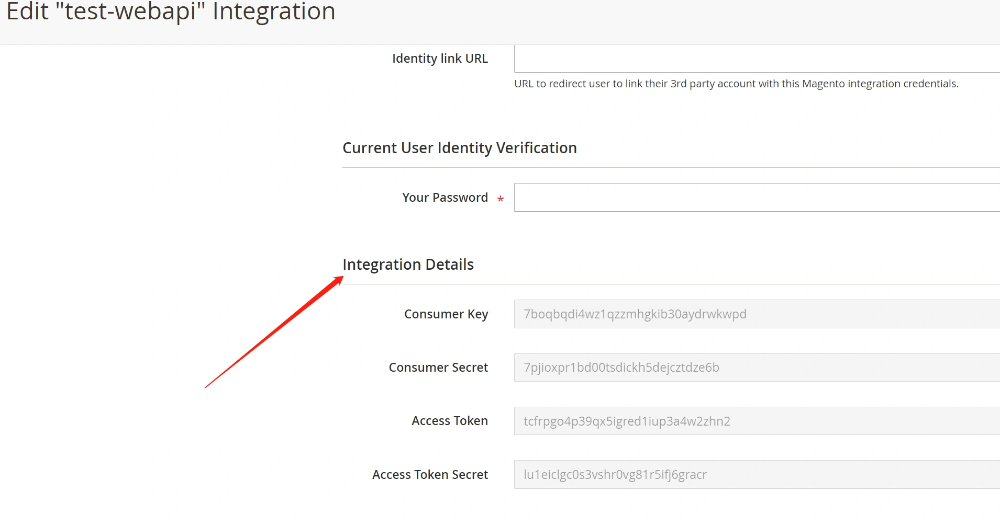

---

**Admin类型的token**
Magento 为管理员和customer提供单独的token服务。通过用户的username和password信息换取token.

Magento Web API 框架允许访客用户访问配置为anonymous权限级别的资源。
**使用admin用户获取token**
使用postman工具发送一个post请求，并传递参数username,password.
请求的地址为：
http://example.com/rest/V1/integration/admin/token

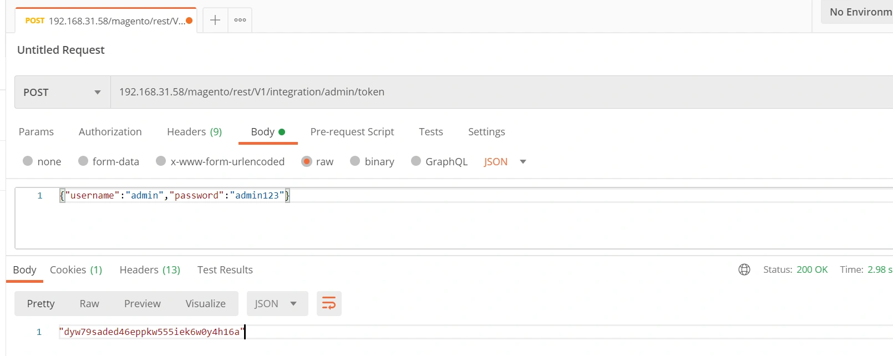

注意:我这里的项目是安装在二级目录magento下面，因此，我的访问地址为：
192.168.31.58/magento/rest/V1/integration/admin/token
这里的192.168.31.58/magento相当于域名。
在请求返回的信息中我们拿到一个字符串：`dyw79saded46eppkw555iek6w0y4h16a`
这个字符串即为获取到的AccessToken。
注意，每次请求获取token接口，都会得到一个新的token。

> 使用admin帐户获取的AccessToken有效期为4个小时。

------

**创建一个指定的api用户，授权访问指定资源**
通常admin用户的权限较大，我们可以创建一个指定的角色和指定的管理员用户，把该用户添加到角色中，专门用于访问指定的api。
第一步，创建角色。
依次导航到 System -- Permissions -- User Roles

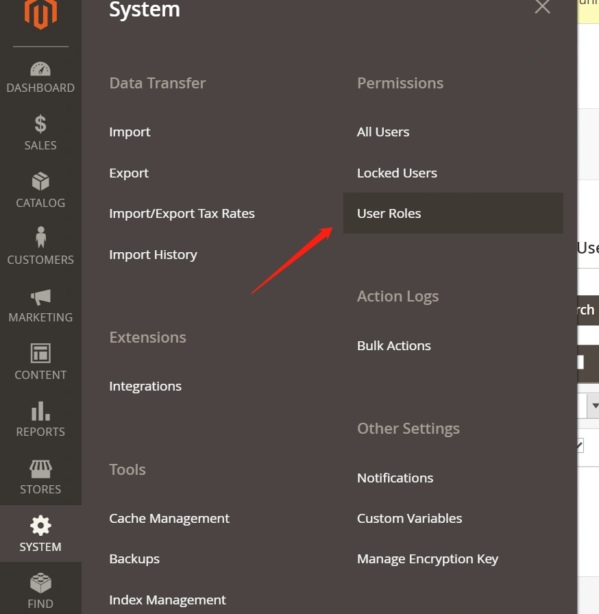

 第二步，点击右上角Add New Role，添加新的角色。 

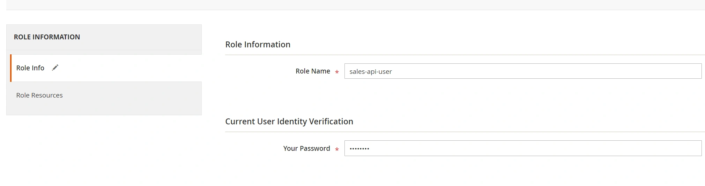

输入角色名，和管理员密码，保存.
第三步，选择该角色的权限，即可访问的资源。 

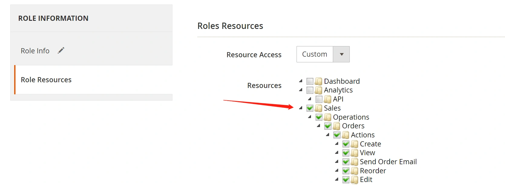

 第四步，保存，返回角色列表。

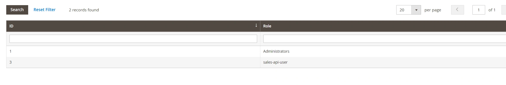

 第五步，点击我们新建的角色，进入详情：

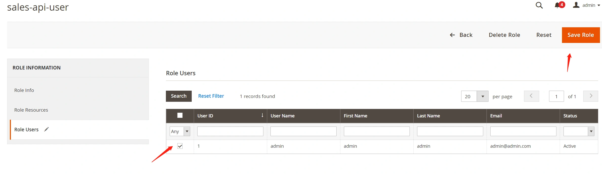

进入详情页面后，在左侧选项卡多了一个Role Users，在右侧选择管理员和户添加到该角色。
由于我的环境只有一个admin用户，因此此处没有显示其它管理员。
我们可以在后台添加一个管理员用户，并把该用户添加到该角色下。
使用该管理员用户获取token的步骤同admin用户方式相同。

该用户仅限于访问sales模块相关的api。

------

**使用代码获取token，访问api示例。**
上面的示例中，我们使用postman获取token。
下面讲解如何通过程序获取token，访问api。
**示例1:获取AccessToken**

```php
$url = 'http://192.168.31.58/rest/V1/integration/admin/token';
 
$ch = curl_init($url);
 
$body = json_encode(['username' => 'admin', 'password' => 'admin123']);
 
curl_setopt($ch, CURLOPT_CUSTOMREQUEST, 'POST');
curl_setopt($ch, CURLOPT_RETURNTRANSFER, true);
curl_setopt($ch, CURLOPT_POSTFIELDS, $body);
curl_setopt($ch, CURLOPT_HTTPHEADER, array('Content-Type: application/json', "Content-Lenght: " . strlen($body)));
 
$access_token = curl_exec($ch);
```

示例2：**测试查询商品分类api。**

```php
//测试查询分类接口
$categoryUrl = 'http://192.168.31.100/magento/rest/default/V1/categories';
$ch = curl_init($categoryUrl);
curl_setopt($ch, CURLOPT_CUSTOMREQUEST, "GET");
curl_setopt($ch, CURLOPT_RETURNTRANSFER, true);
curl_setopt($ch, CURLOPT_HTTPHEADER, array("Content-Type: application/json", "Authorization: Bearer " . json_decode($access_token)));
$result = curl_exec($ch);
$result = json_decode($result, 1);
echo '<pre>';print_r($result);
```


本小节结束.