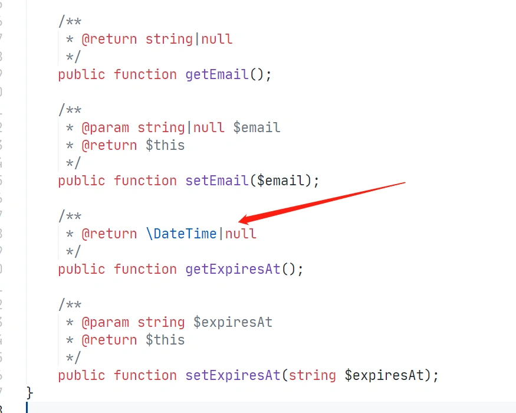
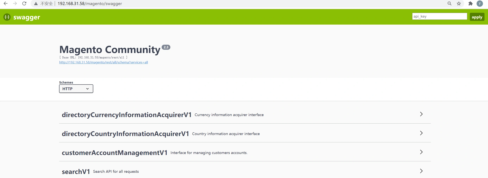
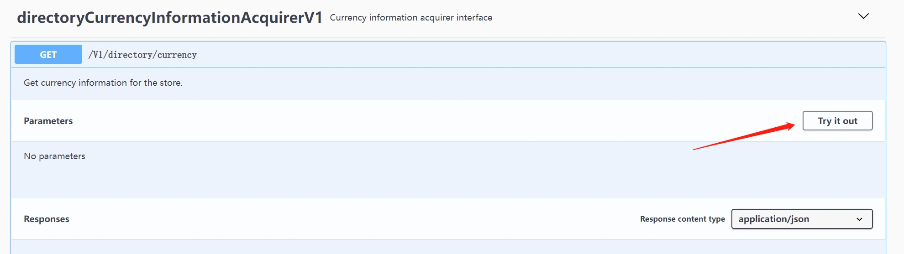
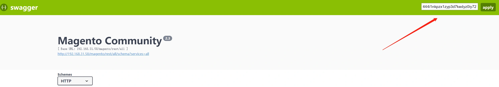
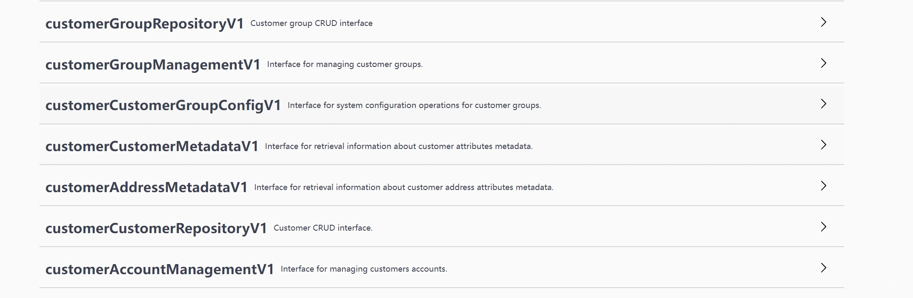

### swagger介绍

magento为我们集成了swaggger，swagger是一个api接口文档生成工具，可以通过swagger页面查看接口文档，模拟请求等。

------

**magento中访问swagger的方式**
swagger访问地址：
[http://域名/swagger](http://xn--eqrt2g/swagger)
如下：

说明：
在magento2.3版本中访问swagger可以会访问出错，该问题为2.3版本的一个bug，我们来修复一下它。
Issue:
https://github.com/dotmailer/dotmailer-magento2-extension/issues/557
修复方式：
编辑`vendor/dotmailer/dotmailer-magento2-extension/Api/Data/CouponAttributeInterface.php`
`@param` 为Datetime的 或者`@return`为Datetime的
改为 `@return string|null`： 

修改后，刷新swagger页面： 

可以看到swagger页面为我们列出了系统内部开放的api。
点击某个api可以查看请求参数，填写正确的参数后，点击Try it out，可以模拟请求，查看返回的结果： 

默认swagger显示的为guest可以调用的接口。不包括订单数据，用户数据这类具有严格权限控制类型的接口。
我们使用上一节讲到的access token机制，可以使用postman工具获取一个admin类型的token，或者通过后台，查看integration生成的token，填写到右上角的api key字段，点击apply，即可查看所有接口列表。 

 如下截取填写了AccessToken后，增加的customer相关的接口： 

说明：
swagger为我们展示了所有magento系统内部提供的api接口。
我们自己开发的模块中，如果添加了api的配置和功能，也会自动生成文档，并展示在swagger页面中。 

本小节结束.