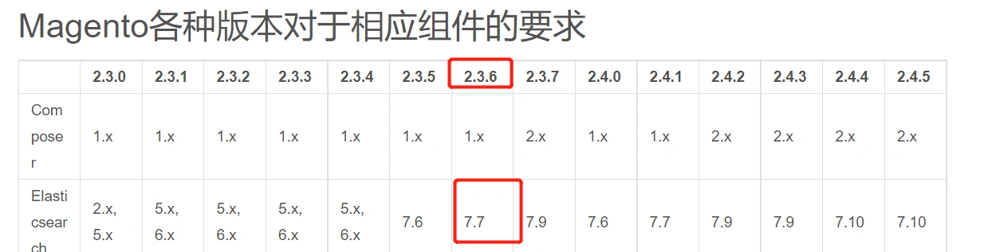

### ElasticSearcch配置与安装

##### ElasticSearch官网

https://www.elastic.co/

##### 查看magento对应的ElasticSearch版本

可以在第三章-3-10小节中查看,或者查看官方文档。



magento2.3.6版本需要es的版本为7.7以上

##### 下载对应es

es各个版本的下载地址:
https://www.elastic.co/downloads/past-releases#elasticsearch
选择下载7.7.1版本


下载 [LINUX X86_64](https://artifacts.elastic.co/downloads/elasticsearch/elasticsearch-7.7.1-linux-x86_64.tar.gz) 版本

------

##### 准备ES运行环境

- 将下载的tar包上传到服务器,并解压
- 新建运行es的用户:

```
useradd -m -s /bin/bash elasticsearch
elasticsearch@dlprdweb01:~$ pwd
/home/elasticsearch
elasticsearch@dlprdweb01:~$ ls -l
total 307084
drwxr-xr-x 9 elasticsearch elasticsearch      4096 May 29  2020 elasticsearch-7.7.1
-rw-rw-r-- 1 ubuntu        ubuntu        314445622 Sep 18 14:22 elasticsearch-7.7.1-linux-x86_64.tar.gz
```

##### 建立词典文件,es启动时指定了这个文件

```
touch ./elasticsearch-7.7.1/config/search_dic.csv
```

##### 配置JAVA_HOME

编辑.bashrc文件:

```
vim ~/.bashrc
```

添加:

```
export JAVA_HOME=/home/elasticsearch/elasticsearch-7.7.1/jdk
export PATH=.:$JAVA_HOME/bin:$PATH
```

刷新环境变量

```
source ~/.bashrc
```

输入 java -version 检测环境变量配置:

```
$ java -version
openjdk version "14.0.1" 2020-04-14
OpenJDK Runtime Environment AdoptOpenJDK (build 14.0.1+7)
OpenJDK 64-Bit Server VM AdoptOpenJDK (build 14.0.1+7, mixed mode, sharing)
```

##### 启动ES

```
/home/elasticsearch/elasticsearch-7.7.1/bin/elasticsearch
```

如果没有报错,Ctrl+c 退出
重新以后台进程方式启动：
`/home/elasticsearch/elasticsearch-7.7.1/bin/elasticsearch -d`

> ElasticSearch是作为一个独立的服务运行.如果是在我们之前搭建的docker里面安装,则按照对应的步骤,在容器里的对应/var/www/html目录下操作即可.