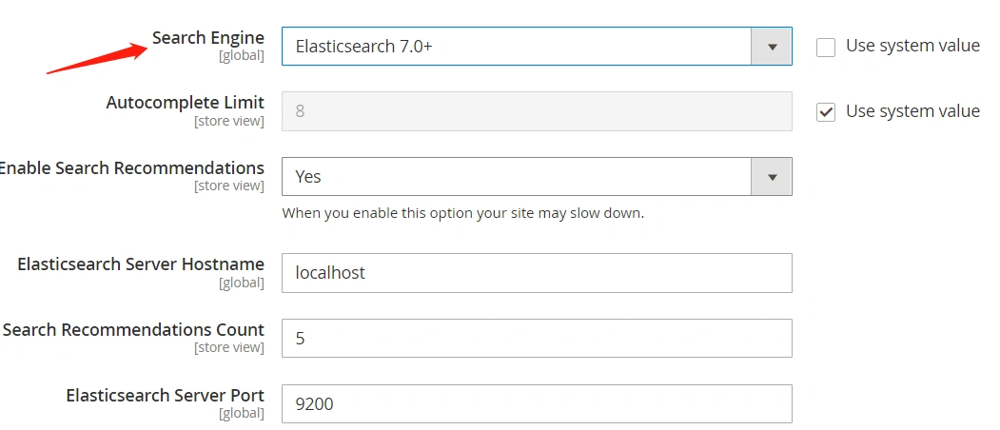
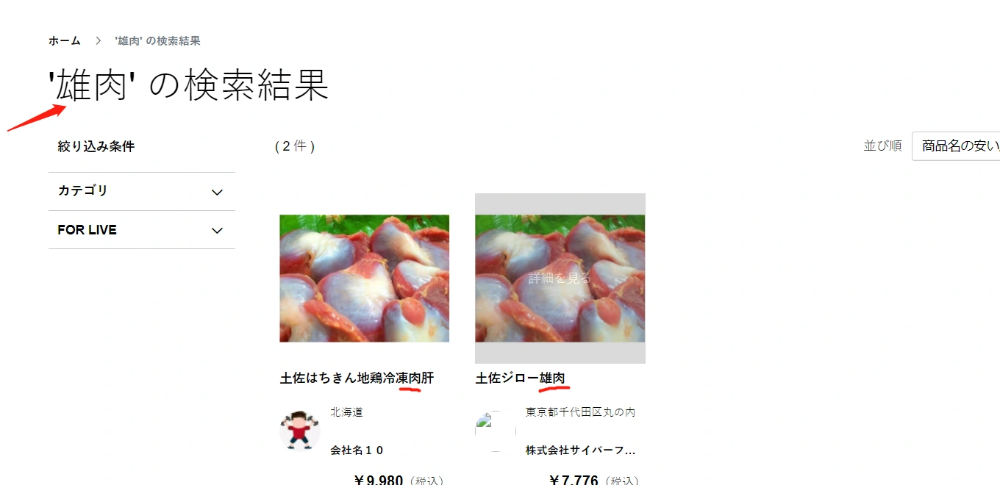

### Magento配置ES

##### 查看es官方自带的插件方式:

切换到elasticsearch解压后的目录.

```
$ ./bin/elasticsearch-plugin install --help

Install a plugin

The following official plugins may be installed by name:
  analysis-icu
  analysis-kuromoji
  analysis-nori
  analysis-phonetic
  ...
```

##### ES实现搜索日语分词

> 注意：ElasticSearch的日语分词需要日语翻译引擎的支持，即本章第2小节介绍的插件。

\## 查看es官方自带的插件方式:

切换到elasticsearch解压后的目录.

```
$ ./bin/elasticsearch-plugin install --help

Install a plugin

The following official plugins may be installed by name:
  analysis-icu
  analysis-kuromoji
  analysis-nori
  analysis-phonetic
  ...
```

##### 安装日语分词插件

```
$ ./bin/elasticsearch-plugin install analysis-kuromoji

-> Installing analysis-kuromoji
-> Downloading analysis-kuromoji from elastic
[=================================================] 100%   
-> Installed analysis-kuromoji
```

更新Module:

```
php bin/magento s:up
```

##### 启动ES

-d参数以后台方式启动:

```
./bin/elasticsearch -d
```

测试elasticsearch运行情况:

```
$ curl -X GET localhost:9200/_cat/health

1631945247 06:07:27 elasticsearch green 1 1 0 0 0 0 0 0 - 100.0%
```

##### 配置Magento切换搜索服务使用ES

Backend--STORES--Configuration--CATALOG--CATALOG--CatalogSearch



## 试Magento配置es结果:

执行magento命令:

```
root@dlprdweb01:/var/www/html/magento236# php bin/magento indexer:reindex
```

Design Config Grid index has been rebuilt successfully in 00:00:00
Customer Grid index has been rebuilt successfully in 00:00:00
Category Products index has been rebuilt successfully in 00:00:00
Product Categories index has been rebuilt successfully in 00:00:00
Catalog Rule Product index has been rebuilt successfully in 00:00:00
Product EAV index has been rebuilt successfully in 00:00:00
Stock index has been rebuilt successfully in 00:00:00
Inventory index has been rebuilt successfully in 00:00:00
Catalog Product Rule index has been rebuilt successfully in 00:00:00
Product Price index has been rebuilt successfully in 00:00:00
Catalog Search index has been rebuilt successfully in 00:00:00

索引全部重建Success代表配置成功.
最后,前台页面搜索关键词测试

------

添加带日语名字的商品，进行搜索测试。

测试搜索“雄肉”关键词,搜索结果检索出标题或描述带有"雄肉", "肉"的商品




本小节结束.