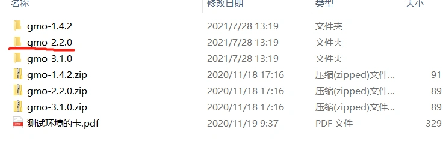
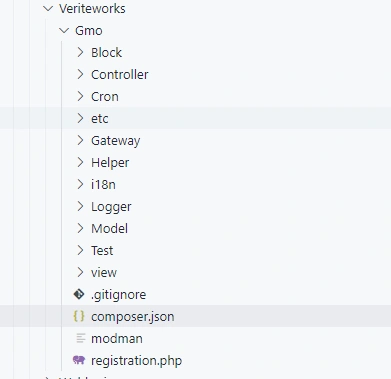

### 安装插件的方法

##### 安装插件的方式本质是是编写一个可以即插即用的Moudle

如果有数据库相关操作,则该module中还应该包含数据库建表脚本.

------

插件安装的方式分两种:
一种是官方市场的提供的插件，以composer包的方式发布 ,需要使用composer命令安装.
另外一种是从网上下载的压缩包.压缩包里面包含了功能完整的一个module.

 magento2.3版本选择gmo2.2.0版本安装
建立目录:
app\code\Veriteworks\Gmo
将解压的文件全部复制到该目录下:

执行php bin/magento s:up

------

这里以一个gmo插件为示例说明了插件的安装方法。

大家在网上下载的插件包,均可以依此方式安装：

- 首先查看下载下来的文件module.xml中的module名称,即模块名,如:Veriteworks_Gmo
- 建立对应目录：app/code/Veriteworks/Gmo,并将代码文件复制到该目录下.
- 其它操作按照安装moudle的方式操作即可.