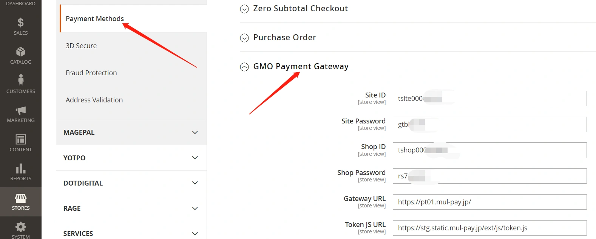
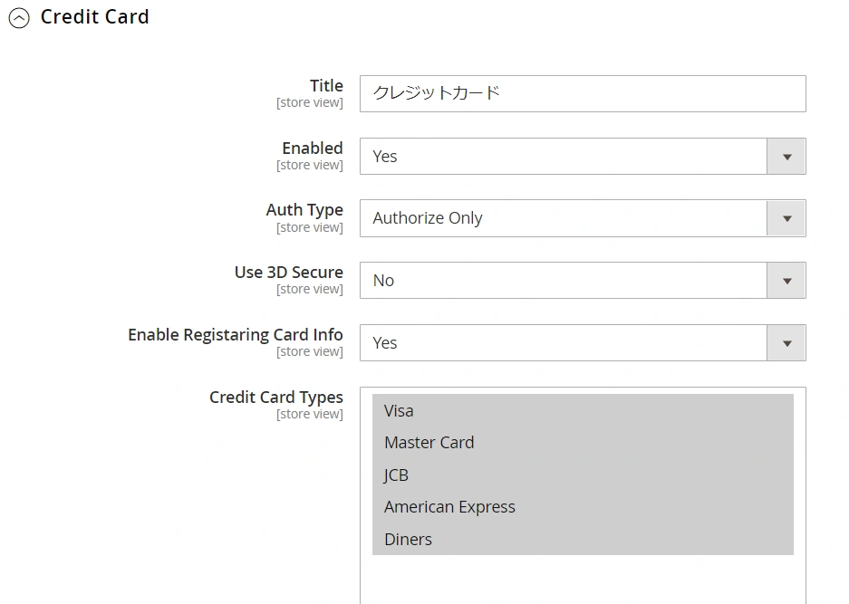
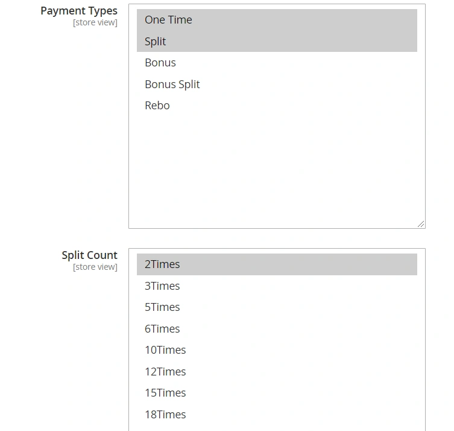
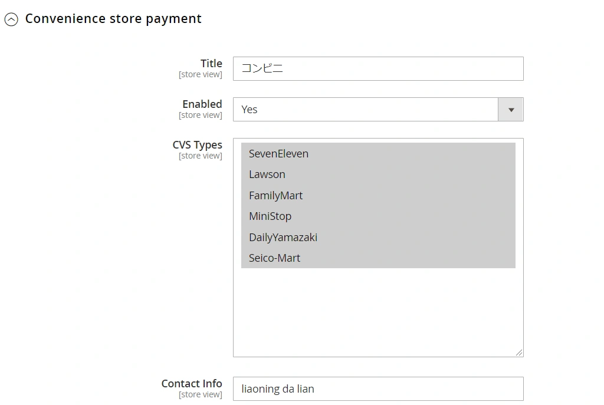
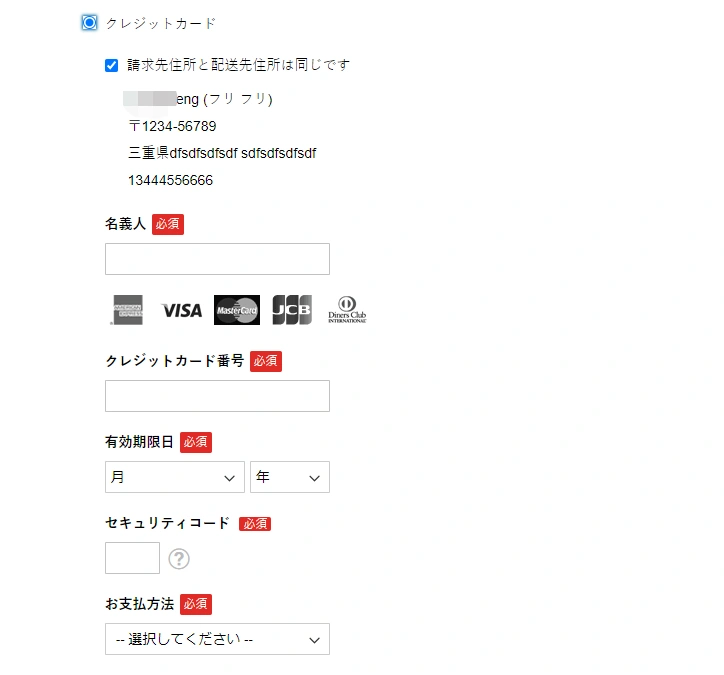
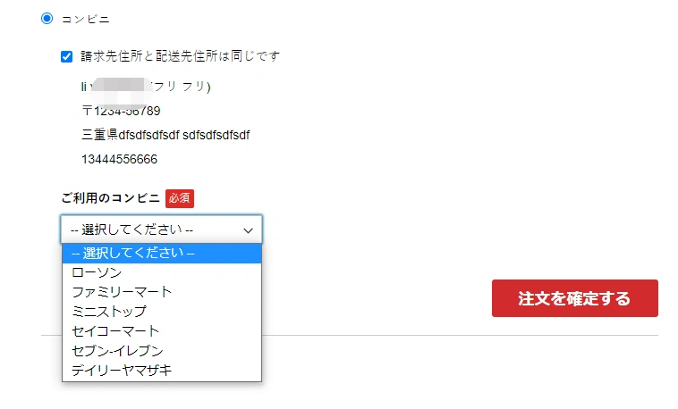

### GMO支付插件

##### gmo支付插件介绍：

不做详细说明，google，gmo官网，查看相关文档.

##### gmo配置

gmo插件安装完后,需要后台进行配置。
请前往gmo支付官网申请签约，并获得帐号。
在后台支付方法配置中填写gmo帐号,密码等信息.

##### 信用卡方式支付

信用卡方式支持分期

基础配置：

分期配置：

##### 便利店支付

便店支付支持日本大部分便利店,7&11,罗森,全家等.

##### 支付结果通知设定:

1.登录GMO-PG的管理画面，gmo-pg为gmo官方为签约提供的后台地址。

2.移动到“店铺管理”。

3.选择“通知设置”选项卡。

4.点击“编辑”按钮，通过以下URL设定结果通知程序URL。

http（s）：//使用的域名/gmo/notify/receive

##### 前台下单支付效果

信用卡支付:

 便利店支付: 

插件支持的Magento的版本:

1.4.2（Magento2.2）

2.2.0（Magento2.3）

3.1.1（Magento2.4）