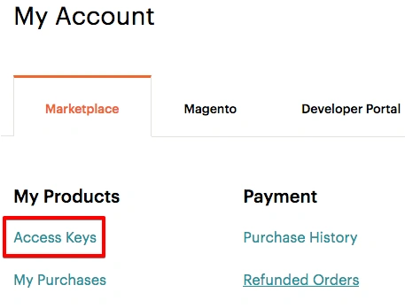
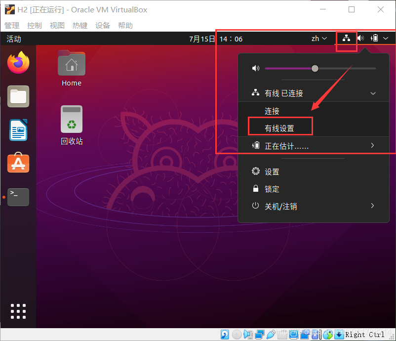

#### 一、Magento各种版本对于相应组件的要求

|                    | 2.3.0      | 2.3.1      | 2.3.2      | 2.3.3         | 2.3.4         | 2.3.5      | 2.3.6 | 2.3.7 | 2.4.0            | 2.4.1 | 2.4.2 | 2.4.3     | 2.4.4 | 2.4.5 |
| :----------------- | :--------- | :--------- | :--------- | :------------ | :------------ | :--------- | :---- | :---- | :--------------- | :---- | :---- | :-------- | :---- | :---- |
| Composer           | 1.x        | 1.x        | 1.x        | 1.x           | 1.x           | 1.x        | 1.x   | 2.x   | 1.x              | 1.x   | 2.x   | 2.x       | 2.x   | 2.x   |
| Elasticsearch      | 2.x, 5.x   | 5.x, 6.x   | 5.x, 6.x   | 5.x, 6.x      | 5.x, 6.x      | 7.6        | 7.7   | 7.9   | 7.6              | 7.7   | 7.9   | 7.9       | 7.10  | 7.10  |
| MariaDB            | 10.1, 10.2 | 10.1, 10.2 | 10.1, 10.2 | 10.1, 10.2    | 10.1, 10.2    | 10.1, 10.2 | 10.2  | 10.3  | 10.2, 10.3, 10.4 | 10.4  | 10.4  | 10.4      | 10.4  | 10.4  |
| MySQL              | 5.6, 5.7   | 5.6, 5.7   | 5.6, 5.7   | 5.6, 5.7      | 5.6, 5.7      | 5.6, 5.7   | 5.7   | 5.7   | 5.7, 8.0         | 8.0   | 8.0   | 8.0       | 8.0   | 8.0   |
| PHP                | 7.1, 7.2   | 7.1, 7.2   | 7.1, 7.2   | 7.1, 7.2, 7.3 | 7.2, 7.3      | 7.2, 7.3   | 7.3   | 7.4   | 7.3, 7.4         | 7.4   | 7.4   | 7.4       | 8.1   | 8.1   |
| RabbitMQ           | 2.x, 3.7   | 2.x, 3.7   | 2.x, 3.7   | 2.x, 3.7      | 3.7, 3.8      | 3.8        | 3.8   | 3.8   | 3.8              | 3.8   | 3.8   | 3.8       | 3.8   | 3.8   |
| Redis              | 5.x        | 5.0        | 5.0        | 5.0           | 5.0           | 5.0        | 5.0   | 6.0   | 5.0              | 5.0   | 6.0   | 6.0       | 6.0   | 6.0   |
| Varnish            | 4.x, 5.x   | 4.x, 5.x   | 4.x, 5.x   | 6.2           | 4.x, 5.x, 6.2 | 6.3        | 6.4   | 6.5   | 6.x              | 6.2   | 6.4   | 6.5       | 6.5   | 6.5   |
| Apache             | 2.4        | 2.4        | 2.4        | 2.4           | 2.4           | 2.4        | 2.4   | 2.4   | 2.4              | 2.4   | 2.4   | 2.4       | 2.4   | 2.4   |
| nginx              | 1.8        | 1.8        | 1.8        | 1.8           | 1.8           | 1.8        | 1.8   | 1.8   | 1.8              | 1.8   | 1.8   | 1.8       | 1.8   | 1.8   |
| AWS Aurora (MySQL) |            |            |            |               |               |            |       |       |                  |       |       | 5.7       |       |       |
| AWS S3             |            |            |            |               |               |            |       |       |                  |       | ✔️     | ✔️         |       |       |
| AWS MQ             |            |            |            |               |               |            |       |       |                  |       |       | 3.8.11    |       |       |
| AWS ElastiCache    |            |            |            |               |               |            |       |       |                  |       |       | Redis 6.x |       |       |
| AWS ElasticSearch  |            |            |            |               |               |            |       |       |                  |       |       | 7.09      |       |       |

> 我们主要关注composer,php,mysql的版本要求即可,其它的组件在系统需要安装时,参考对应版本.

 Magento 开源版需要开启的PHP扩展:

- ext-bcmath
- ext-ctype
- ext-curl
- ext-dom
- ext-fileinfo
- ext-gd
- ext-hash
- ext-iconv
- ext-intl
- ext-json
- ext-libxml
- ext-mbstring
- ext-openssl
- ext-pcre
- ext-pdo_mysql
- ext-simplexml
- ext-soap
- ext-sockets
- ext-sodium
- ext-xmlwriter
- ext-xsl
- ext-zip
- lib-libxml
- lib-openssl

> 本书将采用的各种软件版本如下: Magento:2.3.6 PHP:7.3 Mysql:5.7 Apache:2.4

#### 二、Docker安装Magento

- ##### 注册magento帐号

  magento官方应用市场:
  https://marketplace.magento.com/

1. 登录magento帐号。
2. 点击右上角的用户名-MyProfile。
3. 点击AccessKeys查看你的Key。



4. 如果之前没有创建过,点击Create a new Access Key创建。
   在这里能看到两个key: public key和 private key 


- ##### composer安装创建magento项目

- 登录到dokcer容器:

```
docker exec -it lamp-php73 bash
```

- 创建composer项目
  `composer create-project --repository-url=https://repo.magento.com/ magento/project-community-edition=2.3.6 magento --ignore-platform-reqs`
  提示输入用户名密码:
  用户名: 上一步的public key
  密码:上一步的private key

------

安装完成画面：


- #####  Navicat新建mysql连接：

  主机名:虚拟机ip
  用户名:root
  密码:123456 


#### 使用命令行安装magento：

**在容器里执行安装magento**
切换到magento目录下(/var/www/html/magento),magento目录为上面使用composer create-project 创建magento项目时指定的目录。

```
cd magento
```

输入命令：

```
php bin/magento setup:install \
--base-url=http://192.168.31.58/magento \
--backend-frontname=admin \
--db-host=lamp-database \
--db-name=magento \
--db-user=root \
--db-password=123456 \
--admin-firstname=admin \
--admin-lastname=admin \
--admin-email=admin@admin.com \
--admin-user=admin \
--admin-password=admin123 \
--language=zh_Hans_CN \
--currency=CNY \
--timezone=Asia/Shanghai \
--use-rewrites=1
```

 <font color='red'>提示缺少扩展：soap,bcmath,xsl,sockets.</font>


------

### 使用docker安装扩展

安装缺失的php扩展：
soap,bcmath,xsl,sockets.

在容器内执行docker-php-ext-install bcmath
报错：


可能原因是在镜像没有拉到php的源码,在php.net官网找到对应php版本的源码。

把源码下载到/usr/src目录下

```
cd /usr/src
```

下载源码：

```
wget https://www.php.net/distributions/php-7.3.29.tar.xz
```

重命名：

```
mv php-7.3.29.tar.xz php.tar.xz
```

##### 安装bcmath扩展

```
docker-php-ext-install bcmath
```

查看扩展安装结果：


##### 安装xsl扩展

安装xsl扩展报错
提示：
error: xslt-config not found. Please reinstall the libxslt >= 1.1.0 distribution
先安装:libxslt-dev

```
apt update
apt install libxslt-dev
docker-php-ext-install xsl
```

##### 安装soap扩展

```
docker-php-ext-install soap
```

安装soap扩展报错，更新源，并安装libxml2-dev包：

```
apt update
apt install libxml2-dev
```

再次运行

```
docker-php-ext-install soap
```

------

##### 安装sockets扩展

```
docker-php-ext-install sockets
```

**回到前面一步，执行magento安装命令：**

```
cd /var/www/html/magento
php bin/magento setup:install \
--base-url=http://192.168.31.58/magento \
--backend-frontname=admin \
--db-host=lamp-database \
--db-name=magento \
--db-user=root \
--db-password=123456 \
--admin-firstname=admin \
--admin-lastname=admin \
--admin-email=admin@admin.com \
--admin-user=admin \
--admin-password=admin123 \
--language=zh_Hans_CN \
--currency=CNY \
--timezone=Asia/Shanghai \
--use-rewrites=1
```

------

安装过程可能会报错：
Allowed memory size of 134217728 bytes exhausted (tried to allocate 2560001 bytes)
提示内存不足，修改内存配置：
**首先卸载magento：**

```
cd /var/www/html/magento
php bin/magento setup:uninstall
```


**创建php.ini文件，并修改配置：**
我们把php.ini-production文件复制一份放到/usr/local/etc/php/conf.d目录下，并重命名为php.ini:

```
cd /usr/local/etc/php/
cp php.ini-production conf.d
cd conf.d
mv php.ini-production php.ini
```

修改php.ini文件：

```
vim php.ini
```

将内存调大,调到4G


 安装到后面又报错：在创建管理员用户时，提示不支持的密码hash算法： 


编辑文件：
vim vendor/magento/framework/Encryption/Encryptor.php
修改如下代码，将sodium_crypto_pwhash函数的第6个参数改为1 


**重复php bin/magento setup:uninstall命令卸载和magento安装命令。**
可以正确安装。
说明：
这里按照出错的顺序来演示安装过程，卸载，重装，再卸载，再重装。目的是希望大家可以了解到安装magento过程中可能会遇到哪些错误，如何解决。 

 安装完成画面：


**更改文件权限：**

```
cd /var/www/html
chmod -R 777 ./magento
```

#### 三、测试magento前后台访问

前台访问地址：
http://192.168.31.58/magento/
后台访问地址：
http://192.168.31.58/magento/admin
用户名:admin
密码:admin123

**前台页面：**


 **后台页面：**


 

#### 修改虚拟机的ip为固定ip

如果大家的虚拟机每次重启后发现ip会自动变化，将会导致我们每次访问magento的地址也发生变化，需要手动去数据库里更改core_config_data表的base_url.

将虚拟机的ip改为固定ip:

1.ipconfig查看本机ip

2.网卡选桥接网卡

3.点网络图标，点有线设置：



4.ipv4，由自动改为手动：

填写固定ip,子网掩码，网关。  子网掩码、网关与windows保持一致。


**<font color='red'>至此,我们的Magento安装完成！ </font>**

