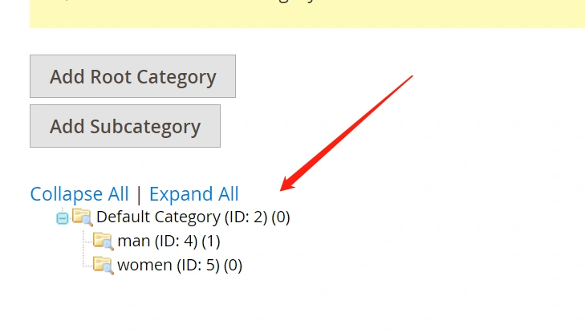
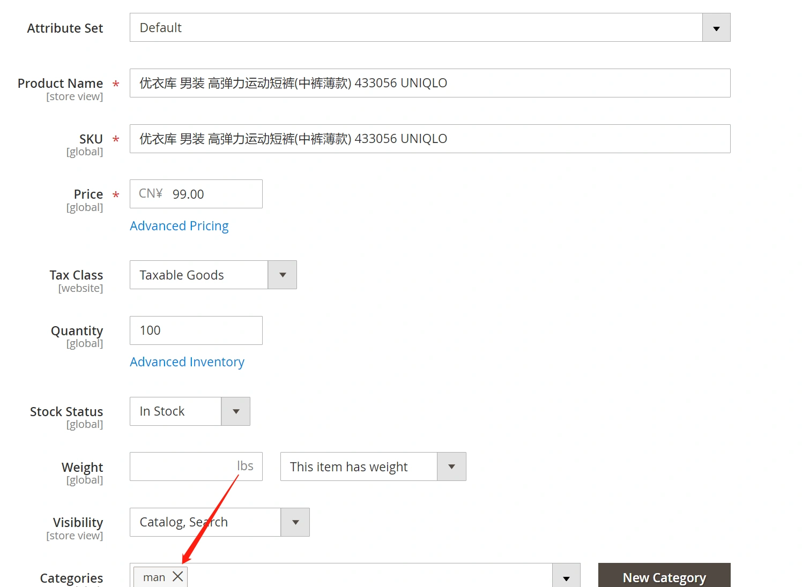
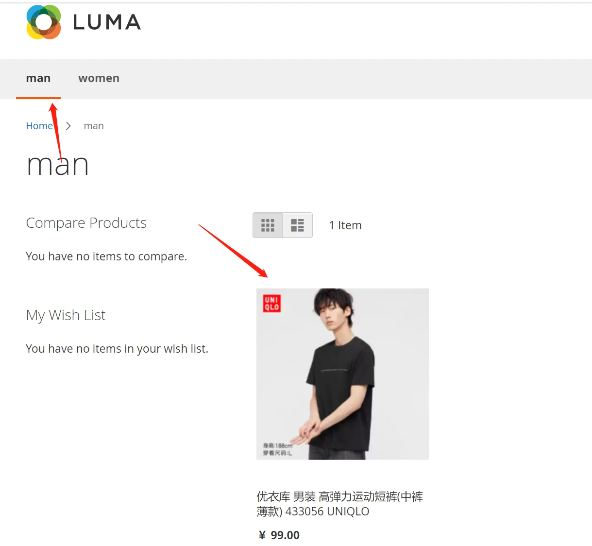
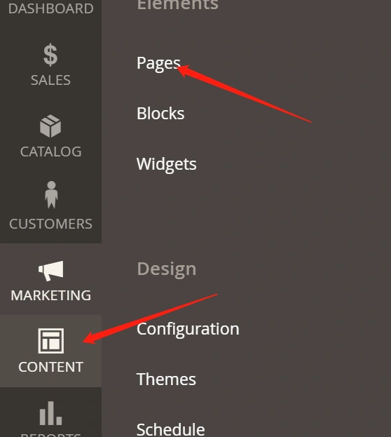
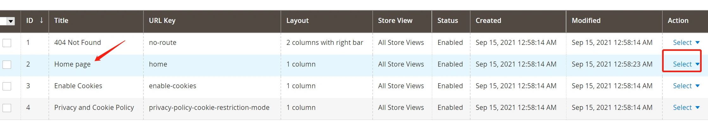
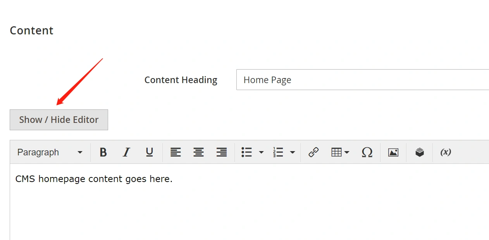
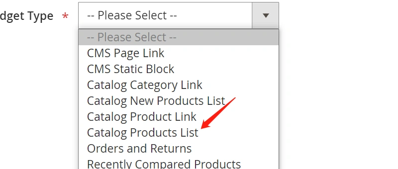
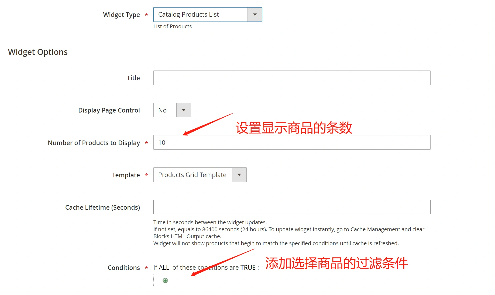
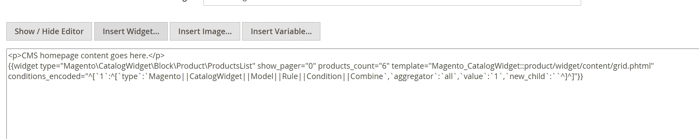

#### 添加分类

由于magnto命令行导入sampledata的方式要依赖于composer，而该测试数据经常下载失败，所以我们手动填充一些商品和分类数据。

**添加两个子分类 man,women：**（Backend -- CATALOG -- Categories）

#### 添加商品

Backend -- CATALOG -- Products  点击右上角的Add Product：
分类选择男装(man)

#### 查看前台页面：

 为了方便测试，大家可以添加更多商品 

#### 填充首页数据：

首页内容比较特殊，是采用CMS方式实现的

- 登录后台：(CONTENT-- Pages)

-  选择：Home Page -- Select-- Edit编辑

  

-  默认的首页只有一行文字。点击编辑器上方的页卡,添加商品： 

  

-  选择InsertWidget 添加小部件，选择Catalog Products List 

-  我们这里选择展示5个商品，默认不添加条件： 

  

-  添加后切换“Show/Hide Editor” 可以显示html界面，或者生成的代码。代码界面如下：

  

-  编辑后保存，首页展示效果：

  

 

**至此，我们首页，分类页的商品数据添加完成！ **

