#### Vscode安装插件

- PHP IntelliSense
  该插件提供php语法错误提示等功能。

------

- phpfmt - PHP formatter
  php代码格式化的插件。
  使用方式:
  右键 Format Document,或者打开命令行(f1) 输入format找到Format Document回车。

------

- Prettier - JavaScript formatter
  格式化html,js代码插件,使用方式同phpfmt。

------

- SFTP
  使用SFTP方式编辑Linux文件。

------

- SSH
  使用SSH服务连接服务器,直接编辑服务器文件。

------

# 插件：Remote SSH

使用Remote SSH插件直接编辑Linux服务器的文件。

- 安装插件，点击vscode左侧插件按钮，搜索ssh

  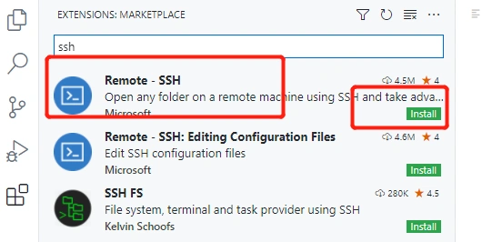

- 安装完成后,会在左侧面板多一个图标:

  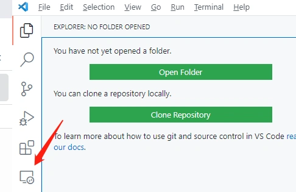

-  添加服务器，点击该图标,并点击右上角的+号,弹出服务器连接信息: 

  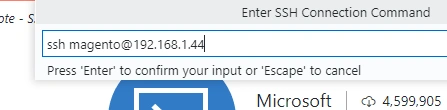

-  添加完在SSH TARGETS列表中多出一条服务器信息,右键选择在当前窗口打开:
  Connect Host in Current Window: 

  

-  输入密码,点击左侧文件浏览,点击Open Folder 

  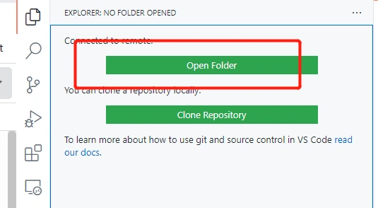

-  指定打开的路径，这里我们指定宿主机的www目录下的magento项目目录 

  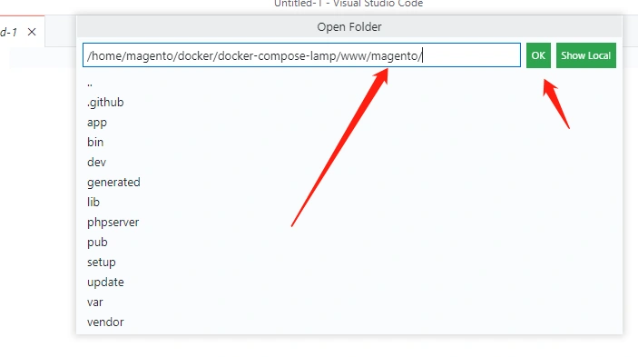

-  文件浏览器将magento目录的文件全部加载进来: 

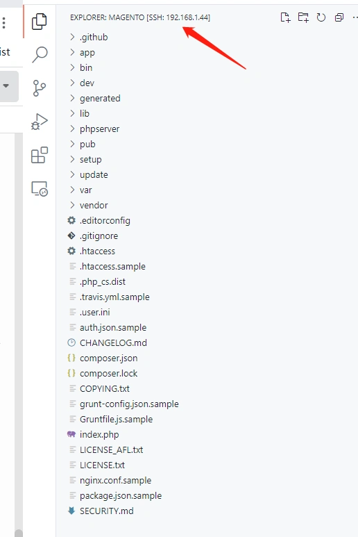

> 说明：<font color='orange'>以此种方式,我们就可以直接编辑服务器上的文件了,我们随便打开一个文件,查看编辑器title栏显示的位置,也是对应linux服务器的文件位置。</font>


> 说明：<font color='red'>因为我们在搭建docker容器的时候,把宿主机的www/magento目录直接映射到了容器的web根目录(/var/www/html/magento),因此,我们编辑www下面magento目录中的文件,将实时同步到web容器中</font>


------

# 插件：SFTP

使用SFTP插件本地文件，并将本地文件与Linux服务器文件做映射。

- 安装插件 ,搜索SFTP

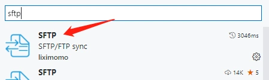

-  在本地任意建立magento目录,并添加到vscode中。 

  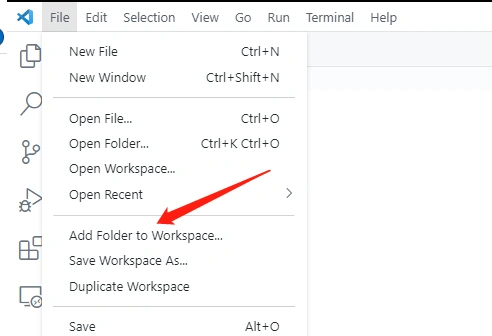

-  打开命令行: 快捷键:(f1或ctrl+shift+p),输入sftp，选择SFTP:Config

  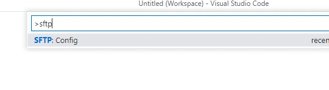

-  配置服务器信息: 

  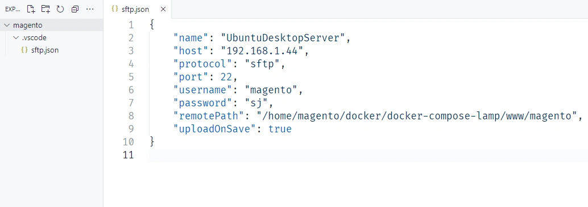

**配置说明:**

```
{
    "name": "UbuntuDesktopServer", // 服务器名称,任意
    "host": "192.168.1.44", // ip
    "protocol": "sftp", // 默认
    "port": 22,
    "username": "magento", // 用户名
    "password": "sj", // 密码,注意,这条配置项默认是没有的,需要我们手动加进来，指定虚拟机的登录密码
    "remotePath": "/home/magento/docker/docker-compose-lamp/www/magento", //宿主机中magento项目目录
    "uploadOnSave": true //保存文件时,自动上传文件到服务器,建议设置为true
}
```

- 同步服务器文件到本地:

  配置完服务器信息,点击项目目录magento右键 DownloadFolder 开始下载服务器目录及文件: 

  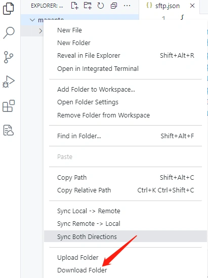

-  我们也可以打开命令行输入sftp,选择List,对指定目录下载: 

  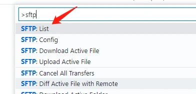

-  在下拉列表中选择指定目录或文件下载: 

  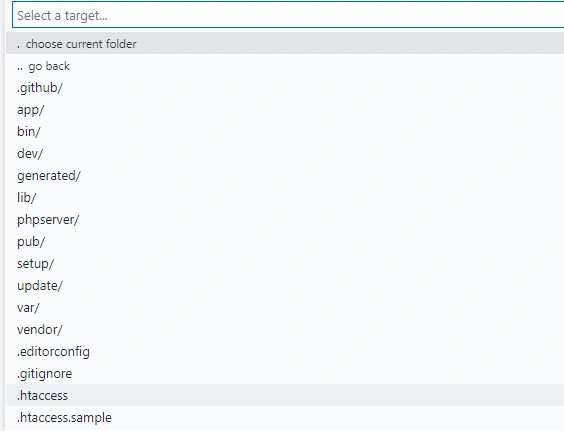

 注意：
由于magento项目的vendor文件过于庞大，如果全部下载，可能会报错。我们使用SFTP:List下载指定目录即可。
如，开发中最常用的app目录，lib目录。 

**下载服务器的vendor目录到本地**
**1.打包vendor目录**
当然，vendor目录也是必不可少的，包含magento的后端所有文件。
可以先在宿主机上把vendor目录打个压缩包，

- tar命令压缩文件: `tar cvf vendor.tar.gz vendor` (把vendor目录压缩vendor.tar.gz包)
- 打zip包：
  需要安装zip打包工具：`sudo apt-get install unzip`
  zip命令压缩文件: `zip -r vendor.zip vendor` (把vendor目录压缩vendor.zip包)

**2.下载压缩文件**

- 通过windows的scp命令把该文件下载下来，解压到本地的magento目录中：
  scp命令格式：scp 要复制的文件地址 复制到的文件地址
  示例：
  `scp root@192.168.31.58:/home/magento/docker/docker-compose-lamp/www/magento/vendor.tar.gz .`
  (把服务器的vendor.tar.gz目录复制到当前目录,注意命令后面的".")

- 或者可以在服务器开启vsftp服务，通过ftp软件连接到服务器，把文件下载下来。

- 或者通过windows与虚拟机VirtualBox共享目录的方式，下载该文件。

  如上几种方式不管哪一种，我们最终的目录就是把vendor目录下载到本地的magento目录下，当我们分析，追踪代码时可以看到原框架是怎么实现的，并且可以参考一些文件的配置语法。

------

- 我们把index.php文件下载下来,并编辑一下,并保存.

  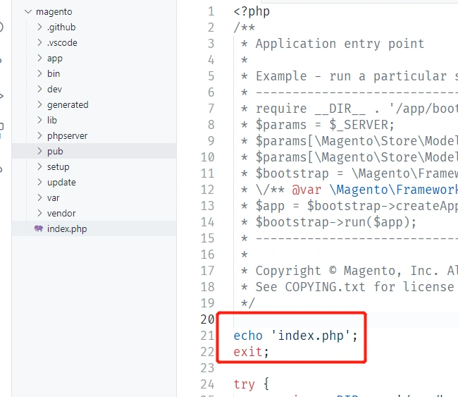

-  再访问magento首页,代码已经更新到容器中。 

  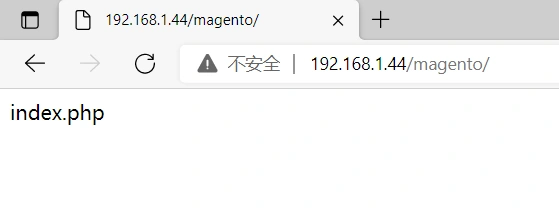

说明：<font color='orange'>对比SSH的方式,SFTP实际上是在保存文件的时候做了一次上传操作.而SSH方式相当于直接编辑服务器文件,SSH更方便直接一些.但是要比SFTP的方式更占服务器资源,尤其当多人同时编辑服务器文件时,内存消耗明显。 </font>


