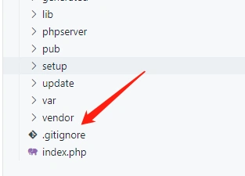

#### 团队开发中使用git

magento在安装完成后自带了.gitignore文件:

该文件对于pub/media,vendor等目录做了忽略。
还包括一些编绎文件,临时生成的文件,上传文件等。

------

##### 团队开发的安装方法

若为团队开发,安装方式相同。
我们可以选择在服务器端,通过composer方式安装magento。
并将代码提交到版本库。

##### 本地开发环境

代码提交后,在docker的容器无须再本地composer安装，git clone代码即可。

需要补充的步骤:

- 在服务器把vendor目录打包,传到宿主机目录/home/magento/docker/docker-compose-lamp/www/magento/目录下,解压。
- app/etc/env.php,复制到容器对应路径。
  修改core_config_data表:
  将path为web/unsecure/base_url的value值改为:
  http://192.168.1.44/magento/ (本地环境地址)

其它操作则遵循git开发流程。

