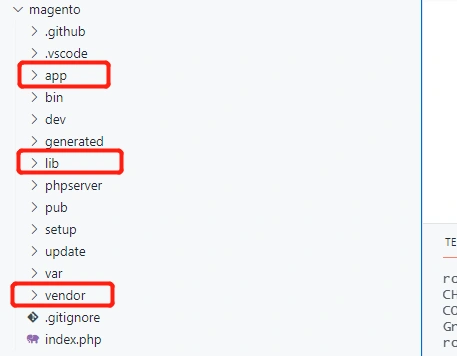
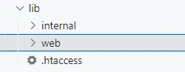
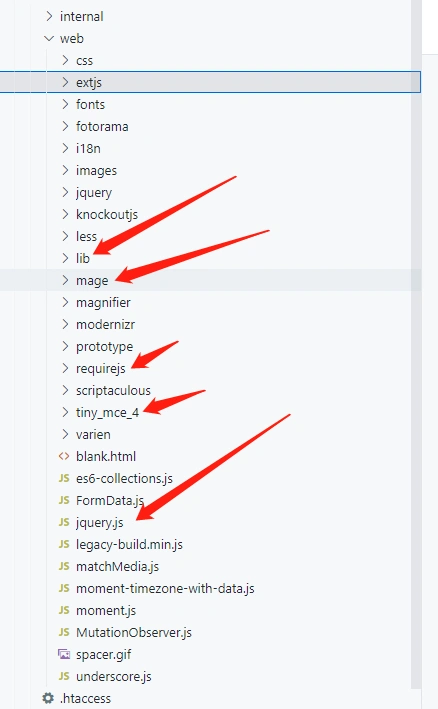
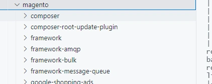
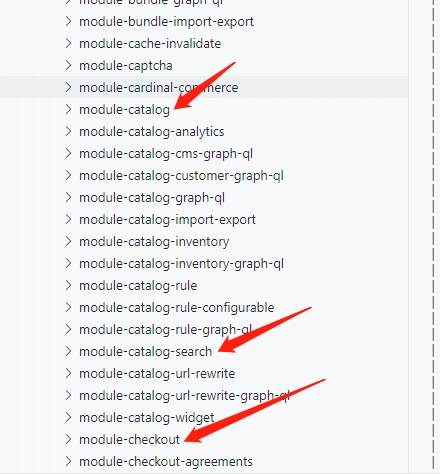

**Magento的目录结构**
在magento开发过程中,我们平时最多关注的是 app,lib,vendor三个目录: 



**app目录解析**
app目录是我们平时开发中接触到最多的。
下面看一下app目录结构: 

```
app
|-- autoload.php
|-- bootstrap.php
|-- code

|-- design
|   |-- adminhtml
|   |   `-- Magento
|   `-- frontend
|       `-- Magento
|-- etc
|   |-- NonComposerComponentRegistration.php
|   |-- config.php
|   |-- db_schema.xml
|   |-- di.xml
|   |-- env.php
|   |-- registration_globlist.php
|   `-- vendor_path.php
`-- functions.php
```

**app/design :**
顾名思义，design为主题目录。

在对magento定制主题，新建模板，css，js等文件都放在该目录下。如果我们是对系统的模块进行重写，etc/layout布局文件也放在主题目录中。
**app/code:**
默认安装完是没有code目录的，在对magento系统功能修改，重写，新添加module时，后端代码将全部写在这个目录下。如:
Controller文件
Block文件
Model文件
etc目录下xml配置文件(除布局文件外)如，路由，module.xml，di.xml，api等。

> 在开发主题相关功能时,app/code 和 app/design目录通常会配合起来.app目录可以看作为:二次开发,修改,定制的开发目录.

app/etc: 项目配置目录,包括模块相关配置的config.php文件,项目全局配置的env.php文件。 functions.php:公共函数文件,可以在该文件中自定义公共函数。

 **lib目录解析** 



lib目录下面我们关注最多的是web目录。
web目录包含了magento系统大部分前端ui组件,第三库库等。 



lib/storege.js 这里面封装了前端对于cookie,storege等数据存取的方法。
mage 这个目录下封装了大量magento系统级别的前台页面,后台页面用到的各种组件,及js库文件等.
requirejs require库的存放位置,magento的js文件大部分以requirejs的方式引入。
tiny_ace4 后台富文本编辑器的第三方插件库。
jquery.js

> lib目录可以看作为:Magento框架的前端框架库

**vendor目录解析**
vendor目录包含了后端所有模块,magento的framework,zend框架,第三方包等。
我们在开发中关注最多的目录是vendor/magento 



- 以framework开头的目录为magento的核心底层框架。

- 以language开头的目录为magento的系统语言包文件。

- 以theme-xxx开头的目录为magento的系统主题目录。

- 以module-xxx开头的目录为magento的模块目录。
  下面列举几个模块:

  

1. module-catalog: 商品分类,商品相关模块。
2. module-catalog-search:商品搜索相关模块。
3. module-checkout:订单相关模块。

> vendor目录可以看作为:Magento的后端框架及业务逻辑目录。

------

**magento数据库表概述**
magento数据表数量很大,在我们安装的版本2.3.6中,一共有393张表。
与传统的mysql建表方式有所不同,magento为了达到字段方便扩展,结构灵活,在部分业务场中使用了EAV模式的表结构:
**EAV的含义**
eav三个字母对应的三个单词为
Entity:实体
Attribute:属性
Value:值
EAV的理解：Entity-Attribute-Value/(实体-属性-值)

- 实体：包括要存储的数据类型的信息（客户，产品......）
- 属性：是实体的属性（颜色，大小，高度......）
- 值：是给定属性的值（蓝色，红色，......）

也就是说,在我们传统的一张表,以eav的方式实现时,会被横向拆分为多张数据表。

这样做的好处是：可以方便的扩展字段,自定义字段。

如,我们可以在magento的后台,为商品扩展属性字段,并指定该属性的值采用的类型,如text,select下拉,checkbox等。

**magento中使用到EAV模式的场景**
用户Customer相关的表:

```
| customer_entity
| customer_entity_datetime       
| customer_entity_decimal
| customer_entity_int 
| customer_entity_text
| customer_entity_varchar
```

客户地址相关表:

```
| customer_address_entity
| customer_address_entity_datetime
| customer_address_entity_decimal
| customer_address_entity_int
| customer_address_entity_text
| customer_address_entity_varchar
```

产品表:

```
| catalog_product_entity        
| catalog_product_entity_datetime  
| catalog_product_entity_decimal
| catalog_product_entity_gallery 
| catalog_product_entity_int 
| catalog_product_entity_media_gallery  
| catalog_product_entity_media_gallery_value
| catalog_product_entity_media_gallery_value_to_entity 
| catalog_product_entity_media_gallery_value_video 
| catalog_product_entity_text 
| catalog_product_entity_tier_price
| catalog_product_entity_varchar
```

分类表:

```
| catalog_category_entity
| catalog_category_entity_datetime
| catalog_category_entity_decimal
| catalog_category_entity_int
| catalog_category_entity_text
```

实体类型表:

```
eav_entity_int
eav_entity_varchar
eav_entity_text
eav_entity_decimal
eav_entity_datetime
```

> 我们在平时的开发中,需要对eav有一个大概的了解,这样在具体的业务逻辑中,才能清楚数据分布在了哪些表中。

