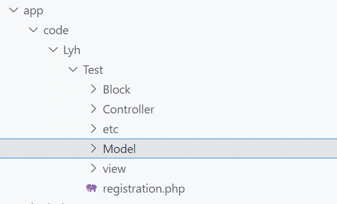
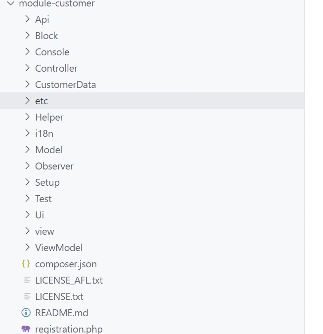
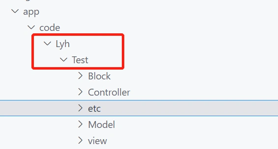
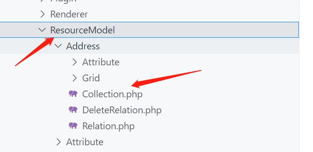
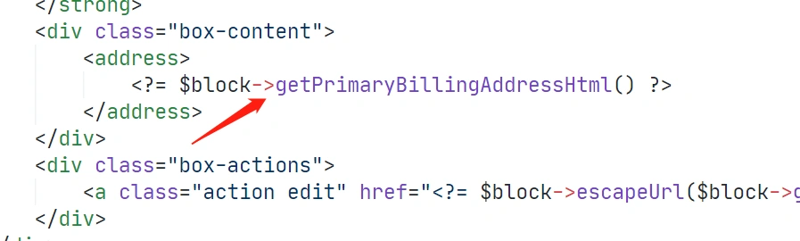

#### 模块目录结构

 一个简单的模块目录结构： 



模块中主要包含:

Controller:控制器目录
Model:模型层目录
Block:Block层目录
view:视图层，模板,layout，js,css，等目录
etc:模块配置目录
i18n:翻译语言包目录

**复杂一点的模块目录结构：**
除了上面那些基础目录外，部分还分为frontendend和adminhtml，即前后台分别对应的文件。
除了分前后台外，还有一些更多功能的目录，如：
Console 控制台命令行目录
Observer 观察者(事件) 目录
Ui Ui组件目录
Helper 帮助类目录
Api 提供api能力目录
下面截取的是module-customer，用户模块的目录结构：



------

#### 模块中的常用文件介绍：

**env.php文件：项目的全局配置文件：** 

```
<?php
return [
    'backend' => [
        'frontName' => 'admin'
    ],
    'queue' => [
        'consumers_wait_for_messages' => 1
    ],
    'crypt' => [
        'key' => 'f073afa210a9846f3c3afe889166e393'
    ],
    'db' => [
        'table_prefix' => '',
        'connection' => [
            'default' => [
                'host' => 'lamp-database',
                'dbname' => 'magento',
                'username' => 'root',
                'password' => '123456',
                'model' => 'mysql4',
                'engine' => 'innodb',
                'initStatements' => 'SET NAMES utf8;',
                'active' => '1',
                'driver_options' => [
                    1014 => false
                ]
            ]
        ]
    ],
    'resource' => [
        'default_setup' => [
            'connection' => 'default'
        ]
    ],
    'x-frame-options' => 'SAMEORIGIN',
    'MAGE_MODE' => 'default',
    'session' => [
        'save' => 'files'
    ],
    'cache' => [
        'frontend' => [
            'default' => [
                'id_prefix' => 'f37_'
            ],
            'page_cache' => [
                'id_prefix' => 'f37_'
            ]
        ]
    ],
    'lock' => [
        'provider' => 'db',
        'config' => [
            'prefix' => null
        ]
    ],
    'cache_types' => [
        'config' => 1,
        'layout' => 1,
        'block_html' => 1,
        'collections' => 1,
        'reflection' => 1,
        'db_ddl' => 1,
        'compiled_config' => 1,
        'eav' => 1,
        'customer_notification' => 1,
        'config_integration' => 1,
        'config_integration_api' => 1,
        'full_page' => 1,
        'config_webservice' => 1,
        'translate' => 1,
        'vertex' => 1
    ],
    'downloadable_domains' => [
        '192.168.31.58'
    ],
    'install' => [
        'date' => 'Tue, 14 Sep 2021 16:58:29 +0000'
    ]
];
```

该文件主要配置内容为，数据库连接配置，缓存配置等。

**routes.xml文件为模块的路由配置：该文件通常位于etc目录下。**
下面截取代码片段来自：
vendor/magento/module-customer/etc/frontend/routes.xml 

```
<?xml version="1.0"?>
<!--
/**
 * Copyright © Magento, Inc. All rights reserved.
 * See COPYING.txt for license details.
 */
-->
<config xmlns:xsi="http://www.w3.org/2001/XMLSchema-instance" xsi:noNamespaceSchemaLocation="urn:magento:framework:App/etc/routes.xsd">
    <router id="standard">
        <route id="customer" frontName="customer">
            <module name="Magento_Customer" />
        </route>
    </router>
</config>
```

这个文件用于规定用户相关页面的路由。
请查看代码，您将看到注册前台路由非常简单。您必须使用前台的标准路由。这路由将有一个子标签定义它的模块和两个属性:

- id属性是唯一标识字符串，它将识别这个路由。您将使用此字符串来声明此模块操作的layout handle
- frontName属性也是唯一标识字符串，它将显示在url请求中。例如，如果你声明一条这样的路由:

```
<route id="customer" frontName="customer">
```

该模块的url应该是:

> [[example.com/index.php/customer/xxx/yyy](http://example.com/index.php/customer/xxx/yyy) (xxx/yyy为控制器和action路径，由布局文件名决定，后面我们会详细讲解。)

**module.xml文件配置模块名称：该文件通常位于etc目录下。** 

```
<?xml version="1.0"?>
<config xmlns:xsi="http://www.w3.org/2001/XMLSchema-instance" xsi:noNamespaceSchemaLocation="urn:magento:framework:Module/etc/module.xsd">
    <module name="Lyh_Test" setup_version="1.0.0.0" active="true" ></module>
</config> 
```

 该文件name字段指定模块名，通常为namespace/module格式，即你的模块目录名，如： 



**webapi.xml用于配置api：该文件通常位于etc目录下。**

用于指定某个模块外提供的api地址，及对应执行的class中的方法。
下面为customer模块的一段代码示例： 

```
<?xml version="1.0"?>
<routes xmlns:xsi="http://www.w3.org/2001/XMLSchema-instance"
        xsi:noNamespaceSchemaLocation="urn:magento:module:Magento_Webapi:etc/webapi.xsd">
    <!-- Customer Group -->
    <route url="/V1/customerGroups/:id" method="GET">
        <service class="Magento\Customer\Api\GroupRepositoryInterface" method="getById"/>
        <resources>
            <resource ref="Magento_Customer::group"/>
        </resources>
    </route>
</routes>
```

通过get 方式访问 [example.com/V1/customerGroups/:id](http://example.com/V1/customerGroups/:id) 这个路由。
访问的class为实现了Magento\Customer\Api\GroupRepositoryInterface接口的实体类中的getById方法。 

#### 配置的方式及加载顺序

我们在开发经常会接触到一些配置变量。
这些变量大部分存在于数据库core_config_data表中。
而有些配置变量是写在module内的xml文件中。

------

Magento的配置变量分布的位置：
app/etc/env.php
app/etc/config.php
table:core_config_data
module里定义的 config.xml

------

同样，当在不同的位置重复定义某个配置时，

magento读取配置的顺序也是按照上面列出的顺序依次读取，如果一个配置重复定义，则优先级按照上面列出的顺序从高到低。

控制器通常的作用是读取get,post参数、路由调度等，显示模板等。
与传统的php框架不同。

##### mvc之controller

magento的控制器通常不会直接向模板传递数据，但提供了向block传递数据的能力。
通常模板中的数据来源于block文件。
控制器通常只有一个方法execute()，即控制器的入口方法。
下面列示例为customer模块的一个控制器，该控制器做了一个用户登录检测，如果已登录，则跳转，否则显示登录页面。

```
 public function execute()
    {
        if ($this->session->isLoggedIn() || !$this->registration->isAllowed()) {
            /** @var \Magento\Framework\Controller\Result\Redirect $resultRedirect */
            $resultRedirect = $this->resultRedirectFactory->create();
            $resultRedirect->setPath('*/*');
            return $resultRedirect;
        }

        /** @var \Magento\Framework\View\Result\Page $resultPage */
        $resultPage = $this->resultPageFactory->create();
        return $resultPage;
    }
```

##### mvc之model

Magento的Model层结构比较复杂，可以表示为三个层：

- Model层
- ResourceModel层
- Collection层

------

magento通过这三个层的配合实现数据库查询。
目录之间的关系为：
Model包含ResourceModel,
ResourceModel包含Collection
每个层提供了不同的功能。



##### mvc之block

 Block层用于向视图层展示数据。
大部分业务逻辑都会写在block层里。
如:调用model,调用service等获取数据。
在模板中调用block中定义的方法获取数据。 

 如下为一段模板中调用block获取数据的示例： 



##### mvc之模板

magento中的模板以.phtml后缀结尾。
magento没有采用单独的模板引擎，而是采用了php和html代码混写的方式。
因此，在模板中可以调用block方法获取数据，同样可以直接获取数据库连接对象，直接写数据库查询语句，直接调用php函数，直接写php逻辑。

------

模板的的数据来自于哪一个block文件，则是由layout布局机制指定。
下面是一段layout文件的示例：

```xml
<referenceContainer name="form.additional.info">
   <block class="Magento\Framework\View\Element\Template" name="form_additional_info_customer" template="Magento_Customer::additionalinfocustomer.phtml"/>
</referenceContainer>
```

