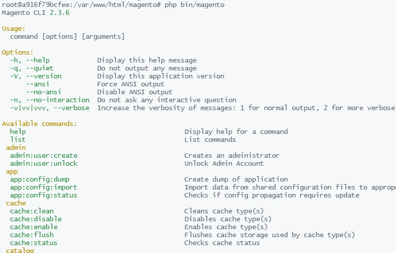

#### MAGENTO命令行

在magento的开发过程中,需要经常使用到命令行工具。

#### 命令行的本质

- 在magento根目录下有一个bin目录,bin目录下面有一个文件名字为magento。
- 平时我们在执行php bin/magento clean:cache命令时,其实际上的含义为:
  调用php终端命令 执行 bin目录下的 magento文件，并指定参数为：cache:clean
- 这就和我们在shell环境执行一个.sh文件的原理是一样的,或者和python xxx.py这种方式执行一个python文件的原理是一样的。
- bin/magento 这个文件为何不以.php结尾呢?我们打开这个文件看一下:第一行: #!/usr/bin/env php
  指定了该文件的解析器为php。
- 所以,magento的命令行的本质相当于 php xxx.php 即为用php终端去执行一个php文件而已,而clean:cache则为向该脚本传递的参数。

------

#### magento查看有哪些命令:

在magento根目录下输入php bin/magento,会看到一大串命令列表:



这真是一个好办法,当我们忘了一个命令时,只要输入php bin/magento,就可以一目了然了。

## magento常用命令

在平时开发中我们接触最多和使用最频繁的命令包括但不限于:

1. php bin/magento setup:upgrade
   这个命令用于更新module.当你修改了一个模块的di.xml文件,配置文件,或者新建一个module时,会使用到这个命令。
2. php bin/magento cache:clean
   这个命令常用于更新缓存.当你更改了后台配置,修改了模块,刷新页面发现没有变化时,常常会用到这个命令,这个命令在开发中使用频率最高。
3. php bin/magento setup:di:compile
   重新编译class文件,当系统报错找不到某些class文件时,或者某个module修改了di.xml文件时，需要手动重新编译一下。
4. php bin/magen indexer:reindex
   重建索引命令,当发现在某些场景下(如搜索),发下数据显示不正确,或者数据没同步,这个命令可以手动帮你重新建立索引。

## magento的命令缩写

命令有点长,记不住或者嫌麻烦?
magento提供了命令缩写模式:
针对上面几个命令,可以缩写为:

```
php bin/magento setup:upgrade  -- php bin/magento s:up
php bin/magento cache:clean --php bin/magento c:c
php bin/magento setup:di:compile  --php bin/magento s:d:c
php bin/magen indexer:reindex -- php bin/magento i:rei
```

## 命令缩写的规律

发现了吗?
我们以php bin/magento setup:upgrade举例:
他除了可以缩写为-- php bin/magento s:up
还可以缩写为 php bin/magento se:up s:upg s:upgra setup:up
也就是说通常以冒号分隔的一个命令，
如setup:upgrade
我们最短可以缩写的程度是什么？
s:u
但是这样就错了!

为什么?
我们看一下setup系列命令:

```
setup
 setup:backup                           
 setup:config:set                       
 setup:cron:run                         
 setup:db-data:upgrade                  
 setup:db-declaration:generate-patch    
 setup:db-declaration:generate-whitelist
 setup:db-schema:upgrade                
 setup:db:status                        
 setup:di:compile                       
 setup:install                          
 setup:performance:generate-fixtures    
 setup:rollback                         
 setup:static-content:deploy            
 setup:store-config:set                 
 setup:uninstall                        
 setup:upgrade  
```

当我们缩写为s:u的时候,系统是执行setup:upgrade 还是执行setup:uninstall呢?
那我们缩写为s:up 的时候 up就不再与冒号右边的uninstall 的un冲突了。
那么就是说一个命令的最小可以缩写的字母,只要保证不与其它命令的单词字母缩写冲突的最小单位 就是最短的缩写了。
