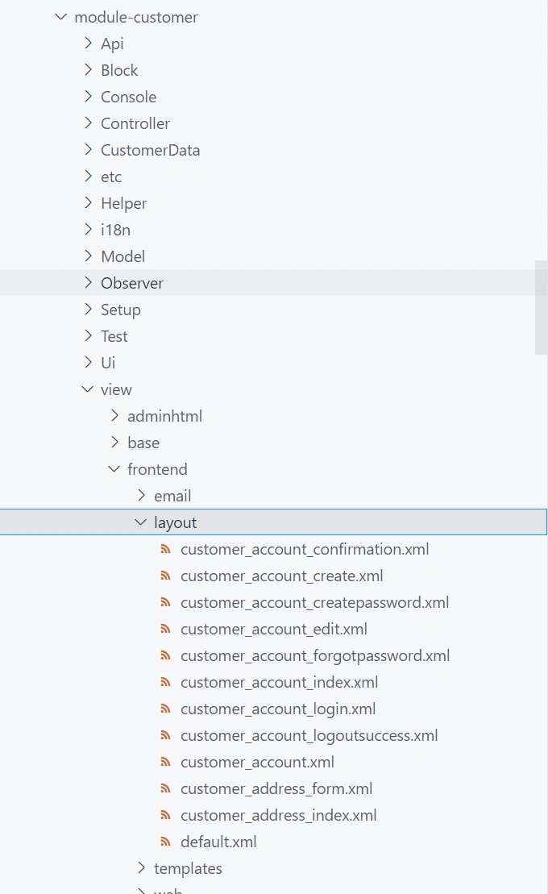

> 在重写之前，我们先熟悉一下layout布局文件

下图为magento中customer模块的布局文件：



可以看到在一个模块的view/frontend/layout目录下存在很多xml文件。
这些以xml结尾的文件就是magento中的布局文件。

------

那么，布局文件的作用是什么呢？
对于我们开发场景来说，我们可以通过布局文件，通过访问的url地址，找到该页面的模板，block，控制器。

------

以这个url为例：http://xxx.com/loginpage/login/index/
该url除了域名外有三段内容：

1. 第一段：loginpage 这部分内容为路由名称

具体定义位置是在routes.xml中定义的frontName的值。

```
 <route frontName="thirdlogin" id="thirdlogin">
```

1. 第二段：login: 为控制器文件所在的目录名称，即module/Controller下建立的目录名称
2. 第三段：index: 为控制 器文件名，也是控制器类名
3. 如url为http://xxx.com/thirdlogin
   我们只写了一段，thirdlogin代表路由文件中定义的路由名，不写第二段和第三段则代表，控制器为Controller下面的Index目录和Index.php文件

------

> 布局文件的命名规则即为:

**路由名\_控制器目录名\_控制器名.xml**

------

了解了上面的规则后，我们来看下一节，如何定位布局xml文件


