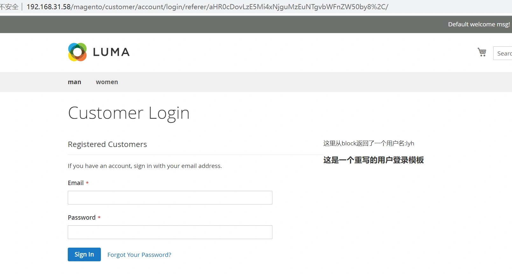
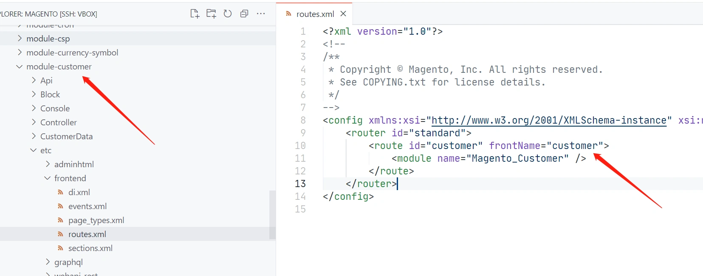
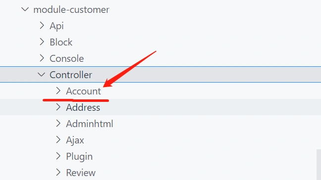
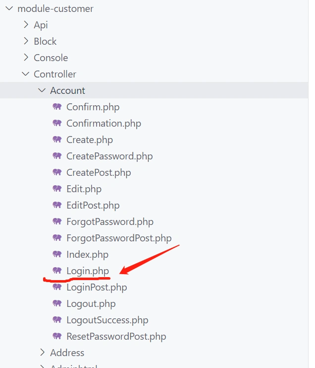
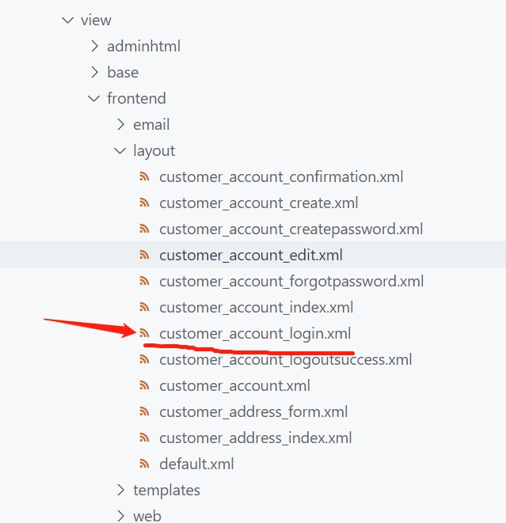
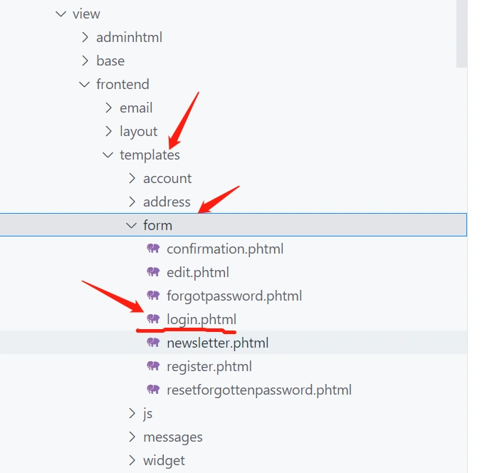
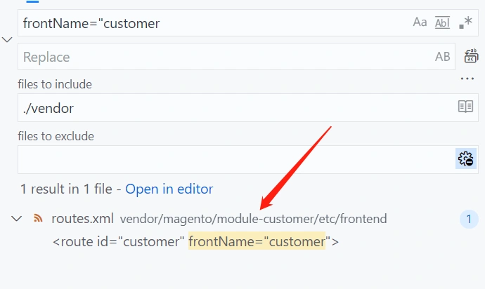

> 当重写一个页面的时候，我们遇到的第一个问题是，怎么找到该页面的布局文件！

这里为大家提供一个最简单直接有效的方法。
我们以用户登录为示例：



1. 首先观察该页面的url地址：
   http://xxx.com/customer/account/login/

2. 通过上一节的内容我们知道，一定有一个定义了frontName为customer的路由文件routes.xml。

3. 我们找到customer模块，查看路由文件，文件路径为：
   vendor/magento/module-customer/etc/frontend/routes.xml

   

4. 第二段为：控制器文件所在的目录名，那么Controller目录下一定有一个目录为：account

   

5.  第三段为控制器文件名：Login.php 

   

以上的结果证明我们的规则完全正确。

下一步，我们想找到模板的位置：
通过上一节，我们知道，布局文件的名字为路由名_控制器目录名_控制器名.xml
所以，布局文件的名称为:
customer_account_login.xml

在customer模块中找到该布局文件：
vendor/magento/module-customer/view/frontend/layout/customer_account_login.xml 



 customer_account_login.xml文件内容： 

```xml
<?xml version="1.0"?>
<page xmlns:xsi="http://www.w3.org/2001/XMLSchema-instance" layout="1column" xsi:noNamespaceSchemaLocation="urn:magento:framework:View/Layout/etc/page_configuration.xsd">
    <head>
        <title>Customer Login</title>
    </head>
    <body>
        <referenceContainer name="content">
            <!-- customer.form.login.extra -->
            <container name="customer.login.container" label="Customer Login Container" htmlTag="div" htmlClass="login-container">
                <block class="Magento\Customer\Block\Form\Login" name="customer_form_login" template="Magento_Customer::form/login.phtml">
                    <container name="form.additional.info" as="form_additional_info"/>
                </block>
                <block class="Magento\Customer\Block\Form\Login\Info" name="customer.new" template="Magento_Customer::newcustomer.phtml"/>
            </container>
            <block class="Magento\Cookie\Block\RequireCookie" name="require-cookie" template="Magento_Cookie::require_cookie.phtml">
                <arguments>
                    <argument name="triggers" xsi:type="array">
                        <item name="loginButton" xsi:type="string">.action.login</item>
                    </argument>
                </arguments>
            </block>
        </referenceContainer>
        <referenceContainer name="form.additional.info">
            <block class="Magento\Framework\View\Element\Template" name="form_additional_info_customer" template="Magento_Customer::additionalinfocustomer.phtml"/>
        </referenceContainer>
    </body>
</page>
```

下面这行代码指定了用户登录使用的模板文件：

```
<block class="Magento\Customer\Block\Form\Login" name="customer_form_login" template="Magento_Customer::form/login.phtml">
```

 并且指定了该模板对应的block为： Magento\Customer\Block\Form\Login



> 找到布局文件至关重要！

为什么这么说呢？ 因为我们后面的小节将讲到重写，重写的机制非常简单，如果想重写block和template。只需要在自己建立的模块中，在layout目录下建立一个与要被重写的布局文件名称完全相同的文件，该布局文件即可被重写！

------

通过上面的分析，我们现在清楚了用户登录页面所涉及到的布局文件，模板文件，控制器，block。
有了上面这些信息，我们就可以进入到重写环节！

> 等等。。。

我们回到第三步。
我是怎么知道，这些文件在customer这个module目录下的呢？
说实话，是猜的，从他的路由名称来看，不是customer模块还能是什么呢？
所以这是最快的办法！
那么，有没有不这么快的办法呢？
也有！

------

我们使用编辑器全局搜索功能。在根目录下搜索下面的关键词：
frontName="customer



> 在搜索结果里找routes.xml文件，定位到了路由文件，便清楚该文件位于哪个module中,然后我们就可以知道这个页面属于哪个moudle。

看来我们的猜测还是挺准的，具体用哪种方法，由个人而定，如果不确定是否找对了文件，那么请用第二种方法！

> 本节内容为重写的基础，掌握了布局文件的规则后，改个模板，改个block，都能找到对应的文件，现在可以重写magento中的任何模块！