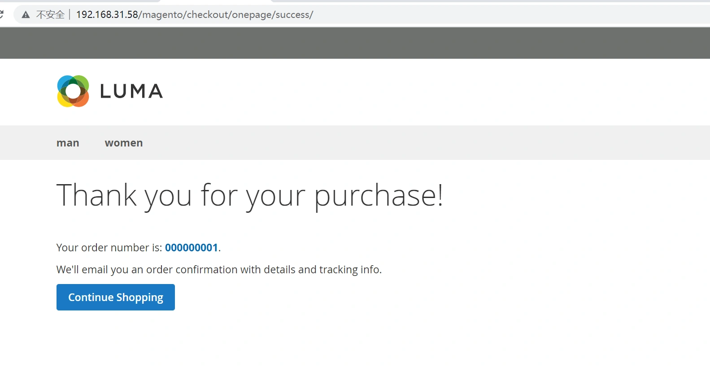
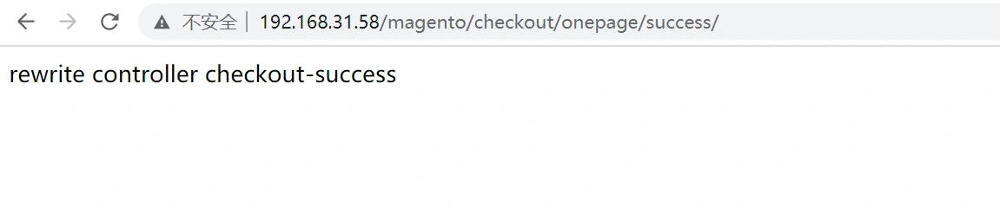

### 重写控制器

默认的下单成功页面的控制器为：
/vendor/magento/module-checkout/Controller/Onepage/Success.php

------

重写控制器只要三步即可： 示例代码以重写下单完成走到success页面为例：
我们先选择一个商品，下单，到成功页面：



我们将重写上面的控制器，用Lyh\Test\Controller\Index\Onepage\Success.php

重写系统原有的Success.php文件

> **StepOne:修改路由文件**

—File— app/code/Lyh/Test/etc/frontend/routes.xml

```xml
<?xml version="1.0"?>
<config xmlns:xsi="http://www.w3.org/2001/XMLSchema-instance" xsi:noNamespaceSchemaLocation="urn:magento:framework:App/etc/routes.xsd">
    <router id="standard">
        <route id="override_checkout" frontName="new_checkout">
            <module name="Lyh_Test" before="Magento_Checkout"></module>
        </route>
    </router>
</config>
```

> **StepTwo: 改依赖注入di.xml文件：**

在config之间填写preference代码块

--File-- app/code/Lyh/Test/etc/di.xml

```xml
<?xml version="1.0"?>
<config xmlns:xsi="http://www.w3.org/2001/XMLSchema-instance" xsi:noNamespaceSchemaLocation="urn:magento:framework:ObjectManager/etc/config.xsd">
    <preference for="Magento\Checkout\Controller\Onepage\Success" type="Lyh\Test\Controller\Index\Onepage\Success" />
</config>
```

> **StepThree: 新建控制器重写控制器：**

--File-- app/code/Lyh/Test/Controller/Index/Onepage/Success.php

```php
<?php
namespace Lyh\Test\Controller\Index\Onepage;
use Magento\Framework\App\Action\HttpGetActionInterface as HttpGetActionInterface;

//继承系统原来的控制器
class Success extends \Magento\Checkout\Controller\Onepage\Success implements HttpGetActionInterface
{  
	public function execute(){
		exit("rewrite controller checkout-success");
	}
}
```

---

执行命令:

- 更新module：

```
php bin/magento s:up 
```

- 重新生成编译文件,当更改di.xml文件时需要执行这个命令：

```
php bin/magento s:d:c  (php bin/magento setup:deploy:compile)
```

------

重新下单，程序运行后找到我们重写的控制器：

