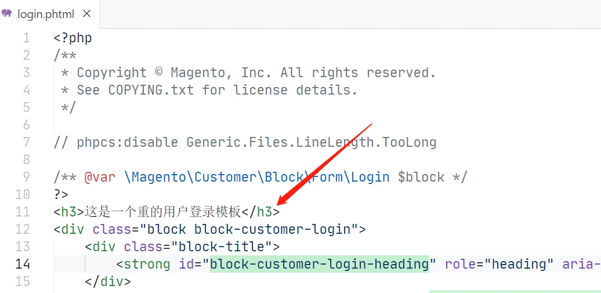
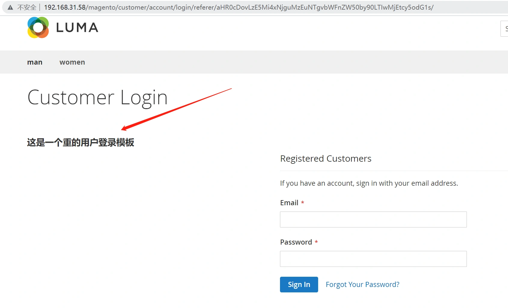

# 重写Template

### 重写Template

示例代码以用户登录页面为例，在用户登录页面添加一行文字：

重写Template一共分为三步：

> **StepOne: 找到用户登录的layout文件**

--File-- /vendor/magento/module-customer/view/frontend/layout/customer_account_login.xml

在这个文件里面有一段配置：

```xml
<block class="Magento\Customer\Block\Form\Login" name="customer_form_login" template="Magento_Customer::form/login.phtml">
        <container name="form.additional.info" as="form_additional_info"/>
</block>
```

Tips:name字段表明了用户登录的模板对应的block名字是customer_form_login。

> **StepTwo: 新建自定义module下的layout文件，指定新的模板**

--File-- /app/code/Lyh/Test/view/frontend/layout/customer_account_login.xml

```xml
<?xml version="1.0"?>
<page xmlns:xsi="http://www.w3.org/2001/XMLSchema-instance"  xsi:noNamespaceSchemaLocation="urn:magento:framework:View/Layout/etc/page_configuration.xsd" layout="2columns-right">
	<body>
		<referenceBlock name="customer_form_login"> 
			<action method="setTemplate">
				<argument name="template" xsi:type="string">Lyh_Test::customer/login.phtml</argument> 
			</action> 
		</referenceBlock>
	</body>
</page>
```

> **StepThree: 添加新的模板**

由于这个示例是重写用户登录模板,可以找到系统的登录模板，将内容全部复制，再修改模板内容。 /vendor/magento/module-customer/view/frontend/templates/form/login.phtml /app/code/Lyh/Test/view/frontend/templates/customer/login.phtml
我们在新建的login.phtml模板中添加一行代码，测试重写是否成功：



 测试登录页面:

