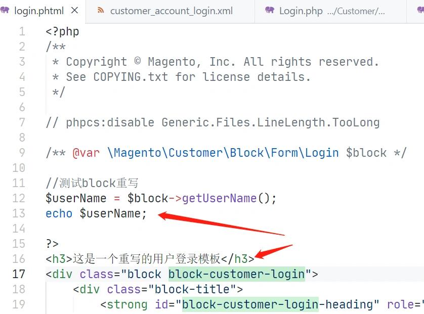
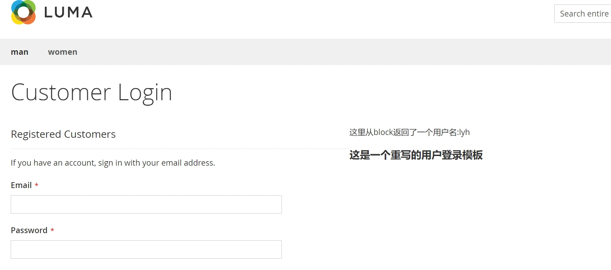

以用户登录页面为示例：
重写Block一共分为三步：

> **StepOne: 找到用户登录的layout文件**

--File-- /vendor/magento/module-customer/view/frontend/layout/customer_account_login.xml

在这个文件里面有一段配置：

```xml
<container name="customer.login.container" label="Customer Login Container" htmlTag="div" htmlClass="login-container">
    <block class="Magento\Customer\Block\Form\Login" name="customer_form_login" template="Magento_Customer::form/login.phtml">
        <container name="form.additional.info" as="form_additional_info"/>
    </block>
    <block class="Magento\Customer\Block\Form\Login\Info" name="customer.new" template="Magento_Customer::newcustomer.phtml"/>
</container>
```

Tips:name字段表明了用户登录的模板对应的block名字是customer_form_login

> **StepTwo: 新建自定义module下的layout文件，指定要重写的block，指定新的模板**

--File-- /app/code/Lyh/Test/view/frontend/layout/customer_account_login.xml

```xml
<?xml version="1.0"?>
<!--
/**
 * Copyright © Magento, Inc. All rights reserved.
 * See COPYING.txt for license details.
 */
-->
<page xmlns:xsi="http://www.w3.org/2001/XMLSchema-instance" layout="1column" xsi:noNamespaceSchemaLocation="urn:magento:framework:View/Layout/etc/page_configuration.xsd">
    <head>
        <title>Customer Login</title>
    </head>
    <body>
        <referenceContainer name="customer.login.container" label="Customer Login Container" htmlTag="div" htmlClass="login-container">
                <block class="Lyh\Test\Block\Customer\Form\Login" name="customer_form_login_override" template="Lyh_Test::customer/login.phtml">
                    <container name="form.additional.info" as="form_additional_info"/>
                </block>
        </referenceContainer>
    </body>
</page>
```

> 注意：这个地方分别指定了要重写的block和模板，同时,block对应的name不能与原xml文件中name相同！

```
 <block class="Lyh\Test\Block\Customer\Form\Login" name="customer_form_login_override" template="Lyh_Test::customer/login.phtml">
```

> **StepThree: 添加新的block文件和模板文件**

由于这个示例是重写用户登录模板,可以找到系统的登录模板，将内容全部复制，再修改模板内容。 /vendor/magento/module-customer/view/frontend/templates/form/login.phtml /app/code/Lyh/Test/view/frontend/templates/customer/login.phtml
在这个模板中这次我们添加了从block获取数据和一行静态文字：



 **添加block文件：**

--FILE--: app/code/Lyh/Test/Block/Customer/Form/Login.php 

```php
<?php
/**
 * Copyright © Magento, Inc. All rights reserved.
 * See COPYING.txt for license details.
 */
namespace Lyh\Test\Block\Customer\Form;

/**
 * Customer login form block
 *
 * @api
 * @author      Magento Core Team <core@magentocommerce.com>
 * @since 100.0.2
 */
class Login extends \Magento\Customer\Block\Form\Login
{
    public function getUserName(){
        return '这里从block返回了一个用户名:lyh';
    }
}
```

 查看重写结果： 

