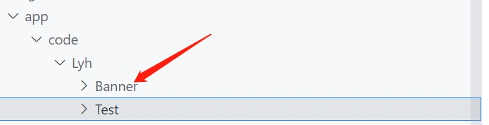
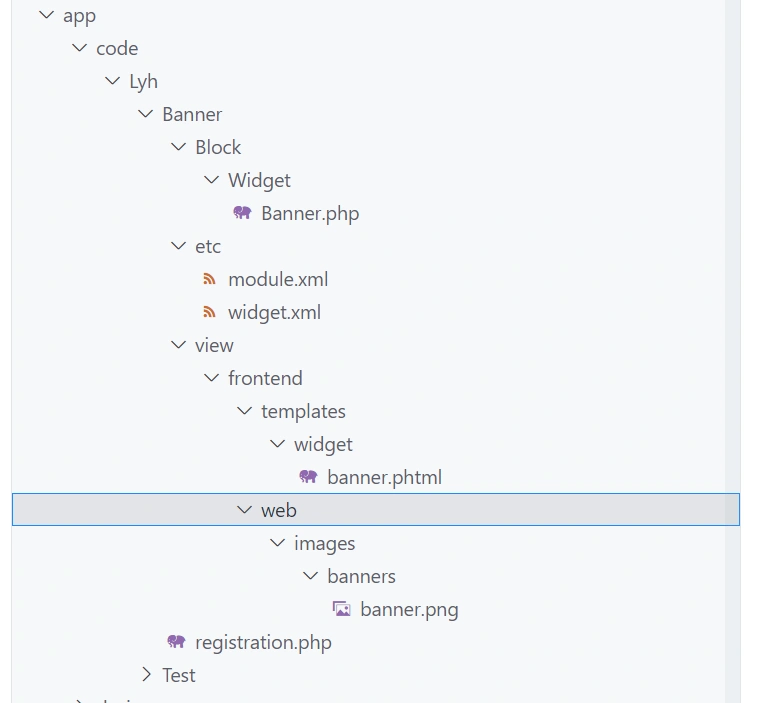

本节将编写一个Banner图片widget示例，并将widget添加到首页展示。

------

我们新建一个module，命名为Banner:



添加文件：

app/code/Lyh/Banner/registration.php

```php
<?php

\Magento\Framework\Component\ComponentRegistrar::register(
    \Magento\Framework\Component\ComponentRegistrar::MODULE,
    'Lyh_Banner',
    __DIR__
);
```

------

添加文件：
app/code/Lyh/Banner/etc/module.xml

```xml
<?xml version="1.0"?>
<config xmlns:xsi="http://www.w3.org/2001/XMLSchema-instance" xsi:noNamespaceSchemaLocation="urn:magento:framework:Module/etc/module.xsd">
    <module name="Lyh_Banner" setup_version="2.0.0">
        <sequence>
            <module name="Magento_Widget" />
        </sequence>
    </module>
</config>
```

------

> 添加widget配置文件：

app/code/Lyh/Banner/etc/widget.xml

```xml
<widgets xmlns:xsi="http://www.w3.org/2001/XMLSchema-instance"
         xsi:noNamespaceSchemaLocation="urn:magento:module:Magento_Widget:etc/widget.xsd">
    <widget class="Lyh\Banner\Block\Widget\Banner" id="homepage_bannger_widget">
        <label>BannerWidget</label>
        <description>banner widget</description>
    </widget>
</widgets>
```

------

添加block文件：
app/code/Lyh/Banner/Block/Widget/Banner.php

```php
<?php
namespace Lyh\Banner\Block\Widget;

use Magento\Framework\View\Element\Template;
use Magento\Widget\Block\BlockInterface;

class Banner extends Template implements BlockInterface
{
    protected $_template = "widget/banner.phtml";
}
```

------

添加模板文件：
app/code/Lyh/Banner/view/frontend/templates/widget/banner.phtml

```php+HTML
<?php
/** \ExampleCorp\Learning\Block\Widget\Test $block */
$bannerImg = $this->getViewFileUrl('Lyh_Banner::images/banners/banner.png');
?>
<style>
#banner-img{
    width:100%;
    height:300px;
}
</style>
<div class="banner-container">
    ">
</div>
```

------

添加图片：
banner.png路径：
app/code/Lyh/Banner/view/frontend/web/images/banners/banner.png

------

最终文件结构为：



启用module：
执行命令:php bin/magento s:up
查看banner模块是否启用成功:

```
$ php bin/magento module:status | grep Banner
```

输出字符：
Lyh_Banner
代表banner模块启用成功。

------

至此，一个widget小部件就定义完成了。