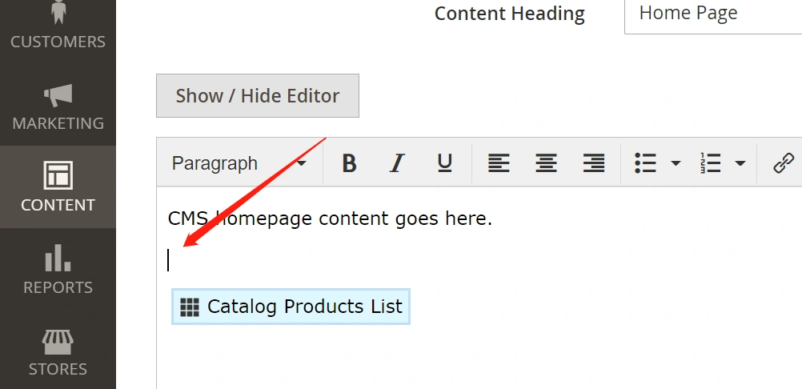
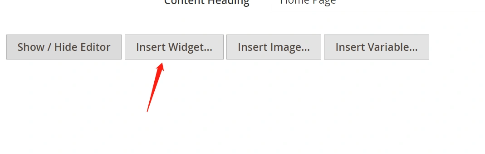
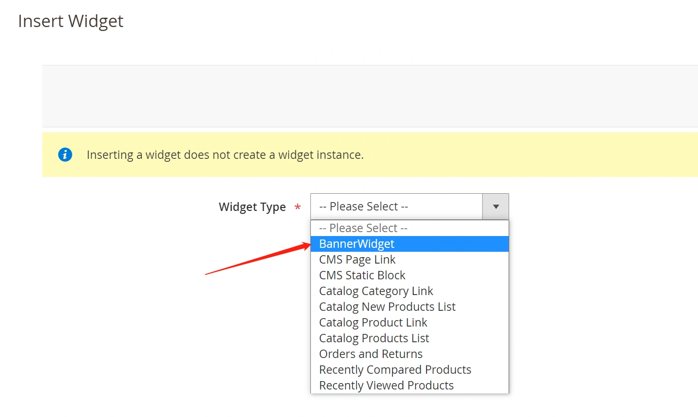
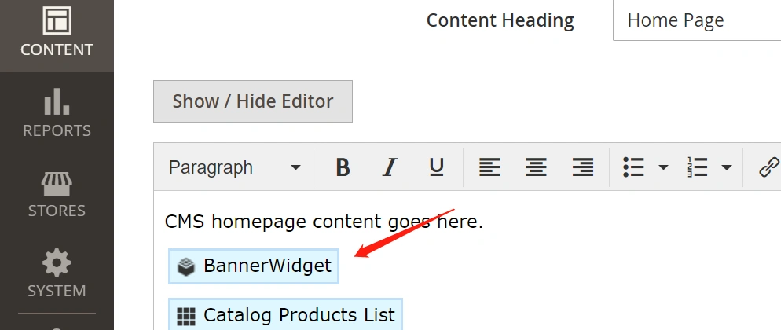
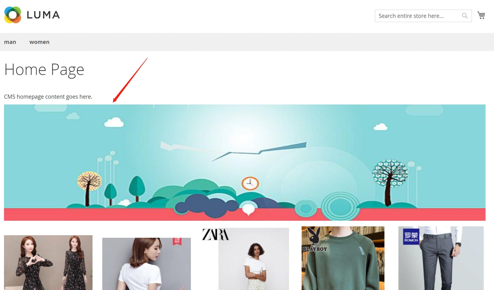
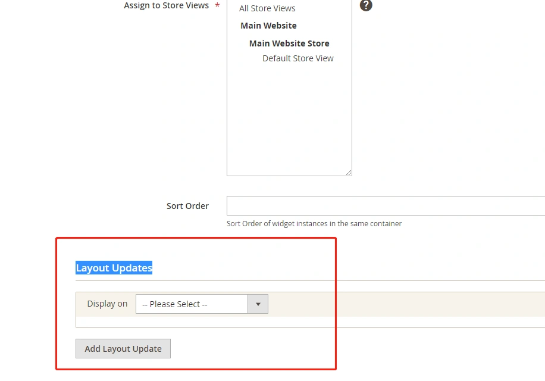
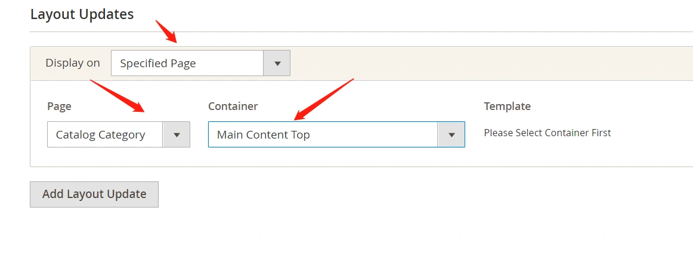
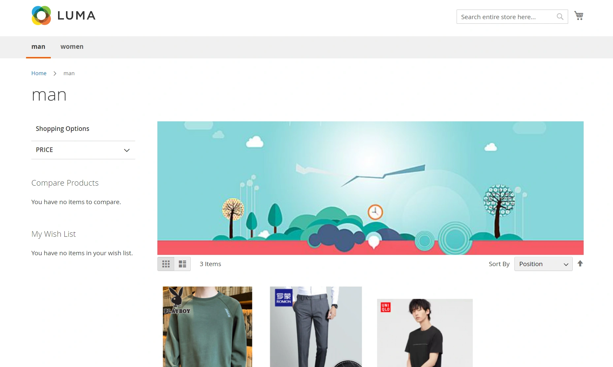

把自定义的widget添加到首页：
还记得上一章第2小节的内容吗？我们自定义的widget和系统自带widget添加到首页的方法相同.

------

先把光标定位到这个位置：

 点击上面的页签：Show/Hide Editor
点击 Insert Widget: 

 选择我们新建的Widget，点击右上角 Insert Widget: 

 插入完的效果，确认，并保存。 

 查看首页效果： 

---

#### 把自定义的小部件显示到指定页面

下面把我们自定义的widget添加到商品分类页面:

- 首先，在后台添加我们自定义的widget:
  Backend -- Content -- Widget -- Add Widget
- 设置小部件属性：

在Layout Updates这个位置可以选择这个widget显示在哪些页面的什么位置：

- 我们选择指定页面：

- 第一个Select我们选择Catalog Category即分类商品页面。

- 第2个Select 我们选择Main Content Top。

  

- 保存
- 清除缓存 php bin/magento c:c

------

前台点击一个分类查看效果：

 这样自定义的小部件就被添加到了商品分类页面中了，同理，我们可以开发一些公用的小部件，添加到更多的页面中。 

