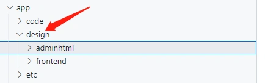

## 主题(Theme)概述

主题相当于一个网站的页面风格,可以一键切换模板，样式。
magento提供了一套完善的主题机制,主题与重写有着密不可分的关系。
主题目录通常存放模板文件,css,js。
可以在后台指定某个店铺的主题,一键切换网站模板。
magento安装后,在app目录下创建了design目录。这里就是存放主题的目录.分为后台主题与前台主题,通常我们定制比较多的场景是前台主题。

本章将带领大家开启主题定制之旅!

 