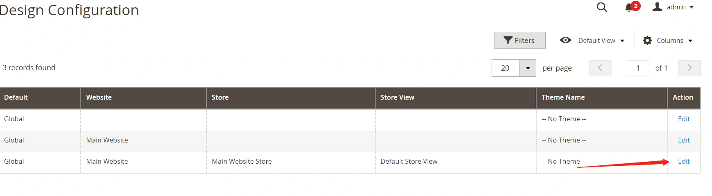

# 1.创建新的主题

## 创建一个主题

- 建立目录app/design/frontend/Summer/green
  我们新建的主题寓意为绿色的夏天。

------

- 建立主题声明文件
  app/design/frontend/Summer/green/theme.xml

```xml
<theme xmlns:xsi="http://www.w3.org/2001/XMLSchema-instance" xsi:noNamespaceSchemaLocation="urn:magento:framework:Config/etc/theme.xsd">
    <title>Summer-green</title> <!-- your theme's name -->
    <parent>Magento/luma</parent> <!-- the parent theme, in case your theme inherits from an existing theme -->
</theme>
```

说明:

title字段为主题名称,会在后台显示。
parent字段为主题继承的父主题.我们继承luma.或者继承empty主题。

------

- 注册主题
  app/design/frontend/Summer/green/registration.php

```
<?php

use \Magento\Framework\Component\ComponentRegistrar;

ComponentRegistrar::register(ComponentRegistrar::THEME, 'frontend/Summer/green', __DIR__);
```

------

- 建立静态文件存放目录:web,并创建子目录 css,images,js
  现在我们的主题目录结构为:

  

- 查看Summer主题:
  Backend -- Content -- Design -- Theme这里可以查看到我们新建的主题: 


- 应用Summer主题:
  Backend -- Content -- Design -- Conguration:
  我们选择最后一条,编辑:

  

-  选择新建的Summer主题: 

  

 保存,这样我们的主题Summer-green就应用成功了. 

