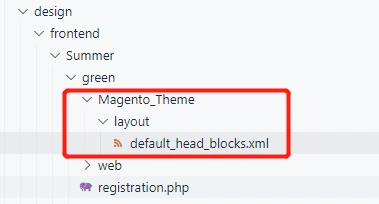
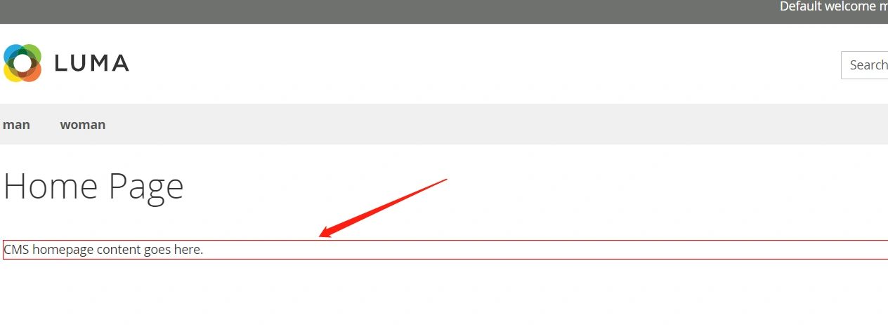
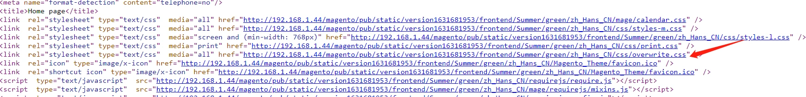

## 全局覆盖样式

- 新建目录Magento_Theme/layout

- 新建文件 default_head_block.xml
  目录结构如下:

  

- default_head_blocks.xml文件内容:

```xml
<?xml version="1.0"?>
<page xmlns:xsi="http://www.w3.org/2001/XMLSchema-instance" xsi:noNamespaceSchemaLocation="urn:magento:framework:View/Layout/etc/page_configuration.xsd">
    <head>
        <css src="css/styles-m.css"/>
        <css src="css/styles-l.css" media="screen and (min-width: 768px)"/>
        <css src="css/print.css" media="print"/>
        
        <css src="css/overwrite.css" order="10000"/>
    </head>
</page>
```

说明:我们在这里添加了一个overwrite.css,这个文件在整个网站的每个页面都会被引入。

------

- 新建overwrite.css文件
  app/design/frontend/Summer/green/web/css/overwrite.css
  文件内容很简单,只是做一个测试,给页面的所有p标签加一个边框:

```css
p{
    border:1px solid red;
}
```

------

执行清除缓存命令:php bin/magento c:c
查看首页,样式成功引入:



 查看页面源代码,css文件被引入: 



- 通过这种方式,我们向网站添加了一个全局的css文件,可以更改任意页面的样式。

  default_head_block.xml文件是一个全局布局文件,我们在主题路径下新建了Magento_Theme/layout目录,则相当于覆盖了系统目录(即vendor)对应的目录下的default_head_block.xml文件

  被覆盖的原文件路径为:

  vendor/magento/theme-frontend-blank/Magento_Theme/layout/default_head_blocks.xml

- 我们在主default_head_blocks.xml文件添加的css,可以修改网站所有页面的样式。

- 如果不想全局引入，而只是当前模块，我们可以直接在模板中写css代码

```
<style>
xxx
</style>
```

- 我们需要在当前模块引入一个单独的css文件：

  在layout布局文件的head中引入

```
<css src="Mypage_OrderHistory::css/order_history.css"/>
```

xml文件示例 ：

```xml
<?xml version="1.0"?>
<page xmlns:xsi="http://www.w3.org/2001/XMLSchema-instance" xsi:noNamespaceSchemaLocation="urn:magento:framework:View/Layout/etc/page_configuration.xsd">
    <update handle="customer_account"/>
    <head>
        <css src="Mypage_OrderHistory::css/order_history.css"/>
    </head>
    <body>
        <block class="Magento\Sales\Block\Order\History\Container"
                       name="sales.order.history.extra.container" as="extra.container">
            <block class="Magento\Framework\View\Element\Template"
                name="sales.order.history.extra.container.data" as="extra.container.data"/>
        </block>
    </body>
</page>
```