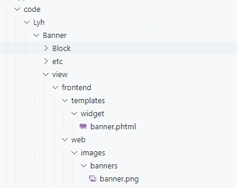
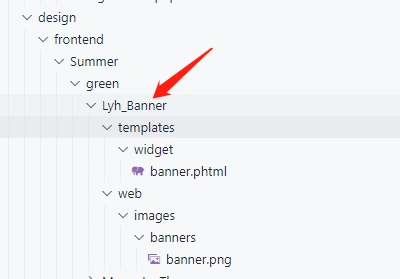
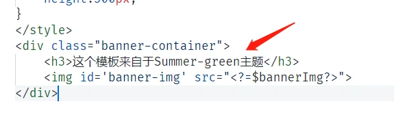
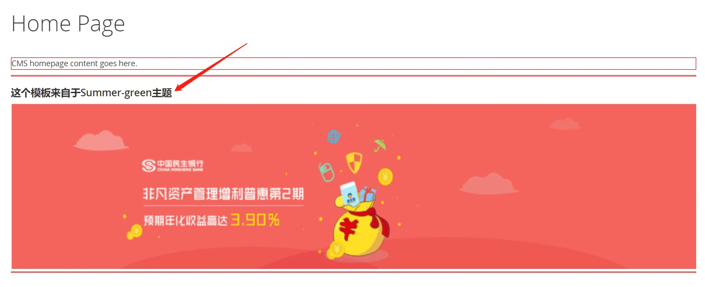

#### 把模板文件全部移动到对应的主题目录

我们把app/code这个目录作为模块目录。
app/design作为主题目录。
因此,我们需要把app/code目录原有的模板移动到app/design目录下交由主题管理.

------

上一章我们新建了一个小部件 Banner.
小部件的模板位置是在

app/code/Lyh/Banner/view/frontend/templates/widget/banner.phtml

------

新建主题目录:
app/design/Summer/green/Lyh_Banner
对比于app/code目录, 原来的module是由一个二级目录组成的,即 Lyh/Banner
迁移到主题目录后,命名规则改为一级目录,并由下划线连接,即Lyh_Banner
我们在Lyh_Banner下分别对照code的结构建立对应的文件：

> 注意看下面两张图的对比.templates和web目录在主题中是直接放到顶级目录的,而在app/code的时候是放在view/frontend下面的.

**原来的模板及前端资源结构:**app/code:

 **在主题目录中的结构**app/design: 

我们在主题的目录下,只放了templates(模板)目录和web(前端资源)目录

------

把app/code的模板复制到app/design对应位置，对主题下的模板进行一点修改:添加一行文字：

 清除缓存,查看效果: php bin/magento c:c 

可以看到,主题目录中的模板生效了.而原来的app/code对应的模板我们并没有删除。
按照主题的目录规则建立模板,主题的模板优先级要大于app/code。
现在，也可以删除app/code/Lyh/Banner/view/frontend/templates/widget/banner.phtml 