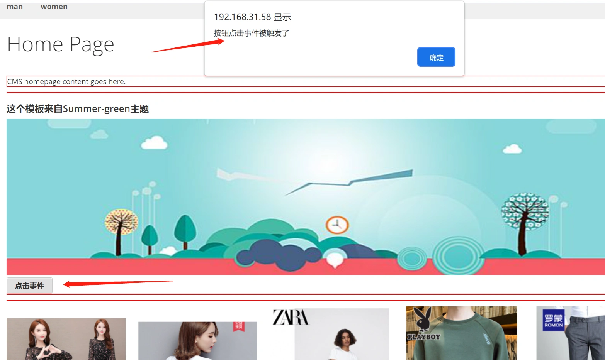
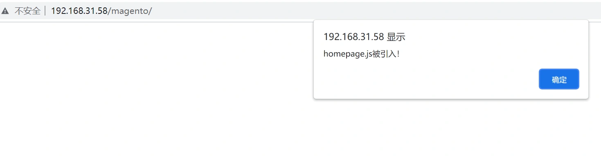
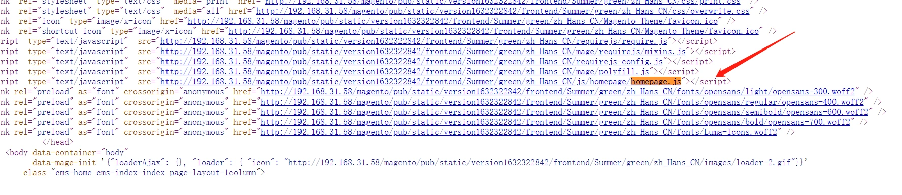
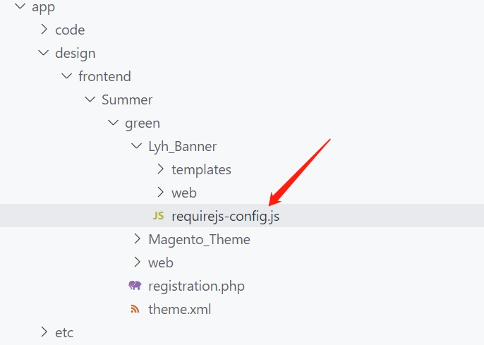
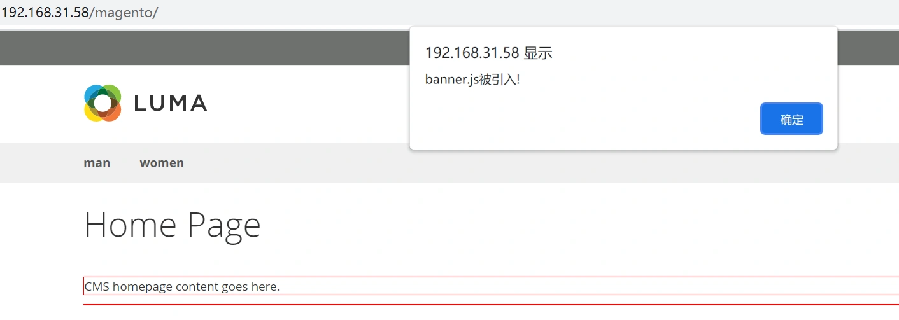
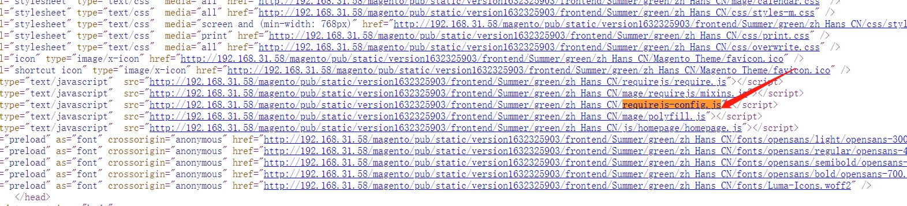
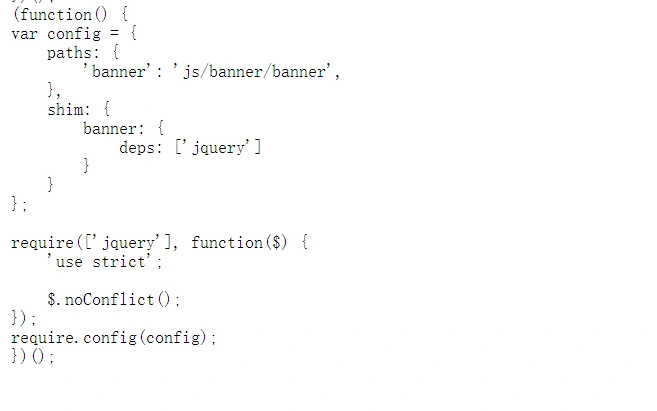

## 在模板中调用jquery库

修改一下模板代码，添加一个按钮，并编写js代码，调用click方法：

```php+HTML
<?php
/** \ExampleCorp\Learning\Block\Widget\Test $block */
$bannerImg = $this->getViewFileUrl('Lyh_Banner::images/banners/banner.png');
?>
<style>
#banner-img{
    width:100%;
    height:300px;
}
</style>
<h3>这个模板来自Summer-green主题</h3>
<div class="banner-container">
    ">
</div>

<div>
    <button id='btn'>点击事件</button>
</div>
<script>
require([
        'jquery'
], function($) {
    $("#btn").click(function(){
        alert('按钮点击事件被触发了');
    })
})
</script>
```

 回到首页，点击按钮，按钮事件被触发了。 



## 代码解析：

```
require([
  'jquery'
], function($) {
   xxx
})
```

这一段是我们调用jquery的代码。
它的语法来自于requirejs。
这个语法的意思是引用jquery.js文件，并把jquery转换为别名 $

------

## 引入外部js

上面的示例是直接把js代码写到模板内，接下来，我们引入一个外部js.

- 修改default_head_blocks.xml文件：

```xml
<?xml version="1.0"?>
<page xmlns:xsi="http://www.w3.org/2001/XMLSchema-instance" xsi:noNamespaceSchemaLocation="urn:magento:framework:View/Layout/etc/page_configuration.xsd">
    <head>
        <css src="css/styles-m.css"/>
        <css src="css/styles-l.css" media="screen and (min-width: 768px)"/>
        <css src="css/print.css" media="print"/>
        
        <css src="css/overwrite.css" order="10000"/>
        <script src="js/homepage/homepage.js"/>
    </head>
</page>
```

> 我们添加了一行js引入的代码：

```
 <script src="js/homepage/homepage.js"/>
```

------

新建js文件：

> 注意：我们这个js的位置不是在Banner目录下，而是外层的web目录下！

app/design/frontend/Summer/green/web/js/homepage/homepage.js

```
require(["jquery"], function ($) {
    alert('homepage.js被引入！')
});
```

清除缓存 php bin/magento c:c
刷新首页测试：



右键查看网页源码，homepage.js被引入到页面： 



#### 指定页面引入js

上面的方法和之前的全局css文件类似，所有页面都将引入homepage.js文件
如果针对指定模块,应该怎么引入js呢？

> requirejs方式配置并引入js：

\- 新建文件： app/design/frontend/Summer/green/Lyh_Banner/requirejs-config.js

文件位置：



> 注意：该文件位置位于Lyh_Banner根目录

------

app/design/frontend/Summer/green/Lyh_Banner/requirejs-config.js

```javascript
var config = {
    paths: {
        'banner': 'js/banner/banner',
    },
    shim: {
        banner: {
            deps: ['jquery']
        }
    }
};

require(['jquery'], function($) {
    'use strict';

    $.noConflict();
});
```

以上内容为requirejs配置js文件引入语法。
path: 定义别名 banner 对应的文件为 js/banner/banner.js（省略后缀名.js）
shim:指定依赖关系: banner对应path定义的别名banner,deps:指定依赖于jquery库。

------

- 新建banner.js
  app/design/frontend/Summer/green/web/js/banner/banner.js

```javascript
!(function($) {

    $(function(){
        alert('banner.js被引入!')
    })

})(jQuery);
```

------

模板引入banner.js:
app/design/frontend/Summer/green/Lyh_Banner/templates/widget/banner.phtml

```html
<div>
    <button id='btn'>点击事件</button>
</div>
<script>
require([
        'jquery',
        'banner' //引入banner.js
], function($,banner) {
   $(function(){
      
   })
})
</script>
```

刷新首页测试：



 <font color='orange'>注意:我们在只在首页调用了banner小部件,如果点击分类页则不会弹 banner.js的内容。说明此种方式只是针对模块引入js文件，而不是全局引入。</font>

 我们查看一下首页源代码：



 查看一下该文件的源代码，引入了大量的js库，包括jquery和其它一些magento前端库的js文件，我们自己配置的banner.js，也被合并到了这个文件中： 



## 总结：

模板与js配合有三种方式:

1. 直接写在模板里的js代码，通过require语法引入jquery。
2. 引入外部的全局js文件。
3. 引入当前模块指定的外部js文件。

------

以上就是我们自己开发的模块，在主题中使用js的方法。

> 关于requirejs的语法,在第十四章:前端-javascript专题中会有详细讲解!

> 下一节我们将讲解magento封装的js语法，这对于我们做二次开发，理解magento的js运行原理有很大帮助。