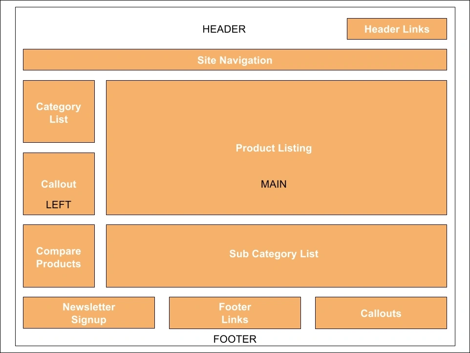

在magento中有两种方式可以修改页面的结构：

1. 修改layout文件。
2. 修改模板。

------

magento采用了layout布局结构,看下面示例：



这个结构相当于magento的layout.即网站页面是由一个个块拼凑起来的。
与我们传统的html结构不同的地方在于，页面的每个块都有自己的模板，并且分布在各自的模块中。
而这些不同位置的模板最终拼装成一个页面，则是由layout机制来实现。

------

#### 管理layout:

1. 要使布局更改在每个页面上都可用，修改default.xml文件。
   app/code/Vendor/Module/view/frontend/layout/default.xml
2. 要将布局更改添加到特定页面，使用与页面路径对应的布局文件。
   app/code/Vendor/Module/view/frontend/layout/catalog_product_view.xml
3. 使用布局可以实现:

- 将页面元素移动到另一个父元素。
- 添加内容。
- 删除页面元素。
- 排列元素位置。

------

#### layout文件中的语法

```xml
<block>
<container>
before and after attributes
<action>
<referenceBlock> and <referenceContainer>
<move>
<remove>
<update>
<argument>
<block> vs <container>
```

我们重写登录页面的时候应用过布局文件，即

```xml
<container name="customer.login.container" label="Customer Login Container" htmlTag="div" htmlClass="login-container">
    <block class="Magento\Customer\Block\Form\Login" name="customer_form_login" template="Magento_Customer::form/login.phtml">
        <container name="form.additional.info" as="form_additional_info"/>
    </block>
    <block class="Magento\Customer\Block\Form\Login\Info" name="customer.new" template="Magento_Customer::newcustomer.phtml"/>
</container>
```

这里面涉及到了container，block等语法。

------

#### container

一种没有内容的结构，用于保存其他布局元素，如块和容器。
container在视图输出生成期间呈现子元素。它可以是空的，也可以包含任意一组<container>和<block>元素。如果<container>为空，并且没有可用的子，它将不会显示在前端源代码中。
container示例：

```xml
<container name="div.sidebar.additional" htmlTag="div" htmlClass="sidebar sidebar-additional" after="div.sidebar.main">
    <container name="sidebar.additional" as="sidebar_additional" label="Sidebar Additional"/>
</container>
```

#### block

定义一个块容器。

细节：块是页面输出的一个单元，它呈现一些独特的内容（最终用户可以看到的任何东西），例如一条信息或一个用户界面元素。

block是Magento中布局的基本构建单元。它们是PHP的block类（包含逻辑）和模板（呈现内容）之间的链接。block可以有子对象和孙子对象（等等）。可以使用子节点将信息从布局XML文件传递到block。

block使用模板生成HTML。block的示例包括类别列表、迷你购物车、产品标签和产品列表。
block示例：

```
<block class="Magento\Catalog\Block\Product\ListProduct" name="category.products.list" as="product_list" template="Magento_Catalog::product/list.phtml"/>
```

------

> block与container的对比

块表示为Magento呈现HTML时链的末端。
容器包含块，可以将它们包装在HTML标记中。
如果没有为容器指定子容器，则容器不会呈现任何输出。

------

#### before和after属性

before和after可在布局XML文件中用于控制 "元素在其公共父级中的顺序"。
可以理解为 元素b和元素c 都是a元素的子元素，使用before或者after语法，可以调用b元素和c元素在a元素中的位置。
代码示例：

```
<move element="breadcrumbs" destination="main.content" before="-" />
```

把breadcrumbs这个元素移动到main.content这个容器内，并且位置在最前显示。
**move**:移动一个元素。
**element**:被移动的元素。
**destination**:移动到的位置。
**before='-'** ：横线代表移动到父级最前的位置。
也可以移动到父级指定元素之前:
**before='catalog.topnav'** :移动到catalog.topnav元素之前。

after属性与before的用法相同。

------

#### referenceBlock和referenceContainer

<referenceBlock>和<referenceContainer>应用于相应的<block>或<container>。

例如，如果通过<referenceBlock name=“right”>进行引用，则您的目标是块<block name=“right”>。

> 这两个标签是我们在重写中用到最多的！

如我们要重写某个block和模板，通常我们会用 referenceBlock name='xxx' 表示引用某个block,name即为要引用的block的name属性。

然后我们可以添加一些属性，比如remove='true' 代表直接删除当前block。
我们可以在referenceBlock内部修改原来的block，或者添加新的block。
referenceContainer与referenceBlock的原理相同。
移除一个block示例 ：

```
<referenceBlock name="block.name" remove=“true”/>
```

------

#### update语法

包含其它的layout文件

```
<update handle="{name_of_handle_to_include}"/>
```

示例：

```
<update handle="customer_account"/>
```

------

> 理解layout结构，对于重写magento功能和修改原有页面结构至关重要！在vendor/magento/module-xxx目录下，基本上每个模块都有对应的xml文件，大家可以通过查看这部分代码来熟悉layout的语法。