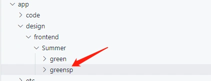
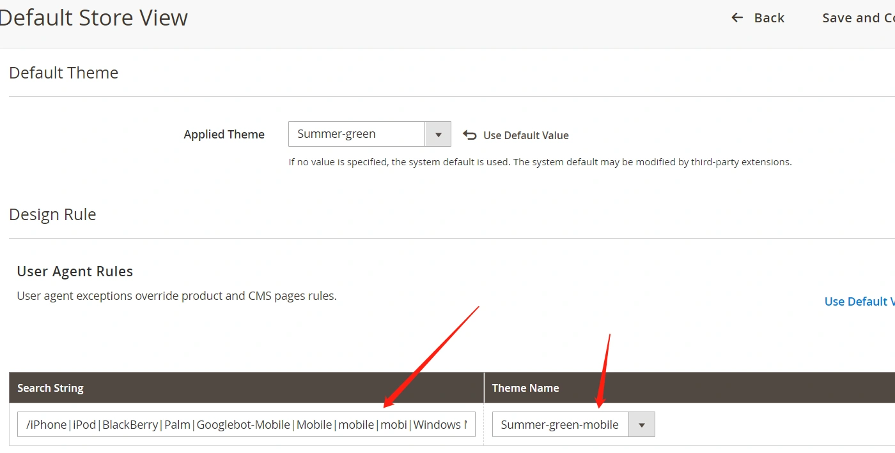
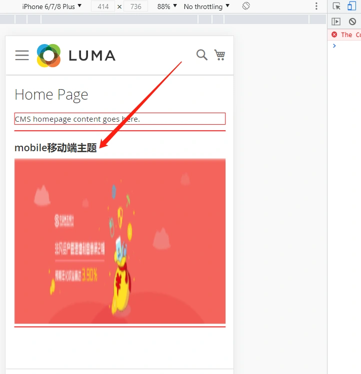

#### 创建移动端主题

我们可以把原有的主题green复制一份,并重命名为greensp,作为手机版主题。



修改文件:
app/design/frontend/Summer/greensp/theme.xml

```xml
<theme xmlns:xsi="http://www.w3.org/2001/XMLSchema-instance" xsi:noNamespaceSchemaLocation="urn:magento:framework:Config/etc/theme.xsd">
    <title>Summer-green-mobile</title> <!-- your theme's name -->
    <parent>Magento/luma</parent> <!-- the parent theme, in case your theme inherits from an existing theme -->
</theme>
```

把标题改为Summer-green-mobile,方便在后台区分。

------

修改文件:
app/design/frontend/Summer/greensp/registration.php

```php
<?php

use \Magento\Framework\Component\ComponentRegistrar;

ComponentRegistrar::register(ComponentRegistrar::THEME, 'frontend/Summer/greensp', __DIR__);
```

------

修改完成后执行php bin/magento s:up 更新module。

## 启用移动端主题

1.CONTENT — Design Configuration — 编辑第3条默认store view:

2.User Agent Rules — Add
添加Search String:

```
/iPhone|iPod|BlackBerry|Palm|Googlebot-Mobile|Mobile|mobile|mobi|Windows Mobile|Safari Mobile|Android|Opera Mini/  
```

Theme Name 选择 Summer-green-mobile



3.更新缓存
php bin/magento s:up

------

切换完成后,使用android,或者ios设置访问网站页面,将会执行到对应的手机主题模板。
模拟移动端设备访问,修改了greensp主题下的模板的标题文字:



---

总结:
这种实现方式是pc端和手机端两套主题完全分开。
优点是,手机主题与pc主题完全分离,同时也降低了前端对于移动版兼容性的技能要求和修改难度。 