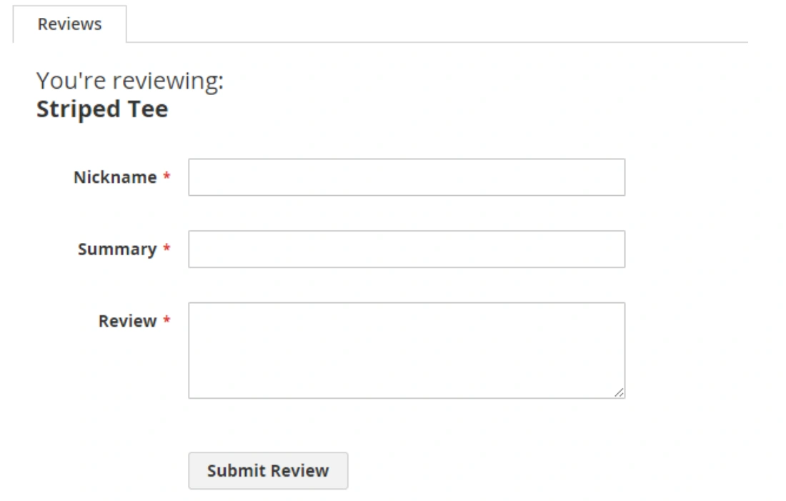
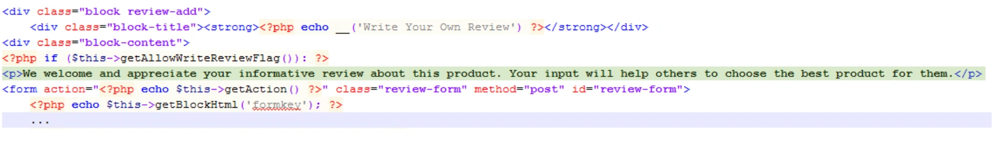
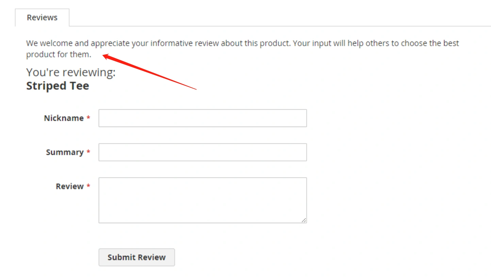

本小节讲解如何自定义模板。本节内容可参考重写章节，本节作为单独讲解。

------

要自定义模板，请执行以下操作：

1. 使用模板提示找到与要更改的page/block关联的模板。
2. 根据模板存储约定，将模板复制到主题文件夹中。
3. 进行必要的更改。

要在主题中添加新模板，请执行以下操作：

1. 根据模板存储约定在主题目录中添加模板。
2. 将模板指定给相应布局文件中的块。

------

如果添加一个新的.html模板，然后对其进行编辑，则在删除pub/static/frontend和var/view_preprocessed目录中的所有文件并重新加载页面之前，更改将不会应用。如果不手动删除这两个目录下的文件，可以通过执行`php bin/magento cache:clean`命令清除缓存，或者通过后台清除缓存。

------

示例：
添加一条信息到客户评论表单
系统默认的评论表单页面：

示例以ExampleCorp模块主题中重写评论表单：
首先，将form.phtml模板从<Magento_Review_module_dir>/view/frontend/templates复制到橙色主题目录中的相应子目录：
`app/design/frontend/ExampleCorp/orange/Magento_Review/templates`
在theme form.phtml文件中，我们在这个模板里添加一段文字：

 更改后的页面如下： 

总结：如果只是改模板的文本，而不需要调用php程序，可以在自定义的主题中，按照magento系统重写的目录规则，请参考上面两个路径的命名规则,放置对应路径的模板，即可达到重写的效果。
完整路径对比：
原magento模板路径：
`vendor/magento/module-review/view/frontend/templates/review.phtml`
主题目录路径：
`app/design/frontend/ExampleCorp/orange/Magento_Review/templates/review.phtml`

> ExampleCorp/orange为主题目录名，Magento_Review对应vendor/magento/module-review目录